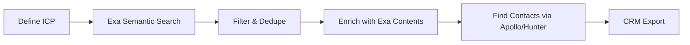

# Morning Research Report

Saturday, January 24, 2026 at 02:50 AM

---

# Ai Business Models

# AI Business Models & The "Software > Everything" Thesis

**Research Date:** January 24, 2026  
**Source:** @davidondrej1's thesis on software-first businesses

---

## Executive Summary

The core thesis: **Software businesses are uniquely positioned for the AI era** because they:
1. Have near-zero marginal cost
2. Scale without linear headcount
3. Generate recurring revenue
4. Can be built and operated solo or with tiny teams
5. Are highly sellable (liquid assets)

AI tools (Claude, Cursor, Bolt, Replit) have collapsed the time-to-build from months → hours, making this the best era in history to bootstrap software companies.

---

## 🏢 Case Study Deep Dives

### 1. Base44 (base44.com)
**What:** AI-powered no-code app builder  
**Tagline:** "Shape your ideas into apps that work your way"

**Key Features:**
- Natural language → working app in minutes
- Built-in backend (auth, database, permissions)
- Instant hosting included
- No coding required

**Business Model:**
- Freemium: Free tier with core features
- Paid from $20/month
- 400K+ users (trusted badge)

**Growth Strategy:**
- Product-led growth (try before buy)
- Social proof via Twitter testimonials
- Viral potential (users share apps they built)

**Lesson:** AI-first product building democratizes software creation. Base44 is essentially productizing what vibe coders do manually.

---

### 2. N8N (n8n.io)
**What:** Open-source workflow automation platform  
**Tagline:** "The fast way to actually get AI working in your business"

**Key Metrics:**
- 162K GitHub stars (massive open-source community)
- Enterprise clients (on-prem + cloud options)
- Estimated $40M+ ARR (per SaaStr reports from 2024)

**Funding History:**
- Started as open-source project
- Series A: $12M (2022)
- Series B: $60M (reported 2024) for AI marketplace

**Growth Strategy:**
- Open-source first → massive developer adoption
- Freemium cloud offering
- Enterprise upsell (SSO, SAML, on-prem)
- Community-driven templates and integrations

**Why It Works:**
- Developers try it free, companies pay for support
- AI workflows = future-proof positioning
- Self-hostable = trust with enterprises

**Lesson:** Open-source + SaaS hybrid is incredibly powerful. Give away the code, charge for convenience and enterprise features.

---

### 3. Lovable.dev
**What:** AI-first web development platform  
**Tagline:** "Build for the web 20x faster"

**Status:** Hot AI dev tool (similar to Bolt.new, Replit)

**Market Position:**
- Competes with Cursor, Bolt, Replit
- Focus on "vibe coding" workflow
- Natural language → deployable apps

**Lesson:** The AI dev tools market is exploding. Multiple $100M+ companies will emerge in this space.

---

### 4. Levels.io (Pieter Levels)
**What:** Solo founder running multiple profitable SaaS products  
**Portfolio:**
- **Nomad List** - Digital nomad community ($400K+/year)
- **Remote OK** - Remote job board ($500K+/year)
- **Photo AI** - AI headshot generator ($2M+/year)
- **Interior AI** - AI interior design ($1M+/year)

**Total Revenue:** Estimated $5M+/year (bootstrapped, solo)

**Key Stats from Photo AI:**
- Launched 2023
- $2M+ ARR within 18 months
- Solo founder + contractors
- Built on simple tech stack (PHP, vanilla JS)

**Interior AI Features:**
- Photo → redesigned interior in 30 seconds
- 3D walkthrough capability
- Virtual staging for real estate
- Sketch → photorealistic render (Sketch2Image™)

**Growth Philosophy:**
1. Build in public (Twitter as marketing)
2. Launch fast, iterate constantly
3. Simple tech > complex frameworks
4. One person can do it all
5. Revenue > funding

**Lesson:** Pieter proves one skilled person can run a $5M+ software portfolio. AI products (Photo AI, Interior AI) now outperform his older products.

---

## 📊 The 4 Failure Factors Framework

When choosing a business model, avoid these 4 common failure modes:

### 1. ⏰ No Time Freedom
**Problem:** Businesses that trade time for money (consulting, agencies, services)
**Solution:** Software products with recurring revenue, not hourly billing

### 2. 💰 No Recurring Revenue
**Problem:** One-time sales require constant customer acquisition
**Solution:** SaaS with monthly/annual subscriptions, high LTV

### 3. 🚪 No Exit Potential
**Problem:** Businesses that can't be sold (personal brands, key-person dependent)
**Solution:** Productized software with documented systems, transferable assets

### 4. 🤖 Not Future-Proof
**Problem:** Businesses that AI will commoditize
**Solution:** Build WITH AI, not against it. Use AI as leverage, not competitor

**The Perfect Business:**
✅ Time-free (passive/semi-passive income)
✅ Recurring revenue (SaaS, subscriptions)
✅ Sellable (documented, transferable)
✅ AI-native (built with and for the AI era)

---

## 🎨 Vibe Coding / AI-First Development

### What is Vibe Coding?
Term coined by Andrej Karpathy (former Tesla AI lead, OpenAI):

> "It's wild... I hate vibe coding. I love Cursor tab coding." — ThePrimeagen

**The concept:** Using AI assistants (Cursor, Claude, Copilot) to code by describing what you want rather than typing syntax. The AI handles implementation; you handle intent.

### The Autonomy Slider (Karpathy's Framework)
Different levels of AI assistance:
1. **Tab completion** — AI autocompletes your code
2. **Cmd+K edits** — Targeted AI modifications
3. **Full agentic** — AI writes entire features autonomously

### Key Tools for Vibe Coding

| Tool | Description | Pricing |
|------|-------------|---------|
| **Cursor** | AI-native code editor, VSCode fork | $20/month |
| **Bolt.new** | Full-stack AI builder in browser | Usage-based |
| **Replit** | AI coding + instant deployment | Freemium |
| **Claude** | General-purpose AI (via API or chat) | Usage-based |
| **v0.dev** | AI UI component generator (Vercel) | Freemium |

### Cursor Adoption Stats
- "Millions of professional developers" (per homepage)
- Stripe: "hundreds to thousands" of employees using it
- YC: "Over 80% adoption... spread like wildfire"

### Replit Success Stories
- **Spellbook:** Built prototype in 2 weeks that "completely changed trajectory"
- **Batchdata:** "Developer would take a week... I did it in an hour"

**Lesson:** Vibe coding is the new normal. Developers who resist will be outpaced by those who embrace AI as a multiplier.

---

## 🚀 More AI-Native Bootstrapped Companies

### Privacy-First Analytics
| Company | Revenue | Team | Notes |
|---------|---------|------|-------|
| **Plausible** | $2M+ ARR | 10 people | Bootstrapped, no VC |
| **Simple Analytics** | $500K+ ARR | 2 people | Netherlands-based |
| **Fathom** | $1M+ ARR | 2 people | Privacy-focused |

### Developer Tools
| Company | Model | Status |
|---------|-------|--------|
| **Supabase** | Open-source Firebase alt | VC-backed, massive growth |
| **Tally** | Free form builder | Bootstrapped, Belgium |
| **Bannerbear** | API for image generation | Bootstrapped |
| **Transistor** | Podcast hosting | Bootstrapped, profitable |

### Creator Economy
| Company | Revenue | Notes |
|---------|---------|-------|
| **Ghost** | $100M+ through platform | Non-profit, open-source |
| **Kit (ConvertKit)** | $30M+ ARR | Bootstrapped → some funding |
| **Carrd** | $1M+ ARR | Solo founder, one-page sites |

### AI Products (Post-2023)
| Product | Category | Revenue Estimate |
|---------|----------|------------------|
| **Photo AI** | AI headshots | $2M+/year |
| **Interior AI** | AI interior design | $1M+/year |
| **Midjourney** | AI art | $200M+/year |
| **ElevenLabs** | AI voice | $50M+/year |

---

## 📚 Recommended Resources

### Books
1. **Zero to One** — Peter Thiel
   - Key insight: Build monopolies, not competition
   - "Doing what we already know takes the world from 1 to n... creating something new takes us from 0 to 1"
   - Endorsed by: Zuckerberg, Musk, Andreessen

2. **The Mom Test** — Rob Fitzpatrick
   - How to validate ideas through customer conversations

3. **Company of One** — Paul Jarvis
   - Why staying small might be the better goal

### Communities
- **Indie Hackers** (indiehackers.com) — Stories and tactics from bootstrapped founders
- **MicroConf** — Conferences for bootstrapped SaaS founders
- **WIP.co** — Public accountability for shipping

### Podcasts
- **Indie Hackers Podcast**
- **My First Million**
- **How I Built This**
- **Startups for the Rest of Us**

### Twitter/X Accounts to Follow
- @levelsio — Pieter Levels (Photo AI, Nomad List)
- @dvassallo — Daniel Vassallo (AWS → indie)
- @arlogilbert — Arlo Gilbert
- @yaborabim — AI-first builder
- @marc_louvion — Ship Fast philosophy
- @tdinh_me — Tony Dinh (indie apps)

---

## 💡 5 Concrete Software Product Ideas for Marb

Based on the research, here are actionable ideas that fit the "4 success factors" framework:

### 1. 🎯 AI Meeting Summarizer + Action Items
**Problem:** People waste hours in meetings, forget action items  
**Solution:** Chrome extension that joins calls, summarizes, creates todos  
**Revenue Model:** $15/month per user  
**Competition:** Otter, Fireflies (but they're bloated)  
**Why Now:** LLM costs have dropped 90% in 2 years  
**Build Time:** 2-4 weeks with vibe coding

**Stack:** Whisper API + Claude + simple web app  
**Moat:** Focus on specific niche (e.g., sales meetings, engineering standups)

---

### 2. 📧 AI Email Responder for SMBs
**Problem:** Small businesses drown in repetitive email inquiries  
**Solution:** Train on their FAQ/docs, draft replies automatically  
**Revenue Model:** $49-199/month based on volume  
**Competition:** Front, Intercom (expensive, complex)  
**Why Now:** Small businesses can't afford full CS teams  
**Build Time:** 3-6 weeks

**Stack:** RAG system + email API integration  
**Moat:** Vertical focus (e.g., real estate agents, contractors)

---

### 3. 🖼️ AI Social Media Image Generator
**Problem:** Content creators need constant visual content  
**Solution:** Template-based, brand-consistent image generation  
**Revenue Model:** $19/month for 100 images  
**Competition:** Canva (but requires manual work), Bannerbear (API-focused)  
**Why Now:** Creator economy is exploding  
**Build Time:** 2-3 weeks

**Similar to:** Bannerbear but for consumers, not developers  
**Moat:** Pre-built templates for specific niches (coaches, podcasters)

---

### 4. 🏠 AI Property Description Generator for Realtors
**Problem:** Realtors spend hours writing listing descriptions  
**Solution:** Photo → beautiful, SEO-optimized property description  
**Revenue Model:** $29/month or pay-per-listing  
**Competition:** Generic AI writers (not specialized)  
**Why Now:** Real estate + AI = underserved niche  
**Build Time:** 1-2 weeks

**Stack:** Vision model + fine-tuned prompts  
**Moat:** Real estate MLS integrations, locality knowledge

---

### 5. 🎙️ AI Podcast Show Notes Generator
**Problem:** Podcasters skip show notes because they're tedious  
**Solution:** Upload episode → chapters, timestamps, summary, quotes, social clips  
**Revenue Model:** $15/month per show  
**Competition:** Transistor has basic version, but not AI-native  
**Why Now:** Podcasting still growing, AI transcription is cheap  
**Build Time:** 2-3 weeks

**Stack:** Whisper + Claude + simple dashboard  
**Moat:** Integration with major podcast hosts

---

## 🎯 Quick-Start Action Plan

1. **This Week:** Pick ONE idea from the list above
2. **Week 1:** Build MVP using Cursor/Bolt/Claude (vibe code it)
3. **Week 2:** Launch on Product Hunt, share on Twitter
4. **Week 3:** Talk to 10 potential customers
5. **Week 4:** Iterate based on feedback or pivot

**Remember:**
- Speed > Perfection
- Revenue > Users
- Recurring > One-time
- AI-native > AI-resistant

---

## Key Takeaways

1. **Software is eating everything, AI is eating software** — be on the right side
2. **Solo founders with AI tools can compete with funded teams**
3. **Open-source + SaaS is a powerful combo** (see n8n)
4. **Build for specific niches** — "AI for X" > "AI for everyone"
5. **The best time to start was yesterday; the second best is today**

---

*"Every company has a story. What's yours?"* — Acquired Podcast

*"Peter Thiel has built multiple breakthrough companies, and Zero to One shows how."* — Elon Musk


---

# Bleeding Edge Ai

# Bleeding Edge AI - Week of Jan 17-24, 2026

> Deep research on cutting-edge AI tools, techniques, and developments from X/Twitter, HN, Reddit, and GitHub.

---

## 🔥 HOT FINDS - Highest Priority

### 1. Context7 MCP - Up-to-date Code Documentation
**Stars:** 43.3k | **Repo:** [upstash/context7](https://github.com/upstash/context7)

The hottest MCP server right now. Pulls up-to-date, version-specific documentation straight from the source into your prompts. No more hallucinated APIs!

**Why it's game-changing:**
- Fetches current docs for any library you're working with
- Add `use context7` to any prompt and it auto-injects relevant docs
- Works with Cursor, Claude Code, VS Code, and 30+ clients

**Setup for Claude Code:**
```bash
claude mcp add context7 -- npx -y @upstash/context7-mcp --api-key YOUR_API_KEY

# Or remote connection:
claude mcp add --header "CONTEXT7_API_KEY: YOUR_API_KEY" --transport http context7 https://mcp.context7.com/mcp
```

**Pro tip:** Add a rule to auto-invoke Context7:
> "Always use Context7 MCP when I need library/API documentation, code generation, setup or configuration steps without me having to explicitly ask."

---

### 2. Serena - Semantic Code Retrieval MCP
**Stars:** 19.1k | **Repo:** [oraios/serena](https://github.com/oraios/serena)

Turns any LLM into a fully-featured coding agent with IDE-like semantic understanding. Users report "game changer" and "absolutely insane improvement" to Claude Code.

**Why it matters:**
- Symbol-level code retrieval (not just grep)
- Works with `find_symbol`, `find_referencing_symbols`, `insert_after_symbol`
- Supports 30+ languages via LSP
- JetBrains plugin available for even more power

**Setup:**
```bash
uvx --from git+https://github.com/oraios/serena serena start-mcp-server --help
```

**Impact:** Users report 2-3x faster operations and 30-50% fewer tokens on complex codebases.

---

### 3. wshobson/agents - Multi-Agent Orchestration for Claude Code
**Stars:** 26.6k | **Repo:** [wshobson/agents](https://github.com/wshobson/agents)

Production-ready system with **108 specialized AI agents**, **15 workflow orchestrators**, and **129 agent skills** organized into 72 focused plugins.

**What's included:**
- 72 Focused Plugins (architecture, languages, infrastructure, quality, data/AI, etc.)
- Three-tier model strategy: Opus 4.5 for critical work, Sonnet 4.5 for complex tasks, Haiku 4.5 for fast ops
- Full-stack orchestration that coordinates 7+ agents for feature development

**Quick Install:**
```bash
/plugin marketplace add wshobson/agents
/plugin install python-development    # Python with 5 specialized skills
/plugin install kubernetes-operations # K8s with 4 deployment skills
/plugin install full-stack-orchestration # Multi-agent workflows
```

**Example - Full-Stack Feature Development:**
```
/full-stack-orchestration:full-stack-feature "user authentication with OAuth2"
```
Coordinates: backend-architect → database-architect → frontend-developer → test-automator → security-auditor → deployment-engineer → observability-engineer

---

### 4. Everything Claude Code (by Anthropic Hackathon Winner)
**Stars:** 23.6k | **Repo:** [affaan-m/everything-claude-code](https://github.com/affaan-m/everything-claude-code)

Battle-tested configs evolved over 10+ months of intensive daily use. From an Anthropic hackathon winner.

**Key Components:**
- **Agents:** planner, architect, tdd-guide, code-reviewer, security-reviewer, build-error-resolver
- **Skills:** coding-standards, backend-patterns, frontend-patterns, continuous-learning
- **Commands:** /tdd, /plan, /e2e, /code-review, /build-fix, /learn, /verify
- **Hooks:** Memory persistence, session lifecycle, strategic compaction

**Install:**
```bash
/plugin marketplace add affaan-m/everything-claude-code
/plugin install everything-claude-code@everything-claude-code
```

**Longform Guides (must-read):**
- Token Optimization: Model selection, system prompt slimming
- Memory Persistence: Auto-save/load context across sessions
- Verification Loops: Checkpoint vs continuous evals
- Parallelization: Git worktrees, cascade method

---

### 5. SuperClaude Framework
**Stars:** 20.4k | **Repo:** [SuperClaude-Org/SuperClaude_Framework](https://github.com/SuperClaude-Org/SuperClaude_Framework)

Meta-programming framework with 30 slash commands, 16 specialized agents, 7 behavioral modes, and 8 MCP server integrations.

**Standout Features:**
- **Deep Research**: Autonomous web research with multi-hop reasoning, adaptive planning, quality scoring
- **Behavioral Modes**: Brainstorming, Business Panel, Deep Research, Orchestration, Token-Efficiency
- **Agent System**: PM ensures continuous learning, Security engineer catches real vulnerabilities

**Install:**
```bash
pipx install superclaude
superclaude install
superclaude mcp --servers tavily context7  # Enhanced capabilities
```

**Commands:** `/sc:research`, `/sc:brainstorm`, `/sc:implement`, `/sc:test`, `/sc:pm`

---

## 🛠️ MCP SERVERS - The New Ecosystem

### Microsoft Playwright MCP
**Stars:** 26.1k | **Repo:** [microsoft/playwright-mcp](https://github.com/microsoft/playwright-mcp)

Browser automation for AI - uses accessibility tree, not screenshots. LLM-friendly, deterministic.

```bash
claude mcp add playwright npx @playwright/mcp@latest
```

**Features:**
- Works headless by default
- Vision and PDF capabilities
- Codegen support for TypeScript
- Works in VS Code, Cursor, Windsurf, Claude Code, Goose, Codex

---

### GitHub Official MCP Server
**Stars:** 26.2k | **Repo:** [github/github-mcp-server](https://github.com/github/github-mcp-server)

GitHub's official MCP Server - connects AI tools directly to GitHub's platform.

**Use Cases:**
- Repository management: Browse code, search files, analyze commits
- Issue & PR automation: Create, update, triage, review
- CI/CD intelligence: Monitor Actions, analyze failures, manage releases
- Code analysis: Security findings, Dependabot alerts

**Setup (Remote - easiest):**
```json
{
  "mcpServers": {
    "github": {
      "url": "https://api.githubcopilot.com/mcp/"
    }
  }
}
```

---

### AWS Official MCP Servers
**Stars:** 7.9k | **Repo:** [awslabs/mcp](https://github.com/awslabs/mcp)

Official AWS MCP servers for cloud infrastructure automation.

---

### Chrome MCP Server
**Stars:** 10.1k | **Repo:** [hangwin/mcp-chrome](https://github.com/hangwin/mcp-chrome)

Chrome extension-based MCP server that exposes browser functionality to AI.

---

### GitMCP - No Hallucinations
**Stars:** 7.5k | **Repo:** [idosal/git-mcp](https://github.com/idosal/git-mcp)

Remote MCP server for any GitHub project. "Put an end to code hallucinations!"

---

### Figma Context MCP
**Stars:** 12.7k | **Repo:** [GLips/Figma-Context-MCP](https://github.com/GLips/Figma-Context-MCP)

Provides Figma layout information to AI coding agents like Cursor.

---

## 🤖 AI CODING TOOLS

### OpenAI Operator (CUA - Computer-Using Agent)
**Announced:** January 2025 | **Status:** Integrated into ChatGPT as "agent mode"

OpenAI's browser automation agent using Computer-Using Agent (CUA) model. Uses screenshots + reasoning to interact with web pages.

**Key Points:**
- GPT-4o vision + reinforcement learning
- Self-correction capabilities
- Can handle forms, grocery ordering, meme creation
- Partnered with DoorDash, Instacart, OpenTable, Uber, etc.
- CUA coming to API soon

---

### llama.vim - Local LLM Completion in Vim
**Stars:** 530+ | **Repo:** [ggml-org/llama.vim](https://github.com/ggml-org/llama.vim)

Local LLM-assisted text completion for Vim/Neovim. Uses llama.cpp.

**Features:**
- Fill-in-Middle (FIM) completions
- Instruction-based editing with Ctrl+I
- Speculative decoding support
- Ring context with chunks from open files

**Setup:**
```bash
# Install llama.cpp
brew install llama.cpp  # macOS

# Start server
llama-server --fim-qwen-7b-default  # 16GB+ VRAM
llama-server --fim-qwen-3b-default  # <16GB VRAM
```

**Vim plugin:**
```vim
Plug 'ggml-org/llama.vim'
```

---

### OpenAI Codex with Ollama
**Blog:** January 15, 2026

Open models can now be used with OpenAI's Codex CLI through Ollama!

```bash
ollama run gpt-oss:20b   # or gpt-oss:120b
```

Works for reading, modifying, and executing code in your working directory.

---

## 🧠 LOCAL LLM DEVELOPMENTS

### DeepSeek R1 - Updated to R1-0528
**Available:** Ollama | [ollama.com/library/deepseek-r1](https://ollama.com/library/deepseek-r1)

Major upgrade with significantly improved reasoning. "Performance approaching O3 and Gemini 2.5 Pro."

**Models:**
```bash
ollama run deepseek-r1          # 8B (Qwen3 distilled)
ollama run deepseek-r1:671b     # Full 671B
ollama run deepseek-r1:1.5b     # Ultra-lightweight
ollama run deepseek-r1:70b      # Llama distilled
```

**License:** MIT - supports commercial use, allows distillation!

---

### Running MoE Models on CPU/RAM (Reddit r/LocalLLaMA)
Real-world performance guide for running 120B+ parameter models on consumer hardware.

**Key Insights:**
- GLM-4.7-Flash (3B active): ~20 tokens/sec on DDR5-6000
- GPT OSS 120B (5.1B active): ~14 tokens/sec on DDR5-6000
- Critical settings: XMP enabled, P-core pinning, power limits unlocked

**Build command for max performance:**
```bash
cmake .. -DGGML_CUDA=ON \
  -DCMAKE_C_FLAGS="-march=raptorlake -mtune=native -O3 -flto=auto"
```

---

## 📊 TRENDING ON HACKER NEWS (This Week)

| Story | Points | Link |
|-------|--------|------|
| Llama.vim - Local LLM-assisted text completion | 530 | [HN](https://news.ycombinator.com/item?id=42806328) |
| OpenAI Operator Research Preview | 436 | [HN](https://news.ycombinator.com/item?id=42806301) |
| Open-source AI video editor (fal.ai) | 268 | [HN](https://news.ycombinator.com/item?id=42806616) |
| DeepSeek R1 on Ollama | 234 | [HN](https://news.ycombinator.com/item?id=42772983) |
| Hunyuan3D 2.0 - 3D Assets Generation | 323 | [HN](https://news.ycombinator.com/item?id=42786040) |
| Kimi K1.5 - Scaling RL with LLMs | 203 | [HN](https://news.ycombinator.com/item?id=42777857) |
| Ask HN: Cool uses of tiny language models | 684 | [HN](https://news.ycombinator.com/item?id=42784365) |
| Stargate Project (OpenAI/Oracle/SoftBank) | 1021 | [HN](https://news.ycombinator.com/item?id=42785891) |

---

## 🎯 QUICK SETUP GUIDE - Get Everything Running

### Essential MCP Stack for Claude Code

```bash
# 1. Context7 - Library documentation
claude mcp add context7 -- npx -y @upstash/context7-mcp

# 2. Serena - Semantic code understanding
uvx --from git+https://github.com/oraios/serena serena start-mcp-server

# 3. Playwright - Browser automation
claude mcp add playwright npx @playwright/mcp@latest

# 4. GitHub - Repository management
claude mcp add github -- docker run -i --rm -e GITHUB_PERSONAL_ACCESS_TOKEN ghcr.io/github/github-mcp-server
```

### Plugin Stack for Claude Code

```bash
# Add marketplaces
/plugin marketplace add wshobson/agents
/plugin marketplace add affaan-m/everything-claude-code

# Install must-haves
/plugin install everything-claude-code@everything-claude-code
/plugin install python-development
/plugin install full-stack-orchestration
```

### Local LLM for Vim/Coding

```bash
# Install llama.cpp
brew install llama.cpp

# Start server with FIM model
llama-server --fim-qwen-7b-default

# Install vim plugin
# Add to .vimrc: Plug 'ggml-org/llama.vim'
```

---

## 📚 RESOURCES TO FOLLOW

### Key Accounts (X/Twitter)
- @anthropaborations - Anthropic news
- @alexalbert__ - Anthropic / Claude Code
- @karpathy - AI fundamentals
- @levelsio - Indie AI / vibe coding
- @swyx - AI engineering
- @emollick - AI research accessibility

### Subreddits
- r/ClaudeAI - Claude-specific discussions
- r/LocalLLaMA - Local model developments
- r/MachineLearning - Research

### Hashtags
- #claudecode
- #aiagents
- #vibe-coding

---

## 🔮 WHAT TO WATCH NEXT

1. **CUA in API** - OpenAI releasing Computer-Using Agent to developers
2. **Claude Code Plugins v5** - TypeScript plugin system in development
3. **DeepSeek R1** - Continuous improvements, now MIT licensed for commercial use
4. **MCP Ecosystem** - Explosive growth in MCP servers for every integration

---

*Last updated: January 24, 2026*
*Research by: Clawdbot Subagent*


---

# Claude Code Advanced

# Claude Code Advanced Features: Tasks & Multi-Agent Systems

*Research compiled: January 24, 2026*

## Table of Contents
1. [Executive Summary](#executive-summary)
2. [Task List System](#task-list-system)
3. [Subagents - Built-in Multi-Agent Architecture](#subagents)
4. [Agent SDK for Programmatic Control](#agent-sdk)
5. [Skills System](#skills-system)
6. [Multi-Session Collaboration Patterns](#multi-session-collaboration)
7. [GitHub Actions Integration](#github-actions)
8. [Suggested Workflows for Marb + Claw](#suggested-workflows)
9. [Environment Variables Reference](#environment-variables)
10. [Code Examples](#code-examples)

---

## Executive Summary

Claude Code has evolved into a sophisticated multi-agent development environment. Key capabilities include:

- **Task List System**: Built-in task tracking that persists across context compactions, with shared task lists across sessions via `CLAUDE_CODE_TASK_LIST_ID`
- **Subagents**: Specialized AI assistants running in isolated contexts with custom prompts, tool restrictions, and permissions
- **Agent SDK**: Python and TypeScript packages for programmatic control (headless mode via `claude -p`)
- **Skills**: Reusable prompts and workflows that can be invoked with `/skill-name`
- **GitHub Actions**: AI-powered automation with `@claude` mentions in PRs/issues

---

## Task List System

### Overview

When working on complex, multi-step work, Claude creates a task list to track progress. Tasks appear in the status area of your terminal with indicators showing what's pending, in progress, or complete.

### Key Features

- **Ctrl+T**: Toggle the task list view (shows up to 10 tasks at a time)
- **Persistence**: Tasks persist across context compactions
- **Interactive Management**: Ask Claude "show me all tasks" or "clear all tasks"
- **Tools Available**:
  - `TaskCreate` - Creates a new task in the task list
  - `TaskGet` - Retrieves full details for a specific task  
  - `TaskList` - Lists all tasks with their current status
  - `TaskUpdate` - Updates task status, dependencies, or details
  - `TaskOutput` - Retrieves output from a background task

### Shared Task Lists (Multi-Session Collaboration)

```bash
# Share a task list across multiple Claude Code sessions
export CLAUDE_CODE_TASK_LIST_ID=my-project
claude

# In another terminal, same task list:
CLAUDE_CODE_TASK_LIST_ID=my-project claude
```

**Location**: Tasks are stored in `~/.claude/tasks/` when using a named task list ID.

### Task List Storage

Default location: `~/.claude/todos/` (per-session JSON files)

When `CLAUDE_CODE_TASK_LIST_ID` is set, tasks are stored in:
`~/.claude/tasks/{task-list-id}/`

---

## Subagents

### Overview

Subagents are specialized AI assistants that handle specific types of tasks. Each subagent runs in its own context window with:
- Custom system prompt
- Specific tool access
- Independent permissions
- Configurable model (can use cheaper models like Haiku for exploration)

### Built-in Subagents

| Agent | Model | Tools | Purpose |
|-------|-------|-------|---------|
| **Explore** | Haiku | Read-only | Fast codebase search and analysis |
| **Plan** | Inherit | Read-only | Research for planning in plan mode |
| **General-purpose** | Inherit | All | Complex multi-step operations |

### Creating Custom Subagents

**Location options:**
- `~/.claude/agents/` - Personal (all projects)
- `.claude/agents/` - Project-specific (commit to git)
- `--agents` CLI flag - Session-only

**Example: Security Reviewer**

```markdown
# ~/.claude/agents/security-reviewer.md

---
name: security-reviewer
description: Reviews code for security vulnerabilities
tools: Read, Grep, Glob, Bash
model: opus
---

You are a senior security engineer. Review code for:
- Injection vulnerabilities (SQL, XSS, command injection)
- Authentication and authorization flaws
- Secrets or credentials in code
- Insecure data handling

Provide specific line references and suggested fixes.
```

**Example: Code Reviewer**

```markdown
---
name: code-reviewer
description: Expert code review specialist. Proactively reviews code for quality, security, and maintainability.
tools: Read, Grep, Glob, Bash
model: inherit
---

You are a senior code reviewer ensuring high standards of code quality.

When invoked:
1. Run git diff to see recent changes
2. Focus on modified files
3. Begin review immediately

Review checklist:
- Code is clear and readable
- Proper error handling
- No exposed secrets
- Good test coverage
```

### Subagent Configuration Fields

| Field | Required | Description |
|-------|----------|-------------|
| `name` | Yes | Unique identifier (lowercase, hyphens) |
| `description` | Yes | When Claude should use this subagent |
| `tools` | No | Allowed tools (inherits all if omitted) |
| `disallowedTools` | No | Tools to deny |
| `model` | No | `sonnet`, `opus`, `haiku`, or `inherit` |
| `permissionMode` | No | `default`, `acceptEdits`, `dontAsk`, `bypassPermissions`, `plan` |
| `skills` | No | Skills to preload into context |
| `hooks` | No | Lifecycle hooks for this subagent |

### Invoking Subagents

```
# Explicit invocation
Use the security-reviewer subagent to analyze the auth module

# Claude decides automatically based on task
Analyze this code for vulnerabilities
```

### Background vs Foreground

- **Foreground**: Blocks main conversation, prompts pass through
- **Background**: Runs concurrently, auto-denies unapproved permissions

Press **Ctrl+B** to background a running task.

---

## Agent SDK

### Overview

The Agent SDK provides programmatic control over Claude Code through:
- CLI (`claude -p`) for scripts and CI/CD
- Python package
- TypeScript package

### Headless Mode (CLI)

```bash
# Basic query
claude -p "What does the auth module do?"

# With structured output
claude -p "List all API endpoints" --output-format json

# Streaming for real-time
claude -p "Analyze this log file" --output-format stream-json

# Auto-approve specific tools
claude -p "Run tests and fix failures" --allowedTools "Bash,Read,Edit"

# Continue conversations
claude -p "Review this codebase"
claude -p "Focus on database queries" --continue

# Resume specific session
session_id=$(claude -p "Start a review" --output-format json | jq -r '.session_id')
claude -p "Continue review" --resume "$session_id"

# JSON Schema validation
claude -p "Extract function names from auth.py" \
  --output-format json \
  --json-schema '{"type":"object","properties":{"functions":{"type":"array","items":{"type":"string"}}}}'
```

### CLI Key Flags

| Flag | Description |
|------|-------------|
| `-p, --print` | Run non-interactively |
| `--output-format` | `text`, `json`, `stream-json` |
| `--allowedTools` | Auto-approve specific tools |
| `--continue, -c` | Resume most recent conversation |
| `--resume, -r` | Resume specific session |
| `--max-turns` | Limit agentic turns |
| `--max-budget-usd` | Maximum spend |
| `--model` | Specify model |
| `--agents` | Define subagents via JSON |
| `--dangerously-skip-permissions` | Bypass all permission checks |

### Agent SDK Links

- Python: `https://platform.claude.com/docs/en/agent-sdk/python`
- TypeScript: `https://platform.claude.com/docs/en/agent-sdk/typescript`

---

## Skills System

### Overview

Skills extend Claude's knowledge with reusable prompts and workflows. They can be:
- **Automatically invoked** by Claude based on context
- **Manually invoked** with `/skill-name`

### Creating Skills

**Location:**
- `~/.claude/skills/<name>/SKILL.md` - Personal
- `.claude/skills/<name>/SKILL.md` - Project

**Example: Fix Issue Workflow**

```markdown
# .claude/skills/fix-issue/SKILL.md

---
name: fix-issue
description: Fix a GitHub issue
disable-model-invocation: true
---

Analyze and fix the GitHub issue: $ARGUMENTS.

1. Use `gh issue view` to get the issue details
2. Understand the problem described
3. Search the codebase for relevant files
4. Implement necessary changes
5. Write and run tests
6. Ensure code passes linting
7. Create a descriptive commit
8. Push and create a PR
```

**Invocation:** `/fix-issue 1234`

### Skill Frontmatter Fields

| Field | Description |
|-------|-------------|
| `name` | Skill identifier |
| `description` | When to use (for Claude's decision) |
| `argument-hint` | Autocomplete hint, e.g., `[issue-number]` |
| `disable-model-invocation` | Only manual trigger |
| `user-invocable` | Set `false` for background knowledge |
| `allowed-tools` | Restrict tool access |
| `model` | Model to use |
| `context` | Set `fork` to run in subagent |
| `agent` | Which subagent for forked context |

### Dynamic Context Injection

```markdown
---
name: pr-summary
description: Summarize PR changes
context: fork
agent: Explore
---

## Pull request context
- PR diff: !`gh pr diff`
- PR comments: !`gh pr view --comments`
- Changed files: !`gh pr diff --name-only`

Summarize this pull request...
```

The `!command` syntax runs commands **before** sending to Claude.

---

## Multi-Session Collaboration

### Writer/Reviewer Pattern

```bash
# Session A (Writer)
claude
> Implement a rate limiter for our API endpoints

# Session B (Reviewer) - separate terminal
claude
> Review the rate limiter implementation in @src/middleware/rateLimiter.ts

# Session A continues
> Address the review feedback: [paste from Session B]
```

### Parallel Research with Subagents

```
Research the authentication, database, and API modules in parallel using separate subagents
```

Each subagent explores independently, synthesizing findings.

### Git Worktrees for Parallel Work

```bash
# Create isolated worktree
git worktree add ../project-feature-auth -b feature/auth

# Work in worktree
cd ../project-feature-auth
claude
```

### Shared Task List Pattern

```bash
# Terminal 1: Main session
export CLAUDE_CODE_TASK_LIST_ID=project-refactor
claude
> Create a task list for refactoring the auth module

# Terminal 2: Sub-task worker
export CLAUDE_CODE_TASK_LIST_ID=project-refactor
claude
> Work on the next pending task from the task list
```

---

## GitHub Actions Integration

### Basic Setup

```yaml
name: Claude Code
on:
  issue_comment:
    types: [created]
  pull_request_review_comment:
    types: [created]
jobs:
  claude:
    runs-on: ubuntu-latest
    steps:
      - uses: anthropics/claude-code-action@v1
        with:
          anthropic_api_key: ${{ secrets.ANTHROPIC_API_KEY }}
```

### Using Skills in GitHub Actions

```yaml
- uses: anthropics/claude-code-action@v1
  with:
    anthropic_api_key: ${{ secrets.ANTHROPIC_API_KEY }}
    prompt: "/review"
    claude_args: "--max-turns 5"
```

### Common @claude Commands

```
@claude implement this feature based on the issue
@claude fix the TypeError in the dashboard
@claude review this PR for security issues
```

---

## Suggested Workflows for Marb + Claw

### 1. Research & Implementation Split

```bash
# Claw: Research Phase
export CLAUDE_CODE_TASK_LIST_ID=feature-xyz
claude --permission-mode plan
> Research how to implement feature XYZ. Create detailed task list.

# Marb: Execute tasks
export CLAUDE_CODE_TASK_LIST_ID=feature-xyz
claude
> Work through the pending tasks, implementing each one.
```

### 2. Code Review Pipeline

```markdown
# .claude/agents/marb-reviewer.md
---
name: marb-reviewer
description: Marb's code review assistant
tools: Read, Grep, Glob, Bash
model: sonnet
---

Review code changes with focus on:
- Architecture alignment with project patterns
- Performance implications
- Security considerations
- Test coverage

Always check git diff against main branch first.
```

### 3. Subagent-Based Project Management

```markdown
# .claude/skills/project-sync/SKILL.md
---
name: project-sync
description: Sync project status between Marb and Claw sessions
disable-model-invocation: true
---

1. Read current task list from shared location
2. Update status of completed items
3. Identify blockers or questions for human review
4. Log session summary to project notes
```

### 4. Clawdbot Integration Pattern

```bash
# In Clawdbot, spawn Claude Code subagent for deep work
# Main agent handles orchestration, subagent handles implementation

# Example skill for Clawdbot to use:
# .claude/skills/deep-implementation/SKILL.md
---
name: deep-implementation
description: Intensive coding session for complex features
context: fork
agent: general-purpose
---

Implement $ARGUMENTS with full focus:
1. Understand requirements thoroughly
2. Design solution architecture
3. Implement incrementally with tests
4. Document changes
5. Prepare PR summary
```

---

## Environment Variables

### Core Variables

| Variable | Purpose |
|----------|---------|
| `CLAUDE_CODE_TASK_LIST_ID` | Share task list across sessions |
| `ANTHROPIC_API_KEY` | API key for Claude |
| `ANTHROPIC_MODEL` | Default model name |
| `MAX_THINKING_TOKENS` | Override thinking token budget (0 to disable) |
| `CLAUDE_CODE_DISABLE_BACKGROUND_TASKS` | Set to 1 to disable background tasks |
| `CLAUDE_CODE_EXIT_AFTER_STOP_DELAY` | Auto-exit after idle (ms) |
| `CLAUDE_AUTOCOMPACT_PCT_OVERRIDE` | Trigger compaction earlier (1-100) |

### Model Configuration

| Variable | Purpose |
|----------|---------|
| `ANTHROPIC_DEFAULT_SONNET_MODEL` | Default Sonnet model |
| `ANTHROPIC_DEFAULT_OPUS_MODEL` | Default Opus model |
| `ANTHROPIC_DEFAULT_HAIKU_MODEL` | Default Haiku model |
| `CLAUDE_CODE_SUBAGENT_MODEL` | Model for subagents |

### Cloud Provider Variables

| Variable | Purpose |
|----------|---------|
| `CLAUDE_CODE_USE_BEDROCK` | Use AWS Bedrock |
| `CLAUDE_CODE_USE_VERTEX` | Use Google Vertex AI |
| `CLAUDE_CODE_USE_FOUNDRY` | Use Microsoft Foundry |

---

## Code Examples

### Python: Headless Claude Code Integration

```python
import subprocess
import json

def run_claude(prompt, output_format="json"):
    result = subprocess.run(
        ["claude", "-p", prompt, "--output-format", output_format],
        capture_output=True,
        text=True
    )
    if output_format == "json":
        return json.loads(result.stdout)
    return result.stdout

# Example usage
response = run_claude("List all Python files in this project")
print(response.get("result"))
```

### Bash: Multi-Agent Workflow

```bash
#!/bin/bash
# multi-agent-workflow.sh

PROJECT_ID="feature-auth-refactor"
export CLAUDE_CODE_TASK_LIST_ID=$PROJECT_ID

# Phase 1: Planning (read-only)
claude --permission-mode plan -p "
Analyze the authentication module and create a detailed 
refactoring plan with tasks. Save to task list.
"

# Phase 2: Implementation (with permissions)
claude -p "
Work through the task list, implementing each task.
Commit after each completed task.
" --allowedTools "Bash,Read,Edit,Write"

# Phase 3: Review
claude -p "
Use a subagent to review all changes made.
Update task list with review findings.
"
```

### CLAUDE.md for Multi-Agent Projects

```markdown
# CLAUDE.md

## Project Context
This project uses multi-agent workflows. Multiple Claude Code sessions
may be working on different parts simultaneously.

## Shared Resources
- Task list ID: Use CLAUDE_CODE_TASK_LIST_ID=project-main
- Coordinate via ~/.claude/tasks/project-main/

## Subagents Available
- `security-reviewer`: Run security analysis
- `code-reviewer`: Standard code review
- `test-runner`: Execute and fix tests

## Workflow Rules
1. Always check task list before starting work
2. Update task status when completing items
3. Use subagents for specialized reviews
4. Commit atomically per feature/fix
```

---

## Additional Resources

### Official Documentation
- Best Practices: https://code.claude.com/docs/en/best-practices
- Subagents: https://code.claude.com/docs/en/sub-agents
- Skills: https://code.claude.com/docs/en/skills
- Headless Mode: https://code.claude.com/docs/en/headless
- Settings: https://code.claude.com/docs/en/settings

### Community
- Claude Developers Discord: https://anthropic.com/discord
- GitHub Issues: https://github.com/anthropics/claude-code/issues
- GitHub Actions: https://github.com/anthropics/claude-code-action

---

*Note: Some Agent SDK pages (Python/TypeScript) returned loading states during research. Check the official platform documentation for the latest SDK details.*


---

# Design To Code Tools

# AI Design-to-Code Tools Research

*Research compiled: January 24, 2026*

## Executive Summary

The design-to-code landscape has evolved dramatically with AI-powered tools that transform visual designs into production code. This document covers major tools, emerging solutions, and recommendations for rapid prototyping workflows with Claude Code.

---

## 🔍 Specific Tools Researched

### 1. Pencil by @tomkrcha

**Status:** ⚠️ Could not locate publicly available tool

**What I Found:**
- @tomkrcha's GitHub shows a discontinued project called **DrawScript** (590 stars)
- DrawScript converted Illustrator shapes into graphics code (Obj-C, C++, JavaScript, JSON, etc.)
- No current "Pencil" repository found at github.com/tomkrcha/pencil

**Recommendation:** Check @tomkrcha's Twitter directly for announcements about "Pencil" - may be:
- A new/unreleased project
- Available via invite/waitlist
- Named differently in public releases

### 2. Flowy by @seejayhess

**Status:** ⚠️ Could not locate publicly available tool

**What I Found:**
- No GitHub profile found at github.com/seejayhess
- No public repositories or websites identified

**Recommendation:** Follow @seejayhess on Twitter for:
- Waitlist access
- Demo videos
- Official launch announcements

---

## 🛠️ Major Design-to-Code Tools

### Tier 1: Fully-Featured AI Builders

#### v0.dev (Vercel)
- **URL:** https://v0.app
- **Type:** Prompt-to-code web builder
- **Best For:** React/Next.js components
- **Features:**
  - Generate working apps from prompts
  - Design mode for visual fine-tuning
  - One-click Vercel deployment
  - GitHub sync
  - Template library
  - Agentic by default (plans, creates tasks, connects databases)
- **Pricing:** Free tier + paid plans
- **Claude Compatibility:** ⭐⭐⭐ (generates React code you can import)

#### Bolt.new (StackBlitz)
- **URL:** https://bolt.new
- **Type:** Chat-based app builder
- **Best For:** Full-stack web apps
- **Features:**
  - Natural language to code
  - In-browser development environment
  - Instant deployment
- **Claude Compatibility:** ⭐⭐⭐ (alternative to direct Claude coding)

#### Replit Agent
- **URL:** https://replit.com/ai
- **Type:** Natural language app builder
- **Best For:** Anyone (technical & non-technical)
- **Features:**
  - Describe idea → Agent builds it
  - Screenshot-to-app capability
  - Instant deployment
- **Claude Compatibility:** ⭐⭐ (separate platform, but exportable code)

---

### Tier 2: Screenshot/Image-to-Code

#### screenshot-to-code
- **URL:** https://github.com/abi/screenshot-to-code
- **Stars:** High activity, well-maintained
- **Type:** Open source, self-hosted
- **Supported Stacks:**
  - HTML + Tailwind
  - HTML + CSS
  - React + Tailwind
  - Vue + Tailwind
  - Bootstrap
  - Ionic + Tailwind
  - SVG
- **AI Models:**
  - Claude Opus 4.5 ⭐
  - Gemini 3 Flash/Pro ⭐
  - GPT-5.2, GPT-4.1
- **Features:**
  - Video/screen recording → prototype
  - Figma design support
  - Mock mode for development

**Installation:**
```bash
# Backend
cd backend
echo "ANTHROPIC_API_KEY=your-key" > .env
poetry install && poetry shell
poetry run uvicorn main:app --reload --port 7001

# Frontend
cd frontend
yarn && yarn dev
# Open http://localhost:5173
```

**Docker:**
```bash
echo "OPENAI_API_KEY=sk-your-key" > .env
docker-compose up -d --build
```

- **Claude Compatibility:** ⭐⭐⭐⭐⭐ (directly uses Claude, best option for screenshots)

---

### Tier 3: Canvas-Based Design Tools

#### tldraw + Make Real
- **URL:** https://tldraw.dev / https://github.com/tldraw/make-real
- **Type:** Infinite canvas SDK + AI code generation
- **Best For:** Sketching UI → code
- **How It Works:**
  1. Draw rough UI wireframes on tldraw canvas
  2. Select drawings and click "Make Real"
  3. AI generates working HTML/CSS/JS
- **Stack:** TypeScript, React, multiplayer sync
- **Claude Compatibility:** ⭐⭐⭐⭐ (works great with Claude vision)

#### Excalidraw
- **URL:** https://excalidraw.com
- **Type:** Virtual whiteboard
- **Best For:** Quick sketches + export for AI processing
- **Integration:** Export PNG → feed to Claude/screenshot-to-code

---

### Tier 4: Figma Integration Tools

#### Figma AI
- **URL:** https://figma.com/ai
- **Type:** Native Figma AI features
- **Features:**
  - **Figma Make:** Prompt any possibility
  - **Code Layers:** Interactive elements without coding
  - **MCP Server:** Connects to VS Code, Cursor, Windsurf, Claude
  - Image generation (Gemini 3.0 Pro, GPT Image 1)
  - Auto rename layers
  - Background removal
  - AI translation

#### Figma Code Connect
- **URL:** https://github.com/figma/code-connect
- **Type:** Design system → code bridge
- **Supported Frameworks:**
  - React (+ React Native)
  - Storybook
  - HTML (Web Components, Angular, Vue)
  - SwiftUI
  - Jetpack Compose
- **Best For:** Mature design systems
- **Requirement:** Organization/Enterprise Figma plan

**Installation:**
```bash
npm install @figma/code-connect
```

#### Builder.io
- **URL:** https://builder.io
- **Type:** AI frontend engineer platform
- **Features:**
  - **Fusion:** Build from scratch, Figma, or existing repos
  - Visual editor
  - Design system integration
  - Figma paste → code generation
- **Outputs:** React, Vue, Angular, Svelte, HTML
- **Claude Compatibility:** ⭐⭐⭐ (generates code you can modify with Claude)

---

### Tier 5: Website Builders with AI

#### Relume
- **URL:** https://relume.io
- **Type:** AI sitemap → wireframe → style guide
- **Workflow:**
  1. Prompt → Sitemap generation
  2. Sitemap → Wireframes (1000+ components)
  3. Wireframes → Style Guide
  4. Export to Figma, Webflow, or React
- **Component Library:** 1000+ components (Tailwind + shadcn/ui)
- **Best For:** Marketing websites, agencies
- **Claude Compatibility:** ⭐⭐⭐⭐ (React export works perfectly with Claude Code)

#### Framer AI
- **URL:** https://framer.com/ai
- **Type:** Website builder with AI
- **Features:**
  - Wireframer: chat → responsive pages
  - Workshop: custom components without code
  - AI Translate: one-click multi-language
  - AI Plugins: connect to OpenAI, Anthropic, Gemini

---

### Tier 6: VSCode Extensions

#### AIDE (nicepkg)
- **URL:** https://github.com/nicepkg/aide
- **Stars:** 2.7k+
- **Type:** VSCode extension
- **Features:**
  - **Smart Paste:** Image → code conversion
  - **Code Convert:** Any language → any language
  - **Code Viewer Helper:** Add comments
  - **AI Batch Processor:** Process multiple files
  - **Rename Variable:** AI-suggested names

**Installation:**
1. Open VS Code Extensions (Ctrl+Shift+X)
2. Search "Aide"
3. Click Install

---

## 📊 Comparison Matrix

| Tool | Input | Output | Claude Native | Self-Host | Free Tier | Best For |
|------|-------|--------|---------------|-----------|-----------|----------|
| screenshot-to-code | Image/Video | React/Vue/HTML | ✅ | ✅ | ✅ | Screenshots |
| v0.dev | Prompt | React/Next.js | ❌ | ❌ | ✅ | Components |
| tldraw Make Real | Canvas sketch | HTML/JS | ⚠️ | ✅ | ✅ | Wireframes |
| Figma MCP | Figma design | Context for Claude | ✅ | ❌ | ⚠️ | Design systems |
| Relume | Prompt | React/Webflow | ❌ | ❌ | ✅ | Full websites |
| Builder.io | Figma/Prompt | React/etc | ❌ | ❌ | ⚠️ | Enterprise |
| AIDE | Image paste | Code in editor | ⚠️ | N/A | ✅ | VSCode users |

---

## 🔄 JSON → Visual → Edit → Code Workflow Pattern

This is the emerging pattern for AI-assisted design-to-code:

```
┌─────────────────────────────────────────────────────────────────┐
│                    DESIGN-TO-CODE WORKFLOW                       │
└─────────────────────────────────────────────────────────────────┘

┌──────────┐    ┌──────────────┐    ┌──────────────┐    ┌────────┐
│  INPUT   │───▶│ JSON/Schema  │───▶│ Visual Edit  │───▶│  CODE  │
└──────────┘    └──────────────┘    └──────────────┘    └────────┘
     │                 │                   │                 │
     ▼                 ▼                   ▼                 ▼
  Prompt         Structured           Canvas/WYSIWYG     Production
  Sketch         Intermediate         Refinement         React/Vue
  Screenshot     Representation       Human-in-loop      Tailwind
  Figma                                                   
```

### Stage 1: Input Capture
- **Prompts:** Natural language descriptions
- **Screenshots:** Existing UI to replicate
- **Sketches:** Quick wireframes on canvas
- **Figma:** Professional design files

### Stage 2: JSON/Schema Intermediate
Many tools convert visual input to structured data:
```json
{
  "type": "Card",
  "props": {
    "title": "Product Name",
    "image": "url",
    "price": "$99"
  },
  "children": [
    {"type": "Button", "text": "Add to Cart"}
  ]
}
```

### Stage 3: Visual Editing
- Canvas-based manipulation (tldraw, Relume)
- WYSIWYG property editing
- Component swapping
- Layout adjustments

### Stage 4: Code Generation
- Framework-specific output
- Component library integration (shadcn/ui, etc.)
- Style token application

---

## 🎯 Tool Approaches Compared

### Canvas-Based (tldraw, Excalidraw)
**Pros:**
- Intuitive sketching
- Quick iteration
- Low barrier to entry

**Cons:**
- Less precise than Figma
- Requires AI interpretation of sketches
- May need multiple passes

**Best For:** Rapid ideation, wireframing, early concepts

### Screenshot-Based (screenshot-to-code, AIDE)
**Pros:**
- Reference existing UIs exactly
- Works with any visual source
- High fidelity

**Cons:**
- No semantic understanding
- Layout may not be responsive
- Can't edit before generation

**Best For:** Cloning existing UIs, converting designs to code

### Figma Plugin (Code Connect, Builder.io)
**Pros:**
- Professional design workflow
- Design system integration
- Team collaboration
- High precision

**Cons:**
- Requires Figma proficiency
- Enterprise features often paid
- More setup overhead

**Best For:** Teams with designers, production-ready code

---

## 🏆 Claude Code Recommendations

### Best Overall: screenshot-to-code
**Why:**
- Native Claude Opus 4.5 support
- Open source, self-hosted option
- Video-to-prototype capability
- Multiple framework outputs
- Active development

**Workflow with Claude Code:**
```bash
# 1. Generate initial code with screenshot-to-code
# 2. Copy generated React component
# 3. In Claude Code:
claude "Refactor this component to use our design tokens and add TypeScript types"
# 4. Iterate with Claude for refinements
```

### Best for Quick Prototypes: v0.dev + Claude Code
**Why:**
- Fastest prompt-to-component
- Immediate preview
- Export to Claude Code for refinement

**Workflow:**
```bash
# 1. Generate in v0.dev with prompt
# 2. Export React code
# 3. In Claude Code:
claude "Add these features to the component: [list features]"
```

### Best for Sketching: tldraw + Claude Vision
**Why:**
- Natural drawing interface
- Claude can interpret sketches directly
- Free and open source

**Workflow:**
```bash
# 1. Draw UI in tldraw
# 2. Export as PNG
# 3. In Claude Code:
claude "Convert this wireframe to a React component with Tailwind CSS" --image wireframe.png
```

---

## 📦 Rapid Prototyping Setup for Marb

### Recommended Stack:

```
┌─────────────────────────────────────────────────────────┐
│                  MARB'S PROTOTYPE STACK                  │
├─────────────────────────────────────────────────────────┤
│                                                         │
│   1. Quick Ideas → v0.dev (browser)                     │
│      • Prompt components into existence                 │
│      • Preview instantly                                │
│      • Export when ready                                │
│                                                         │
│   2. Screenshot Reference → screenshot-to-code (local)  │
│      • Clone existing UIs                               │
│      • Use Claude Opus 4.5                              │
│      • Multiple framework outputs                        │
│                                                         │
│   3. Sketches → tldraw + Claude Code                    │
│      • Draw rough wireframes                            │
│      • Export PNG                                       │
│      • Feed to Claude with vision                       │
│                                                         │
│   4. Refinement → Claude Code                           │
│      • Add business logic                               │
│      • TypeScript types                                 │
│      • API integration                                  │
│      • Testing                                          │
│                                                         │
└─────────────────────────────────────────────────────────┘
```

### Local Setup Commands:

```bash
# 1. Clone screenshot-to-code
git clone https://github.com/abi/screenshot-to-code
cd screenshot-to-code

# 2. Setup backend
cd backend
echo "ANTHROPIC_API_KEY=$ANTHROPIC_API_KEY" > .env
poetry install
poetry run uvicorn main:app --reload --port 7001

# 3. Setup frontend (new terminal)
cd frontend
yarn install
yarn dev

# 4. Open http://localhost:5173
```

---

## 🔮 Emerging Tools to Watch

### Not Yet Verified (From Twitter Mentions):
- **Pencil** by @tomkrcha - Canvas-based, Claude integration
- **Flowy** by @seejayhess - Unknown workflow, early stage

### Coming Soon:
- **Figma MCP Server** - Full Figma context in Claude
- **Claude Artifacts** - Direct visual preview in Claude.ai

---

## 📋 Action Items

1. **Set up screenshot-to-code locally** for high-quality UI cloning
2. **Bookmark v0.dev** for quick component generation
3. **Install AIDE VSCode extension** for image-paste-to-code
4. **Follow @tomkrcha and @seejayhess** for Pencil/Flowy updates
5. **Test Figma MCP server** when available for design system integration

---

## 📚 Resources

- screenshot-to-code: https://github.com/abi/screenshot-to-code
- v0.dev: https://v0.app
- tldraw: https://tldraw.dev
- Relume: https://relume.io
- Figma AI: https://figma.com/ai
- AIDE Extension: https://marketplace.visualstudio.com/items?itemName=nicepkg.aide-pro
- Claude Quickstarts: https://github.com/anthropics/claude-quickstarts

---

*Last updated: January 24, 2026*


---

# Exa Ai Research

# Exa AI Research: Lead Generation & Market Research

**Research Date:** January 24, 2026  
**Purpose:** Evaluate Exa AI for company discovery, lead generation, and market research

---

## 🔍 Executive Summary

Exa AI is a semantic search engine designed for AI applications. Unlike traditional data providers (Apollo, ZoomInfo), Exa excels at **intelligent web discovery** rather than static database lookups. It's ideal for:

- Finding companies matching specific criteria semantically
- Competitive intelligence and market research  
- Discovering niche players traditional databases miss
- Building custom company lists with AI-powered search

**Best fit:** Developers building AI-powered research tools, or users who need to discover companies that don't show up in traditional databases.

---

## 🌟 Key Capabilities

### Core Endpoints

| Endpoint | Purpose | Best For |
|----------|---------|----------|
| `/search` | Neural/keyword search across the web | Company discovery, competitor research |
| `/contents` | Extract clean text/highlights from URLs | Deep analysis, enrichment |
| `/findSimilar` | Find pages similar to a given URL | "Find more like this" workflows |
| `/answer` | Direct answers with citations | Quick factual queries |
| `/research` | Automated deep research tasks | Comprehensive market studies |

### Company Search Specifics

Using `category="company"` unlocks:
- LinkedIn company page search (Very High coverage)
- Company homepage discovery
- Rich metadata: headcount, location, funding, revenue
- Semantic filtering by industry, stage, technology

### Index Coverage

| Content Type | Coverage | Notes |
|--------------|----------|-------|
| LinkedIn Company Pages | Very High | Use `category="company"` |
| Company Homepages | Very High | Great for startup discovery |
| LinkedIn Profiles (People) | Very High (US+EU) | Use `category="people"` |
| News | Very High | Real-time, updated every minute |
| Financial Reports (SEC) | Very High | 10-Ks, Yahoo Finance |
| GitHub Repos | High | Open source intelligence |
| Research Papers | Very High | Academic/technical discovery |

---

## 💰 Pricing

### Exa AI Pricing (Pay as You Go)

| Feature | Price | Notes |
|---------|-------|-------|
| **Search (1-25 results)** | $5/1k requests | Fast, auto, neural modes |
| **Search (26-100 results)** | $25/1k requests | More results |
| **Deep Search** | $15/1k requests | Highest quality |
| **Contents - Text** | $1/1k pages | Raw content extraction |
| **Contents - Highlights** | $1/1k pages | AI-selected snippets |
| **Contents - Summary** | $1/1k pages | LLM summaries |
| **Answer API** | $5/1k answers | Direct Q&A |
| **Research API** | $5/1k tasks | Agent operations |

**Free tier:** $10 in credits to start

### Cost Examples

| Use Case | Cost Estimate |
|----------|---------------|
| Find 25 AI startups + summaries | ~$0.03 |
| Research 100 competitors with content | ~$0.35 |
| Deep research on 10 companies | ~$0.20 |
| Build list of 1000 companies | ~$5.00 |

---

## 📊 Competitor Comparison

### Pricing Comparison Table

| Platform | Free Tier | Starter/Basic | Growth | Notes |
|----------|-----------|---------------|--------|-------|
| **Exa AI** | $10 credits | Pay-as-you-go | Custom | Per-query pricing, no monthly minimum |
| **Apollo.io** | 50 credits/mo | $49/mo (2k credits) | $149/mo (10k) | Database access, sequences included |
| **Hunter.io** | 50 credits/mo | $34/mo (2k credits) | $104/mo (10k) | Email finding focused |
| **Lusha** | 70 credits/mo | Custom | Custom | 1 credit = email, 10 credits = phone |
| **ZoomInfo** | None | ~$15k/yr minimum | Custom | Enterprise-focused, sales required |
| **Clearbit** | Free (limited) | Custom | Custom | Now part of HubSpot |

### Feature Comparison

| Feature | Exa | Apollo | Hunter | ZoomInfo |
|---------|-----|--------|--------|----------|
| **Semantic Search** | ✅ Excellent | ❌ Keyword only | ❌ Domain-based | ❌ Filters only |
| **Real-time Data** | ✅ Minutes old | ⚠️ Monthly updates | ⚠️ Periodic | ⚠️ Periodic |
| **API Quality** | ✅ Developer-first | ✅ Good | ✅ Good | ⚠️ Complex |
| **Company Discovery** | ✅ Excellent | ⚠️ Static DB | ❌ Not focus | ⚠️ Static DB |
| **Email/Contact Data** | ❌ No direct | ✅ Yes | ✅ Yes | ✅ Yes |
| **Intent Data** | ⚠️ News-based | ⚠️ Basic | ❌ No | ✅ Yes |
| **LinkedIn Access** | ✅ Public data | ✅ Via scraping | ⚠️ Limited | ✅ Yes |
| **Pricing Model** | Pay-per-use | Credits | Credits | Annual contract |

### When to Use What

| Use Case | Best Tool |
|----------|-----------|
| Find unknown companies by description | **Exa** |
| Get verified emails for known contacts | **Apollo / Hunter** |
| Enterprise sales with intent data | **ZoomInfo** |
| Real-time competitive intelligence | **Exa** |
| Outbound campaign with sequences | **Apollo** |
| Pure email finding/verification | **Hunter** |
| AI/LLM integration for research | **Exa** |

---

## 🔧 API Examples

### 1. Find Companies by Description

```python
import requests

url = "https://api.exa.ai/search"
headers = {"x-api-key": "YOUR_API_KEY"}

# Find AI startups in healthcare
payload = {
    "query": "AI healthcare startup using machine learning for diagnostics",
    "category": "company",
    "numResults": 25,
    "useAutoprompt": True,
    "contents": {
        "text": True,
        "summary": True
    }
}

response = requests.post(url, headers=headers, json=payload)
companies = response.json()["results"]
```

### 2. Find Competitors to a Known Company

```python
# Find companies similar to a given company's website
payload = {
    "url": "https://stripe.com",
    "numResults": 20,
    "category": "company"
}

response = requests.post("https://api.exa.ai/findSimilar", 
                         headers=headers, json=payload)
```

### 3. Deep Company Research

```python
# Use the Research API for comprehensive analysis
payload = {
    "instructions": """
    Research Anthropic as a company. Find:
    1. Funding history and investors
    2. Key products and technology
    3. Main competitors
    4. Recent news and developments
    5. Leadership team
    Return as structured JSON.
    """,
    "model": "exa-research-pro",
    "outputSchema": {
        "type": "object",
        "properties": {
            "funding": {"type": "array"},
            "products": {"type": "array"},
            "competitors": {"type": "array"},
            "news": {"type": "array"},
            "leadership": {"type": "array"}
        }
    }
}

response = requests.post("https://api.exa.ai/research", 
                         headers=headers, json=payload)
```

### 4. Find Decision Makers

```python
# Find LinkedIn profiles of executives at target companies
payload = {
    "query": "VP of Engineering at fintech startup San Francisco",
    "category": "people",
    "numResults": 50,
    "useAutoprompt": True
}

response = requests.post("https://api.exa.ai/search", 
                         headers=headers, json=payload)
```

### 5. Industry News Monitoring

```python
# Get recent news about a company or industry
payload = {
    "query": "AI chip startup funding news",
    "category": "news",
    "numResults": 25,
    "startPublishedDate": "2026-01-01",  # Recent only
    "contents": {
        "summary": True
    }
}

response = requests.post("https://api.exa.ai/search", 
                         headers=headers, json=payload)
```

---

## 🎯 Lead Generation Workflows

### Workflow 1: Build Targeted Company Lists



**Steps:**
1. Use Exa to find companies matching your ICP description
2. Use `/contents` to get company summaries and key info
3. Export to Apollo/Hunter to find contact emails
4. Import enriched leads to CRM

### Workflow 2: Competitive Intelligence

```mermaid
graph LR
    A[Competitor URL] --> B[/findSimilar]
    B --> C[Company List]
    C --> D[/contents for each]
    D --> E[Analysis]
```

**Steps:**
1. Start with known competitor URL
2. Find similar companies with `/findSimilar`
3. Extract content and summaries
4. Build competitive landscape report

### Workflow 3: Real-time Market Alerts


**Steps:**
1. Schedule daily/hourly searches for industry news
2. Filter for funding announcements, launches, partnerships
3. Alert on new market entrants or competitive moves

---

## 🔌 Integration Ideas for Marb's Workflows

### 1. Claude MCP Integration
Exa provides official MCP (Model Context Protocol) support:
```bash
claude mcp add --transport http exa "https://mcp.exa.ai/mcp?tools=web_search_advanced_exa"
```

This enables Claude to:
- Research companies on demand
- Find competitors dynamically
- Pull real-time news and trends

### 2. Clawdbot Integration

Add to a skill for company research:
```yaml
# In a Clawdbot skill
triggers: ["find companies", "research company", "competitor analysis"]
```

Example workflow:
- User: "Find 10 AI companies working on voice synthesis"
- Bot: Uses Exa search → enriches results → formats as Telegram message

### 3. Google Sheets Pipeline

Exa has a [Google Sheets add-on](https://exa.ai/docs/reference/exa-for-sheets):
- Input: Column of company descriptions
- Output: Company URLs, summaries, metadata
- Use for batch prospecting

### 4. Webhook/Automation

Build a Zapier/Make automation:
1. Trigger: New company added to watchlist
2. Action: Exa `/findSimilar` to find competitors
3. Action: Enrich with company summaries
4. Output: Populate Notion database

---

## 📋 Rate Limits

| Endpoint | Limit |
|----------|-------|
| `/search` | 5 QPS |
| `/contents` | 50 QPS |
| `/answer` | 5 QPS |
| `/research` | 15 concurrent tasks |

Enterprise plans offer custom rate limits.

---

## ✅ Strengths

1. **Semantic search** - Find companies by description, not just keywords
2. **Real-time data** - Index updated every minute
3. **API-first** - Clean, developer-friendly API
4. **Flexible pricing** - Pay only for what you use
5. **AI integration** - Built for LLM workflows
6. **Unique coverage** - Finds companies traditional databases miss

## ⚠️ Limitations

1. **No contact data** - Need Apollo/Hunter for emails/phones
2. **No intent signals** - Unlike ZoomInfo, no buying intent data
3. **No CRM integration** - Pure API, no native Salesforce/HubSpot
4. **Rate limits** - 5 QPS may limit high-volume use cases
5. **Learning curve** - Prompt engineering needed for best results

---

## 💡 Recommendations

### For Marb's Use Cases

1. **Use Exa for discovery** - Finding companies, competitive research, market mapping
2. **Pair with Apollo** - Once you have company URLs, use Apollo for contact enrichment
3. **MCP integration** - Add to Claude/Clawdbot for on-demand research
4. **Start small** - $10 free credits is enough to validate the use case

### Suggested First Projects

1. Build a "Find competitors" skill using `/findSimilar`
2. Create an automated weekly market research report
3. Add company research to Clawdbot's capabilities via MCP

---

## 📚 Resources

- **Website:** https://exa.ai
- **Documentation:** https://docs.exa.ai
- **Pricing:** https://exa.ai/pricing
- **MCP Setup:** https://exa.ai/docs/reference/exa-mcp
- **Status:** https://status.exa.ai
- **Discord:** https://discord.com/invite/HCShtBqbfV

---

*Last updated: January 24, 2026*


---

# Local Lead Sourcing

# Local Lead Sourcing: Finding Businesses with Bad Websites

**Goal:** Build an automated system to identify local businesses in Salt Lake City (SLC) that have terrible websites but are otherwise thriving businesses — ideal prospects for web design/development services.

---

## Table of Contents
1. [Data Sources for Local Businesses](#1-data-sources-for-local-businesses)
2. [Website Quality Scoring Methods](#2-website-quality-scoring-methods)
3. [Tools & APIs Reference](#3-tools--apis-reference)
4. [Filtering Criteria](#4-filtering-criteria)
5. [System Architecture](#5-system-architecture)
6. [Implementation Code](#6-implementation-code)
7. [Cost Analysis](#7-cost-analysis)
8. [Deployment Guide](#8-deployment-guide)

---

## 1. Data Sources for Local Businesses

### Google Places API (Primary — Recommended)
**Best for:** Comprehensive business data, high accuracy, includes website URLs

```bash
# Base URL
https://places.googleapis.com/v1/places:searchText

# Pricing: $32 per 1,000 requests (Text Search)
# Free tier: $200/month credit (~6,250 searches/month)
```

**Endpoints:**
- `/places:searchText` — Search by keyword + location
- `/places:searchNearby` — Search within radius
- `/places/{place_id}` — Get full business details

**Sample Request:**
```javascript
const response = await fetch('https://places.googleapis.com/v1/places:searchText', {
  method: 'POST',
  headers: {
    'Content-Type': 'application/json',
    'X-Goog-Api-Key': process.env.GOOGLE_PLACES_API_KEY,
    'X-Goog-FieldMask': 'places.displayName,places.formattedAddress,places.websiteUri,places.rating,places.userRatingCount,places.types,places.businessStatus,places.nationalPhoneNumber'
  },
  body: JSON.stringify({
    textQuery: 'restaurants in Salt Lake City, UT',
    locationBias: {
      circle: {
        center: { latitude: 40.7608, longitude: -111.8910 },
        radius: 50000.0  // 50km
      }
    },
    maxResultCount: 20
  })
});
```

**Response includes:**
- `websiteUri` — The business website (critical!)
- `rating` / `userRatingCount` — Indicates business health
- `businessStatus` — Filter out closed businesses
- `types` — Business category

---

### Yelp Places API (Secondary)
**Best for:** Review data, business health indicators, alternative to Google

```bash
# Base URL
https://api.yelp.com/v3/businesses/search

# Pricing: Free tier = 500 calls/day
# Paid plans start at $99/month
```

**Sample Request:**
```javascript
const response = await fetch(
  'https://api.yelp.com/v3/businesses/search?' + new URLSearchParams({
    location: 'Salt Lake City, UT',
    categories: 'restaurants,contractors,lawyers,dentists',
    limit: 50,
    sort_by: 'rating'
  }),
  {
    headers: {
      'Authorization': `Bearer ${process.env.YELP_API_KEY}`
    }
  }
);
```

**Key Data Points:**
- `url` — Yelp page (can extract website from there)
- `rating` / `review_count` — Business health
- `price` — Revenue indicator ($$$$ = higher budget)
- `is_closed` — Filter out closed businesses

---

### Other Data Sources

| Source | Best For | Access Method | Notes |
|--------|----------|---------------|-------|
| **SLC Chamber of Commerce** | Local established businesses | Manual scrape or API inquiry | slchamber.com/directory |
| **Yellow Pages** | Older businesses (often bad sites) | Scraping (yellowpages.com) | Rate limit carefully |
| **BBB** | Established, reputable businesses | bbb.org/search | Good trust indicator |
| **Industry Directories** | Niche targeting | Varies | HomeAdvisor, Avvo, Healthgrades |
| **Utah.gov Business Registry** | Verify active businesses | business.utah.gov | Confirm legitimacy |

---

## 2. Website Quality Scoring Methods

### Core Metrics to Evaluate

| Metric | Tool | Weight | Bad Score Threshold |
|--------|------|--------|---------------------|
| **Performance Score** | Lighthouse/PageSpeed | 25% | < 50 |
| **Mobile Responsiveness** | Lighthouse | 20% | Fails mobile-friendly |
| **SSL/HTTPS** | Direct check | 15% | No HTTPS |
| **Core Web Vitals** | PageSpeed API | 15% | Any "Poor" rating |
| **Tech Stack Age** | BuiltWith/Wappalyzer | 10% | Old CMS versions |
| **Broken Links** | Custom crawler | 10% | > 5% broken |
| **Last Updated** | Archive.org/meta tags | 5% | > 2 years |

### Scoring Formula

```javascript
function calculateOpportunityScore(business, siteMetrics) {
  // Business health (0-100)
  const businessHealth = (
    (business.rating / 5 * 40) +                    // Rating weight
    (Math.min(business.reviewCount / 100, 1) * 30) + // Review count
    (business.priceLevel * 10) +                     // Revenue indicator
    (business.yearsInBusiness > 5 ? 20 : 10)        // Establishment
  );
  
  // Website badness (0-100, higher = worse site = better opportunity)
  const siteBadness = (
    (100 - siteMetrics.performanceScore) * 0.25 +
    (siteMetrics.mobileFailures * 20) * 0.20 +
    (!siteMetrics.hasHttps ? 15 : 0) +
    (siteMetrics.poorCoreWebVitals * 5) * 0.15 +
    (siteMetrics.outdatedTech ? 10 : 0) +
    (siteMetrics.brokenLinkPercent * 100) * 0.10 +
    (siteMetrics.yearsSinceUpdate > 2 ? 5 : 0)
  );
  
  // Opportunity = good business + bad website
  return (businessHealth * 0.5) + (siteBadness * 0.5);
}
```

---

## 3. Tools & APIs Reference

### Google PageSpeed Insights API (FREE — Primary)
**Cost:** Free with API key (no quota limits, but rate limited)

```bash
# Endpoint
GET https://www.googleapis.com/pagespeedonline/v5/runPagespeed

# Parameters
?url=https://example.com
&strategy=mobile  # or 'desktop'
&category=performance
&category=accessibility
&category=seo
&key=YOUR_API_KEY
```

**Sample Implementation:**
```javascript
async function getPageSpeedScore(url) {
  const apiUrl = new URL('https://www.googleapis.com/pagespeedonline/v5/runPagespeed');
  apiUrl.searchParams.set('url', url);
  apiUrl.searchParams.set('strategy', 'mobile');
  apiUrl.searchParams.set('category', 'performance');
  apiUrl.searchParams.set('category', 'accessibility');
  apiUrl.searchParams.set('category', 'seo');
  // apiUrl.searchParams.set('key', process.env.PAGESPEED_API_KEY); // Optional

  const response = await fetch(apiUrl);
  const data = await response.json();
  
  return {
    performanceScore: data.lighthouseResult?.categories?.performance?.score * 100,
    accessibilityScore: data.lighthouseResult?.categories?.accessibility?.score * 100,
    seoScore: data.lighthouseResult?.categories?.seo?.score * 100,
    
    // Core Web Vitals
    lcp: data.lighthouseResult?.audits?.['largest-contentful-paint']?.numericValue,
    fid: data.loadingExperience?.metrics?.FIRST_INPUT_DELAY_MS?.percentile,
    cls: data.lighthouseResult?.audits?.['cumulative-layout-shift']?.numericValue,
    
    // Specific issues
    issues: data.lighthouseResult?.audits
  };
}
```

---

### GTmetrix API
**Cost:** Free tier = 5 credits/day, Pro starts at $15/month

```javascript
async function runGTmetrixTest(url) {
  // Start test
  const testResponse = await fetch('https://gtmetrix.com/api/2.0/tests', {
    method: 'POST',
    headers: {
      'Authorization': `Basic ${Buffer.from(process.env.GTMETRIX_API_KEY + ':').toString('base64')}`,
      'Content-Type': 'application/vnd.api+json'
    },
    body: JSON.stringify({
      data: {
        type: 'test',
        attributes: {
          url: url,
          location: '2',  // Dallas
          browser: '3'    // Chrome Desktop
        }
      }
    })
  });
  
  const { data } = await testResponse.json();
  const testId = data.id;
  
  // Poll for results (typically 30-60 seconds)
  // ... polling logic ...
  
  return results;
}
```

---

### BuiltWith API (Tech Stack Detection)
**Cost:** Free tier available, Pro from $295/month

```javascript
async function getTechStack(domain) {
  const response = await fetch(
    `https://api.builtwith.com/free1/api.json?KEY=${process.env.BUILTWITH_KEY}&LOOKUP=${domain}`
  );
  const data = await response.json();
  
  // Look for outdated indicators
  const redFlags = [];
  const technologies = data.Results?.[0]?.Result?.Paths?.[0]?.Technologies || [];
  
  technologies.forEach(tech => {
    // Flag old CMS versions
    if (tech.Name.includes('WordPress') && tech.Tag?.includes('4.')) {
      redFlags.push('Outdated WordPress');
    }
    if (tech.Name === 'jQuery' && parseFloat(tech.Tag) < 3) {
      redFlags.push('Old jQuery version');
    }
    if (tech.Name === 'Flash') {
      redFlags.push('Uses Flash (extinct)');
    }
    if (tech.Name === 'FrontPage') {
      redFlags.push('FrontPage (ancient)');
    }
  });
  
  return { technologies, redFlags, isOutdated: redFlags.length > 0 };
}
```

---

### Wappalyzer API
**Cost:** Free tier = 50 lookups/month, from $99/month

```javascript
async function wappalyzerLookup(url) {
  const response = await fetch(
    `https://api.wappalyzer.com/v2/lookup/?urls=${encodeURIComponent(url)}`,
    {
      headers: {
        'x-api-key': process.env.WAPPALYZER_API_KEY
      }
    }
  );
  return response.json();
}
```

---

### SSL/HTTPS Check (Free - No API needed)
```javascript
async function checkSSL(domain) {
  try {
    // Try HTTPS
    const httpsResponse = await fetch(`https://${domain}`, { 
      method: 'HEAD',
      redirect: 'manual'
    });
    
    return {
      hasHttps: true,
      redirectsToHttps: httpsResponse.status < 400,
      sslValid: true
    };
  } catch (error) {
    // Try HTTP and check if it redirects
    try {
      const httpResponse = await fetch(`http://${domain}`, {
        method: 'HEAD',
        redirect: 'manual'
      });
      
      const redirectsToHttps = httpResponse.headers.get('location')?.startsWith('https');
      
      return {
        hasHttps: false,
        redirectsToHttps,
        sslValid: false
      };
    } catch {
      return { hasHttps: false, redirectsToHttps: false, sslValid: false, error: true };
    }
  }
}
```

---

### Broken Link Checker (Custom)
```javascript
async function checkBrokenLinks(url, maxLinks = 50) {
  const response = await fetch(url);
  const html = await response.text();
  
  // Extract links
  const linkRegex = /href=["']([^"']+)["']/g;
  const links = [];
  let match;
  while ((match = linkRegex.exec(html)) !== null && links.length < maxLinks) {
    const link = match[1];
    if (link.startsWith('http') || link.startsWith('/')) {
      links.push(link.startsWith('/') ? new URL(link, url).href : link);
    }
  }
  
  // Check each link
  const results = await Promise.allSettled(
    links.map(async (link) => {
      try {
        const res = await fetch(link, { method: 'HEAD', timeout: 5000 });
        return { link, status: res.status, broken: res.status >= 400 };
      } catch {
        return { link, status: 0, broken: true };
      }
    })
  );
  
  const brokenLinks = results
    .filter(r => r.status === 'fulfilled' && r.value.broken)
    .map(r => r.value);
  
  return {
    totalChecked: links.length,
    brokenCount: brokenLinks.length,
    brokenPercent: (brokenLinks.length / links.length) * 100,
    brokenLinks
  };
}
```

---

### Wayback Machine (Last Updated Check)
```javascript
async function checkLastUpdated(domain) {
  // Check Wayback Machine for historical snapshots
  const response = await fetch(
    `https://archive.org/wayback/available?url=${domain}`
  );
  const data = await response.json();
  
  const lastSnapshot = data.archived_snapshots?.closest?.timestamp;
  
  // Also try to get meta tags from the page
  const pageResponse = await fetch(`https://${domain}`);
  const html = await pageResponse.text();
  
  // Look for last-modified header or meta tags
  const lastModified = pageResponse.headers.get('last-modified');
  const copyrightMatch = html.match(/©\s*(\d{4})/);
  const copyrightYear = copyrightMatch ? parseInt(copyrightMatch[1]) : null;
  
  return {
    lastWaybackSnapshot: lastSnapshot,
    lastModifiedHeader: lastModified,
    copyrightYear,
    probablyOutdated: copyrightYear && copyrightYear < new Date().getFullYear() - 2
  };
}
```

---

## 4. Filtering Criteria

### Target Industries (High ROI from Good Websites)

| Industry | Why They Need Good Websites | Budget Potential |
|----------|----------------------------|------------------|
| **Restaurants** | Online ordering, reservations, menus | $$ |
| **Contractors** (HVAC, Plumbing, Electric) | Local SEO critical, quote requests | $$$ |
| **Lawyers** | Trust signals, lead generation | $$$$ |
| **Realtors** | Property listings, IDX integration | $$$ |
| **Dentists/Medical** | Patient scheduling, trust | $$$$ |
| **Auto Repair** | Appointment booking, reviews | $$ |
| **Salons/Spas** | Booking systems, portfolios | $$ |
| **Home Services** | Lead gen, service areas | $$$ |

### Business Health Filters

```javascript
const businessFilters = {
  // Minimum thresholds
  minRating: 3.5,           // Don't pitch failing businesses
  minReviewCount: 10,       // Established enough
  maxReviewCount: 500,      // Not too big (enterprise)
  
  // Activity indicators
  mustBeOpen: true,         // businessStatus === 'OPERATIONAL'
  recentReview: 180,        // Days since last review
  
  // Price level (revenue indicator)
  minPriceLevel: 1,         // At least $ (not free/cheap)
  
  // Exclude
  excludeChains: true,      // Corporate HQ decides, not local
  excludeFranchises: ['McDonald', 'Subway', 'Starbucks', ...]
};
```

### Website Quality Filters

```javascript
const websiteFilters = {
  // Must have a website to pitch
  hasWebsite: true,
  
  // Target score ranges (bad enough to pitch, but not broken)
  performanceScore: { max: 60 },     // Bad but functional
  mobileScore: { max: 70 },          // Poor mobile experience
  
  // Red flags we want
  wantedIssues: [
    'no-https',
    'outdated-cms',
    'not-mobile-friendly',
    'slow-load-time',
    'no-meta-descriptions',
    'broken-links'
  ],
  
  // Avoid (too broken or special cases)
  excludeIf: [
    'site-down',              // Can't evaluate
    'parked-domain',          // No real site
    'facebook-only',          // Social-only presence
    'wix-premium',            // Already paying for builder
    'shopify'                 // Already on modern platform
  ]
};
```

---

## 5. System Architecture

```
┌─────────────────────────────────────────────────────────────────────────┐
│                        LEAD SOURCING PIPELINE                          │
└─────────────────────────────────────────────────────────────────────────┘
                                    │
    ┌───────────────────────────────┼───────────────────────────────┐
    │                               │                               │
    ▼                               ▼                               ▼
┌─────────┐                   ┌─────────┐                     ┌─────────┐
│ Google  │                   │  Yelp   │                     │ Local   │
│ Places  │                   │  API    │                     │ Dirs    │
│  API    │                   │         │                     │         │
└────┬────┘                   └────┬────┘                     └────┬────┘
     │                             │                               │
     └──────────────┬──────────────┴───────────────────────────────┘
                    │
                    ▼
        ┌───────────────────────┐
        │   Business Normalizer  │  ← Dedupe, standardize, merge sources
        │   & Deduplicator       │
        └───────────┬───────────┘
                    │
                    ▼
        ┌───────────────────────┐
        │   Business Filter      │  ← Apply rating/review/industry filters
        │   (Health Check)       │
        └───────────┬───────────┘
                    │
                    ▼
        ┌───────────────────────┐
        │   Website Extractor    │  ← Get website URLs
        │   & Validator          │
        └───────────┬───────────┘
                    │
    ┌───────────────┼───────────────┬───────────────┐
    │               │               │               │
    ▼               ▼               ▼               ▼
┌─────────┐   ┌─────────┐   ┌─────────┐   ┌─────────┐
│PageSpeed│   │BuiltWith│   │  SSL    │   │ Broken  │
│  API    │   │   API   │   │ Check   │   │ Links   │
└────┬────┘   └────┬────┘   └────┬────┘   └────┬────┘
     │             │             │             │
     └─────────────┴──────┬──────┴─────────────┘
                          │
                          ▼
              ┌───────────────────────┐
              │   Quality Scorer      │  ← Calculate opportunity score
              │   & Ranker            │
              └───────────┬───────────┘
                          │
                          ▼
              ┌───────────────────────┐
              │   Prospect Database   │  ← SQLite/PostgreSQL
              │   (with history)      │
              └───────────┬───────────┘
                          │
                          ▼
              ┌───────────────────────┐
              │   Export / Dashboard  │  ← CSV, Airtable, CRM
              └───────────────────────┘
```

### Database Schema

```sql
-- Businesses table
CREATE TABLE businesses (
  id TEXT PRIMARY KEY,
  name TEXT NOT NULL,
  address TEXT,
  city TEXT,
  state TEXT,
  zip TEXT,
  phone TEXT,
  website TEXT,
  
  -- Source tracking
  google_place_id TEXT,
  yelp_id TEXT,
  
  -- Health metrics
  rating REAL,
  review_count INTEGER,
  price_level INTEGER,
  is_open BOOLEAN,
  
  -- Categorization
  industry TEXT,
  categories TEXT,  -- JSON array
  
  -- Timestamps
  created_at TIMESTAMP DEFAULT CURRENT_TIMESTAMP,
  updated_at TIMESTAMP DEFAULT CURRENT_TIMESTAMP
);

-- Website audits table
CREATE TABLE website_audits (
  id INTEGER PRIMARY KEY AUTOINCREMENT,
  business_id TEXT REFERENCES businesses(id),
  website TEXT NOT NULL,
  
  -- Lighthouse scores
  performance_score INTEGER,
  accessibility_score INTEGER,
  seo_score INTEGER,
  
  -- Core Web Vitals
  lcp_ms INTEGER,
  fid_ms INTEGER,
  cls REAL,
  
  -- Security
  has_https BOOLEAN,
  ssl_valid BOOLEAN,
  
  -- Tech stack
  cms TEXT,
  tech_stack TEXT,  -- JSON
  is_outdated BOOLEAN,
  
  -- Content quality
  broken_link_count INTEGER,
  broken_link_percent REAL,
  
  -- Overall
  opportunity_score REAL,
  
  audited_at TIMESTAMP DEFAULT CURRENT_TIMESTAMP
);

-- Prospects view
CREATE VIEW prospects AS
SELECT 
  b.*,
  wa.performance_score,
  wa.has_https,
  wa.is_outdated,
  wa.opportunity_score,
  wa.audited_at
FROM businesses b
JOIN website_audits wa ON wa.business_id = b.id
WHERE b.website IS NOT NULL
  AND b.is_open = true
  AND b.rating >= 3.5
  AND wa.opportunity_score >= 50
ORDER BY wa.opportunity_score DESC;
```

---

## 6. Implementation Code

### Full Pipeline Script (Node.js)

```javascript
// lead-sourcer.js
import { setTimeout } from 'timers/promises';

const config = {
  location: 'Salt Lake City, UT',
  coordinates: { lat: 40.7608, lng: -111.8910 },
  radius: 50000, // 50km
  
  industries: [
    'restaurant', 'plumber', 'electrician', 'hvac', 
    'lawyer', 'dentist', 'realtor', 'auto repair',
    'salon', 'spa', 'contractor'
  ],
  
  rateLimit: {
    googlePlaces: 1000,  // ms between requests
    pageSpeed: 2000,     // generous to avoid throttling
    builtwith: 1000
  }
};

// ============ DATA FETCHING ============

async function fetchBusinessesFromGoogle(industry) {
  const response = await fetch('https://places.googleapis.com/v1/places:searchText', {
    method: 'POST',
    headers: {
      'Content-Type': 'application/json',
      'X-Goog-Api-Key': process.env.GOOGLE_PLACES_API_KEY,
      'X-Goog-FieldMask': [
        'places.id', 'places.displayName', 'places.formattedAddress',
        'places.websiteUri', 'places.rating', 'places.userRatingCount',
        'places.types', 'places.businessStatus', 'places.nationalPhoneNumber',
        'places.priceLevel'
      ].join(',')
    },
    body: JSON.stringify({
      textQuery: `${industry} in ${config.location}`,
      locationBias: {
        circle: {
          center: config.coordinates,
          radius: config.radius
        }
      },
      maxResultCount: 20
    })
  });
  
  const data = await response.json();
  return data.places || [];
}

async function getAllBusinesses() {
  const allBusinesses = [];
  
  for (const industry of config.industries) {
    console.log(`Fetching ${industry}...`);
    const businesses = await fetchBusinessesFromGoogle(industry);
    
    for (const biz of businesses) {
      allBusinesses.push({
        id: biz.id,
        name: biz.displayName?.text,
        address: biz.formattedAddress,
        website: biz.websiteUri,
        phone: biz.nationalPhoneNumber,
        rating: biz.rating,
        reviewCount: biz.userRatingCount,
        priceLevel: biz.priceLevel,
        isOpen: biz.businessStatus === 'OPERATIONAL',
        industry,
        types: biz.types
      });
    }
    
    await setTimeout(config.rateLimit.googlePlaces);
  }
  
  // Dedupe by website
  const seen = new Set();
  return allBusinesses.filter(biz => {
    if (!biz.website || seen.has(biz.website)) return false;
    seen.add(biz.website);
    return true;
  });
}

// ============ WEBSITE AUDITING ============

async function auditWebsite(url) {
  const results = {
    url,
    performance: null,
    accessibility: null,
    seo: null,
    hasHttps: null,
    techStack: null,
    isOutdated: false,
    brokenLinks: null
  };
  
  try {
    // 1. PageSpeed Insights
    const psUrl = new URL('https://www.googleapis.com/pagespeedonline/v5/runPagespeed');
    psUrl.searchParams.set('url', url);
    psUrl.searchParams.set('strategy', 'mobile');
    psUrl.searchParams.set('category', 'performance');
    psUrl.searchParams.set('category', 'accessibility');
    psUrl.searchParams.set('category', 'seo');
    
    const psResponse = await fetch(psUrl);
    const psData = await psResponse.json();
    
    if (psData.lighthouseResult) {
      results.performance = Math.round((psData.lighthouseResult.categories?.performance?.score || 0) * 100);
      results.accessibility = Math.round((psData.lighthouseResult.categories?.accessibility?.score || 0) * 100);
      results.seo = Math.round((psData.lighthouseResult.categories?.seo?.score || 0) * 100);
      
      // Core Web Vitals
      results.lcp = psData.lighthouseResult.audits?.['largest-contentful-paint']?.numericValue;
      results.cls = psData.lighthouseResult.audits?.['cumulative-layout-shift']?.numericValue;
      results.tbt = psData.lighthouseResult.audits?.['total-blocking-time']?.numericValue;
    }
    
    await setTimeout(config.rateLimit.pageSpeed);
    
    // 2. SSL Check
    const domain = new URL(url).hostname;
    results.hasHttps = url.startsWith('https://');
    
    // 3. Basic tech detection (from HTML)
    const pageResponse = await fetch(url, { timeout: 10000 });
    const html = await pageResponse.text();
    
    results.techStack = detectTechFromHtml(html);
    results.isOutdated = results.techStack.some(t => 
      t.includes('WordPress 4') || 
      t.includes('jQuery 1') || 
      t.includes('Bootstrap 2')
    );
    
  } catch (error) {
    results.error = error.message;
  }
  
  return results;
}

function detectTechFromHtml(html) {
  const tech = [];
  
  if (html.includes('wp-content') || html.includes('wordpress')) tech.push('WordPress');
  if (html.includes('Wix.com')) tech.push('Wix');
  if (html.includes('Squarespace')) tech.push('Squarespace');
  if (html.includes('shopify')) tech.push('Shopify');
  if (html.includes('jquery')) {
    const match = html.match(/jquery[.-]?(\d+\.\d+)/i);
    tech.push(match ? `jQuery ${match[1]}` : 'jQuery');
  }
  if (html.includes('bootstrap')) {
    const match = html.match(/bootstrap[.-]?(\d+)/i);
    tech.push(match ? `Bootstrap ${match[1]}` : 'Bootstrap');
  }
  
  return tech;
}

// ============ SCORING ============

function calculateOpportunityScore(business, audit) {
  if (!audit || audit.error) return 0;
  
  // Business health (0-50)
  let businessScore = 0;
  businessScore += Math.min((business.rating || 0) / 5 * 20, 20);
  businessScore += Math.min((business.reviewCount || 0) / 100 * 15, 15);
  businessScore += (business.priceLevel || 1) * 5;
  businessScore += business.isOpen ? 5 : 0;
  
  // Website badness (0-50)
  let siteScore = 0;
  siteScore += Math.max(0, (100 - (audit.performance || 100)) * 0.2);
  siteScore += Math.max(0, (100 - (audit.accessibility || 100)) * 0.1);
  siteScore += Math.max(0, (100 - (audit.seo || 100)) * 0.1);
  siteScore += audit.hasHttps === false ? 10 : 0;
  siteScore += audit.isOutdated ? 10 : 0;
  
  return Math.round(businessScore + siteScore);
}

// ============ MAIN PIPELINE ============

async function runPipeline() {
  console.log('🔍 Starting lead sourcing pipeline...\n');
  
  // Step 1: Fetch businesses
  console.log('📊 Step 1: Fetching businesses from Google Places...');
  const businesses = await getAllBusinesses();
  console.log(`Found ${businesses.length} unique businesses with websites\n`);
  
  // Step 2: Filter by health
  console.log('🏥 Step 2: Filtering by business health...');
  const healthyBusinesses = businesses.filter(biz => 
    biz.isOpen &&
    biz.rating >= 3.5 &&
    biz.reviewCount >= 10 &&
    biz.website
  );
  console.log(`${healthyBusinesses.length} businesses pass health check\n`);
  
  // Step 3: Audit websites
  console.log('🔬 Step 3: Auditing websites...');
  const prospects = [];
  
  for (let i = 0; i < healthyBusinesses.length; i++) {
    const biz = healthyBusinesses[i];
    console.log(`  [${i + 1}/${healthyBusinesses.length}] Auditing ${biz.name}...`);
    
    const audit = await auditWebsite(biz.website);
    const score = calculateOpportunityScore(biz, audit);
    
    prospects.push({
      ...biz,
      audit,
      opportunityScore: score
    });
  }
  
  // Step 4: Rank and filter
  console.log('\n📈 Step 4: Ranking prospects...');
  const topProspects = prospects
    .filter(p => p.opportunityScore >= 40)
    .sort((a, b) => b.opportunityScore - a.opportunityScore)
    .slice(0, 50);
  
  console.log(`\n✅ Found ${topProspects.length} high-opportunity prospects!\n`);
  
  // Output
  return topProspects;
}

// ============ EXPORT ============

function exportToCSV(prospects) {
  const headers = [
    'Name', 'Industry', 'Website', 'Phone', 'Address',
    'Rating', 'Reviews', 'Performance', 'SSL', 'Opportunity Score'
  ].join(',');
  
  const rows = prospects.map(p => [
    `"${p.name}"`,
    p.industry,
    p.website,
    p.phone || '',
    `"${p.address}"`,
    p.rating,
    p.reviewCount,
    p.audit?.performance || 'N/A',
    p.audit?.hasHttps ? 'Yes' : 'No',
    p.opportunityScore
  ].join(','));
  
  return [headers, ...rows].join('\n');
}

// Run it
runPipeline()
  .then(prospects => {
    const csv = exportToCSV(prospects);
    console.log('\n📋 Top 10 Prospects:');
    prospects.slice(0, 10).forEach((p, i) => {
      console.log(`${i + 1}. ${p.name} (Score: ${p.opportunityScore})`);
      console.log(`   ${p.website}`);
      console.log(`   Performance: ${p.audit?.performance || 'N/A'} | Rating: ${p.rating}⭐ | ${p.reviewCount} reviews`);
    });
    
    // Save CSV
    require('fs').writeFileSync('prospects.csv', csv);
    console.log('\n💾 Saved to prospects.csv');
  })
  .catch(console.error);
```

---

## 7. Cost Analysis

### API Costs (Monthly Estimates)

| API | Free Tier | Paid Tier | Est. Monthly Cost |
|-----|-----------|-----------|-------------------|
| **Google Places** | $200 credit | $32/1000 calls | $0-50 |
| **PageSpeed Insights** | Unlimited* | N/A | $0 |
| **Yelp** | 500/day | $99/mo | $0-99 |
| **BuiltWith** | 5 free/day | $295/mo | $0-295 |
| **Wappalyzer** | 50/mo | $99/mo | $0-99 |
| **GTmetrix** | 5/day | $15/mo | $0-15 |

### Recommended Budget Tiers

**Tier 1: Free/Minimal ($0/month)**
- Google Places (free tier)
- PageSpeed Insights (unlimited)
- Custom SSL/broken link checks
- Manual tech detection from HTML

**Tier 2: Starter ($50-100/month)**
- Google Places (moderate usage)
- Yelp API ($99/mo) OR Wappalyzer ($99/mo)
- Everything from Tier 1

**Tier 3: Professional ($300-500/month)**
- All Tier 2 APIs
- BuiltWith ($295/mo)
- GTmetrix Pro ($15/mo)
- Higher volume capabilities

---

## 8. Deployment Guide

### Quick Start

```bash
# 1. Clone/setup project
mkdir lead-sourcer && cd lead-sourcer
npm init -y
npm install node-fetch dotenv better-sqlite3

# 2. Create .env file
cat > .env << 'EOF'
GOOGLE_PLACES_API_KEY=your_key_here
YELP_API_KEY=your_key_here
# Optional:
BUILTWITH_KEY=your_key_here
WAPPALYZER_KEY=your_key_here
GTMETRIX_KEY=your_key_here
EOF

# 3. Run the pipeline
node lead-sourcer.js
```

### Scheduling (Cron)

```bash
# Run weekly on Sunday at 2 AM
0 2 * * 0 cd /path/to/lead-sourcer && node lead-sourcer.js >> /var/log/lead-sourcer.log 2>&1
```

### Docker Setup

```dockerfile
FROM node:20-alpine
WORKDIR /app
COPY package*.json ./
RUN npm ci --only=production
COPY . .
CMD ["node", "lead-sourcer.js"]
```

---

## Next Steps

1. **Get API keys:**
   - [Google Cloud Console](https://console.cloud.google.com/apis/credentials) → Enable Places API
   - [Yelp Developers](https://www.yelp.com/developers/v3/manage_app)
   - [PageSpeed](https://developers.google.com/speed/docs/insights/v5/get-started) (optional key)

2. **Start small:**
   - Run for 1-2 industries first
   - Validate results manually
   - Refine scoring weights

3. **Build outreach:**
   - Export to CRM (HubSpot, Pipedrive)
   - Create email templates highlighting specific issues
   - Track conversions to refine targeting

---

*Last updated: January 2026*


---

# Marketing Agents

# AI Marketing Automation & Lead Gen Agent Swarm

> Deep research on building an AI agent swarm for marketing automation
> Based on @alfiejcarter's approach and industry best practices
> Compiled: January 24, 2026

---

## Table of Contents
1. [The 5-Agent Marketing Swarm](#the-5-agent-marketing-swarm)
2. [Building Each Agent with Claude](#building-each-agent-with-claude)
3. [Similar Marketing Automation Approaches](#similar-marketing-automation-approaches)
4. [Tool Integrations](#tool-integrations)
5. [Content Calendar Automation](#content-calendar-automation)
6. [AI-Generated Lead Magnets That Convert](#ai-generated-lead-magnets-that-convert)
7. [Blueprint: Marb's Marketing Agent Swarm](#blueprint-marbs-marketing-agent-swarm)

---

## The 5-Agent Marketing Swarm

The @alfiejcarter approach uses specialized AI agents working as a coordinated swarm, each with distinct responsibilities in the marketing funnel.

### 1. Lead Magnet Engineer
**Role:** Creates high-converting lead magnets and opt-in offers

**Responsibilities:**
- Analyze target audience pain points
- Design lead magnet concepts (ebooks, templates, checklists, tools)
- Write copy for landing pages and opt-in forms
- A/B test different lead magnet formats
- Track conversion rates and iterate

**Key Metrics:**
- Opt-in conversion rate
- Lead quality score
- Cost per lead
- Lead magnet completion rate

---

### 2. Social Media Expert
**Role:** Manages social presence and engagement across platforms

**Responsibilities:**
- Create platform-specific content (Twitter/X, LinkedIn, Instagram, TikTok)
- Schedule and publish posts optimally
- Engage with comments and mentions
- Identify trending topics and hashtags
- Build and nurture community
- Monitor brand mentions and sentiment

**Key Metrics:**
- Engagement rate
- Follower growth
- Reach and impressions
- Click-through rate to content

---

### 3. Creative Director
**Role:** Maintains brand consistency and visual identity

**Responsibilities:**
- Develop brand guidelines and voice
- Create visual content templates
- Oversee content quality across all channels
- Design ad creatives
- Ensure messaging alignment
- Review and approve all outgoing content

**Key Metrics:**
- Brand consistency score
- Creative performance (CTR on ads)
- Content quality rating
- Brand recall metrics

---

### 4. Research Analyst
**Role:** Provides data-driven insights and competitive intelligence

**Responsibilities:**
- Monitor competitor activities
- Analyze market trends
- Research target audience behavior
- Identify content gaps and opportunities
- Track industry news and developments
- Generate audience insights

**Key Metrics:**
- Report accuracy
- Actionable insights generated
- Competitive advantage identification
- Market opportunity discovery

---

### 5. Performance Tracker
**Role:** Measures, analyzes, and optimizes all marketing activities

**Responsibilities:**
- Set up tracking and attribution
- Monitor KPIs across all channels
- Generate performance reports
- Identify underperforming campaigns
- Recommend optimizations
- Forecast future performance

**Key Metrics:**
- ROI on marketing spend
- Attribution accuracy
- Forecast precision
- Optimization lift

---

## Building Each Agent with Claude

Based on Anthropic's "Building Effective Agents" guide, here's how to implement each agent using Claude.

### Core Architecture Principles

1. **Start Simple** - Use single LLM calls with well-crafted prompts before adding complexity
2. **Augmented LLM** - Enhance Claude with retrieval, tools, and memory
3. **Composable Patterns** - Build with workflows (predictable) vs agents (autonomous)

### Agent Implementation Patterns

#### Pattern 1: Prompt Chaining (Best for Creative Director)
```
Task → LLM Call 1 → Check → LLM Call 2 → Check → Output

Example:
1. Generate content brief
2. Check against brand guidelines  
3. Create content
4. Review for quality
5. Output final content
```

#### Pattern 2: Routing (Best for Social Media Expert)
```
Input → Classifier → Specialized Handler

Example:
- Twitter content → Short-form optimization
- LinkedIn content → Professional tone enhancement
- Instagram content → Visual caption writing
```

#### Pattern 3: Orchestrator-Workers (Best for Lead Magnet Engineer)
```
Central Orchestrator → Dynamic subtask delegation → Synthesis

Example:
1. Orchestrator analyzes target audience
2. Delegates: research, copywriting, design specs
3. Workers complete subtasks
4. Orchestrator synthesizes final lead magnet
```

#### Pattern 4: Evaluator-Optimizer (Best for Performance Tracker)
```
Generate → Evaluate → Feedback Loop → Iterate

Example:
1. Generate campaign recommendations
2. Evaluate against historical data
3. Refine recommendations
4. Output optimized strategy
```

---

### Agent System Prompts

#### Lead Magnet Engineer Prompt
```markdown
You are a Lead Magnet Engineer specializing in creating high-converting 
opt-in offers for B2B SaaS and creator businesses.

## Your Expertise
- Understanding buyer psychology and pain points
- Creating irresistible lead magnets (templates, checklists, tools, guides)
- Writing high-converting landing page copy
- Optimizing opt-in flows for maximum conversion

## Your Process
1. RESEARCH: Understand the target audience's biggest challenges
2. CONCEPT: Design a lead magnet that solves a specific, urgent problem
3. CREATE: Develop the lead magnet content with clear value delivery
4. OPTIMIZE: Write compelling copy that drives opt-ins

## Output Format
- Lead Magnet Title
- Value Proposition (one sentence)
- Target Audience
- Key Benefits (3-5)
- Landing Page Headline
- Subheadline
- CTA Button Text
- Lead Magnet Outline

## Quality Criteria
- Solves an immediate, specific problem
- Delivers quick wins (consumable in <15 minutes)
- Showcases expertise without overwhelming
- Creates desire for more (natural upsell path)
```

#### Social Media Expert Prompt
```markdown
You are a Social Media Expert managing organic presence across Twitter/X, 
LinkedIn, and other platforms for tech founders and creator businesses.

## Your Expertise
- Platform-native content creation
- Community engagement and growth
- Trend identification and newsjacking
- Personal brand building

## Platform Guidelines
### Twitter/X
- Short, punchy hooks
- Thread-worthy insights
- Engage in replies quickly
- Use contrarian takes sparingly

### LinkedIn
- Professional but human tone
- Story-driven posts
- Actionable insights
- Thoughtful engagement

## Your Process
1. ANALYZE: Review recent performance and trending topics
2. CREATE: Generate platform-optimized content
3. SCHEDULE: Recommend optimal posting times
4. ENGAGE: Suggest engagement opportunities

## Output Format
For each piece of content:
- Platform
- Content type (post/thread/carousel)
- Hook (first line)
- Full content
- Hashtags (if applicable)
- Best posting time
- Engagement prompt
```

#### Creative Director Prompt
```markdown
You are a Creative Director ensuring brand consistency and quality 
across all marketing outputs.

## Your Expertise
- Brand voice development and maintenance
- Visual identity guidelines
- Copy quality and tone alignment
- Cross-channel consistency

## Brand Review Checklist
1. Does this match our established voice/tone?
2. Is the messaging aligned with brand values?
3. Does the visual style match brand guidelines?
4. Is the quality level consistent with past work?
5. Does this reinforce or dilute brand positioning?

## Your Process
1. REVIEW: Analyze content against brand guidelines
2. SCORE: Rate alignment (1-10) across key dimensions
3. FEEDBACK: Provide specific improvement suggestions
4. APPROVE: Give final sign-off or request revisions

## Output Format
- Content Reviewed: [title/description]
- Brand Alignment Score: X/10
- Voice/Tone: ✓/✗ [notes]
- Messaging: ✓/✗ [notes]
- Visual Style: ✓/✗ [notes]
- Quality: ✓/✗ [notes]
- Status: APPROVED / NEEDS REVISION
- Revision Notes: [specific changes needed]
```

#### Research Analyst Prompt
```markdown
You are a Research Analyst providing competitive intelligence and 
market insights for marketing strategy.

## Your Expertise
- Competitive analysis
- Market trend identification
- Audience behavior research
- Content gap analysis

## Research Domains
- Industry trends and shifts
- Competitor content and positioning
- Audience pain points and desires
- Emerging opportunities

## Your Process
1. GATHER: Collect data from multiple sources
2. ANALYZE: Identify patterns and insights
3. SYNTHESIZE: Draw actionable conclusions
4. RECOMMEND: Suggest strategic responses

## Output Format
- Research Topic: [subject]
- Key Findings:
  1. [Finding with source/evidence]
  2. [Finding with source/evidence]
  3. [Finding with source/evidence]
- Implications: [what this means]
- Recommendations: [suggested actions]
- Confidence Level: High/Medium/Low
- Next Research Priority: [suggested follow-up]
```

#### Performance Tracker Prompt
```markdown
You are a Performance Tracker analyzing marketing metrics and 
recommending optimizations.

## Your Expertise
- Marketing analytics and attribution
- KPI monitoring and reporting
- Performance optimization
- ROI calculation and forecasting

## Key Metrics Framework
### Top of Funnel
- Reach, impressions, brand awareness
- Traffic sources and volume
- Social engagement

### Middle of Funnel
- Lead generation rate
- Content engagement
- Email open/click rates

### Bottom of Funnel
- Conversion rate
- Customer acquisition cost
- Return on ad spend

## Your Process
1. COLLECT: Gather performance data
2. ANALYZE: Identify trends and anomalies
3. DIAGNOSE: Determine root causes
4. OPTIMIZE: Recommend improvements

## Output Format
- Reporting Period: [dates]
- Executive Summary: [1-2 sentences]
- Key Metrics:
  - Metric: Current | Previous | Change %
- Top Performers: [what's working]
- Underperformers: [what needs attention]
- Recommendations:
  1. [Specific action with expected impact]
  2. [Specific action with expected impact]
- Next Actions: [immediate priorities]
```

---

## Similar Marketing Automation Approaches

### Commercial Platforms

#### 1. HubSpot Breeze AI
- **Agents:** Customer Agent, Prospecting Agent, Personalization Agent, Data Agent
- **Strength:** Deep CRM integration, unified customer data
- **URL:** hubspot.com/products/artificial-intelligence

#### 2. Jasper AI
- **Focus:** Content automation and brand voice
- **Features:** Canvas (planning), Studio (workflows), IQ (context)
- **Best For:** Large marketing teams needing brand consistency
- **URL:** jasper.ai

#### 3. Copy.ai
- **Focus:** GTM AI platform
- **Features:** Prospecting cockpit, content creation, ABM, deal coaching
- **Strength:** Workflow automation for sales + marketing
- **URL:** copy.ai

#### 4. ReplyGuy AI
- **Focus:** Twitter/X engagement automation
- **Features:** Feed monitoring, automated replies, voice training
- **Best For:** Personal brand building on X
- **Pricing:** $166-333/mo
- **URL:** replyguy.ai

### Agent Frameworks

#### 1. CrewAI
- **Type:** Multi-agent orchestration framework
- **Stats:** 450M+ workflows/month, 60% Fortune 500
- **Features:**
  - Visual editor + AI copilot
  - Role-based agents
  - Workflow tracing
  - Agent training
- **Best For:** Complex, collaborative agent workflows
- **URL:** crewai.com

#### 2. LangGraph
- **Type:** Low-level orchestration framework
- **Features:**
  - Durable execution
  - Human-in-the-loop
  - State management
  - Production deployment
- **Best For:** Stateful, long-running agent workflows
- **Docs:** docs.langchain.com/oss/python/langgraph

#### 3. n8n
- **Type:** Workflow automation platform
- **Features:**
  - Visual workflow builder
  - Self-hosted or cloud
  - 400+ integrations
  - AI workflow support
- **Best For:** Technical teams wanting control
- **URL:** n8n.io

---

## Tool Integrations

### Data & Enrichment

#### Clay
**Type:** GTM data platform
**Key Features:**
- 150+ data providers in one place
- AI-led research with Claygent
- Intent signals and triggers
- CRM sync and enrichment
- Waterfall enrichment (try multiple sources)

**API Integration:**
```javascript
// Clay API enrichment example
const enrichLead = async (email) => {
  const response = await fetch('https://api.clay.com/v1/enrich', {
    method: 'POST',
    headers: {
      'Authorization': `Bearer ${CLAY_API_KEY}`,
      'Content-Type': 'application/json'
    },
    body: JSON.stringify({
      email: email,
      enrichments: ['company', 'person', 'intent']
    })
  });
  return response.json();
};
```

**Use Cases:**
- Lead enrichment (get company size, funding, tech stack)
- Account scoring
- ICP matching
- Trigger-based outreach

---

#### Apollo.io
**Type:** Sales intelligence platform
**Key Features:**
- B2B contact database (millions of contacts)
- Advanced filtering (title, seniority, company size)
- Email sequencing
- CRM integrations

**API Integration:**
```javascript
// Apollo search example
const searchProspects = async (criteria) => {
  const response = await fetch('https://api.apollo.io/v1/mixed_people/search', {
    method: 'POST',
    headers: {
      'X-Api-Key': APOLLO_API_KEY,
      'Content-Type': 'application/json'
    },
    body: JSON.stringify({
      person_titles: criteria.titles,
      person_seniorities: criteria.seniorities,
      organization_num_employees_ranges: criteria.employeeRanges
    })
  });
  return response.json();
};
```

**Use Cases:**
- Prospect list building
- Contact discovery
- Email verification
- Sequence automation

---

### Email Outreach

#### Instantly.ai
**Type:** Cold email platform
**Key Features:**
- Unlimited email accounts
- Built-in warmup
- AI personalization
- Unibox (unified inbox)
- A/Z testing

**Integration Pattern:**
```javascript
// Instantly campaign creation
const createCampaign = async (campaign) => {
  const response = await fetch('https://api.instantly.ai/v1/campaign', {
    method: 'POST',
    headers: {
      'Authorization': `Bearer ${INSTANTLY_API_KEY}`,
      'Content-Type': 'application/json'
    },
    body: JSON.stringify({
      name: campaign.name,
      emails: campaign.emails,
      sequence: campaign.sequence,
      settings: {
        daily_limit: 50,
        warmup_enabled: true
      }
    })
  });
  return response.json();
};
```

**Best Practices:**
- Start with 5-10 emails/day per account
- Use AI spintax for variation
- Enable warmup for 2 weeks before sending
- Monitor deliverability scores

---

#### Lemlist
**Type:** Multichannel outreach platform
**Key Features:**
- 450M+ lead database
- Email, LinkedIn, WhatsApp, calls
- Waterfall enrichment
- lemwarm (deliverability)
- AI personalization

**Integration Pattern:**
```javascript
// Lemlist sequence with multichannel
const createSequence = {
  name: "SaaS Founders Outreach",
  steps: [
    { type: "email", delay: 0, template: "intro_email" },
    { type: "linkedin_connect", delay: 2 },
    { type: "email", delay: 3, template: "follow_up_1" },
    { type: "linkedin_message", delay: 5 },
    { type: "email", delay: 7, template: "break_up" }
  ]
};
```

**Use Cases:**
- Multichannel sequences
- LinkedIn automation
- Call scheduling
- Lead database access

---

### Workflow Automation Stack

| Layer | Tool | Purpose |
|-------|------|---------|
| Data | Clay | Enrichment & research |
| Contacts | Apollo | Lead database |
| Email | Instantly | Cold outreach |
| Multichannel | Lemlist | LinkedIn + email |
| CRM | HubSpot/Salesforce | Customer data |
| Automation | n8n/Make | Workflow orchestration |
| AI | Claude/CrewAI | Agent intelligence |

---

## Content Calendar Automation

### The Automated Content Calendar System

#### Architecture
```
Research Analyst → Content Ideas
        ↓
Creative Director → Content Brief
        ↓
Social Media Expert → Platform-Specific Content
        ↓
Performance Tracker → Optimization
        ↓
(Feedback Loop)
```

### Content Calendar Components

#### 1. Content Pillars (Define First)
- **Educational:** How-tos, tutorials, industry insights
- **Thought Leadership:** Opinions, trends, predictions
- **Social Proof:** Case studies, testimonials, wins
- **Engagement:** Questions, polls, discussions
- **Promotional:** Product updates, offers, CTAs

#### 2. Content Mix by Platform

| Platform | Pillars | Frequency |
|----------|---------|-----------|
| Twitter/X | All | 3-5x/day |
| LinkedIn | Education, Thought Leadership | 1-2x/day |
| Newsletter | Deep Education, Curation | 1-2x/week |
| Blog | SEO, Thought Leadership | 2-4x/month |

#### 3. Automated Calendar Generation

```python
# Content Calendar Agent Pseudo-code
class ContentCalendarAgent:
    def generate_weekly_calendar(self, brand_context, trending_topics):
        # 1. Research trending topics
        topics = self.research_analyst.get_trending_topics()
        
        # 2. Match with content pillars
        content_ideas = self.match_pillars(topics, brand_context.pillars)
        
        # 3. Distribute across week
        calendar = self.distribute_content(
            ideas=content_ideas,
            platforms=brand_context.platforms,
            optimal_times=brand_context.posting_schedule
        )
        
        # 4. Generate content drafts
        for slot in calendar:
            slot.draft = self.social_expert.create_content(
                topic=slot.topic,
                platform=slot.platform,
                pillar=slot.pillar
            )
            
            # 5. Creative review
            slot.approved = self.creative_director.review(slot.draft)
        
        return calendar
```

#### 4. Optimal Posting Schedule

Based on Buffer's research across 4.8M tweets:

**Twitter/X:**
- 8-10 AM local time
- 12-1 PM (lunch)
- 5-6 PM (commute)

**LinkedIn:**
- Tuesday-Thursday
- 7-8 AM (pre-work)
- 12 PM (lunch)
- 5-6 PM (post-work)

**Instagram:**
- 11 AM - 1 PM
- 7-9 PM

### Content Repurposing Workflow

```
Long-form Content (Blog/Newsletter)
        ↓
    ┌───┴───┐
    ↓       ↓
Twitter   LinkedIn
Thread    Carousel
    ↓       ↓
    └───┬───┘
        ↓
   Short-form
   (Quote cards,
    Key takeaways)
```

### Content Calendar Template (Weekly)

| Day | Platform | Type | Pillar | Topic | Status |
|-----|----------|------|--------|-------|--------|
| Mon | Twitter | Thread | Education | [Topic] | Draft |
| Mon | LinkedIn | Post | Thought Leadership | [Topic] | Draft |
| Tue | Twitter | Single | Engagement | [Question] | Draft |
| Tue | Newsletter | Email | Curation | [Theme] | Draft |
| Wed | Twitter | Thread | Social Proof | [Case Study] | Draft |
| Wed | LinkedIn | Carousel | Education | [How-to] | Draft |
| Thu | Twitter | Single | Promotional | [CTA] | Draft |
| Fri | Twitter | Thread | Thought Leadership | [Opinion] | Draft |
| Fri | LinkedIn | Post | Social Proof | [Win] | Draft |

---

## AI-Generated Lead Magnets That Convert

### Lead Magnet Types by Conversion Rate

| Type | Avg. Conversion | Best For |
|------|-----------------|----------|
| Templates/Swipe Files | 15-35% | Immediate use value |
| Checklists | 12-25% | Simple, actionable |
| Calculators/Tools | 20-40% | High perceived value |
| Mini-Courses | 10-20% | Trust building |
| Ebooks/Guides | 5-15% | Thought leadership |
| Webinars | 20-35% | High-ticket sales |

### High-Converting Lead Magnet Frameworks

#### 1. The "Quick Win" Template
**Format:** Single-page PDF or Notion template
**Key Elements:**
- Solves ONE specific problem
- Usable in <10 minutes
- Demonstrates expertise
- Natural upsell to paid offering

**Example:**
```
Lead Magnet: "The 1-Page Cold Email Template That Books Meetings"
- Specific: Cold email for B2B SaaS
- Quick: Fill-in-the-blank in 5 minutes
- Valuable: Proven to get 30%+ reply rates
- Upsell: Full cold email course
```

#### 2. The "Toolkit" Bundle
**Format:** Collection of resources
**Key Elements:**
- Multiple related tools/templates
- Higher perceived value ($X value free)
- Comprehensive solution

**Example:**
```
Lead Magnet: "The Complete Content Repurposing Toolkit"
Contents:
- Blog to Thread converter (Notion template)
- Content calendar (Google Sheet)
- Headline formulas (PDF)
- Image templates (Canva)
Value positioning: "$297 value, free"
```

#### 3. The "Assessment/Calculator" Tool
**Format:** Interactive web tool
**Key Elements:**
- Personalized output
- Requires engagement
- Shareworthy results

**Example:**
```
Lead Magnet: "Your Marketing ROI Calculator"
- Input: Ad spend, conversion rates, ACV
- Output: Personalized ROI projection
- CTA: "Get a custom strategy to improve these numbers"
```

### AI Agent Workflow for Lead Magnet Creation

```
1. Research Analyst
   ↓ Identify: Top audience pain points
   ↓ Research: Competitor lead magnets
   ↓ Output: Pain point ranking + opportunity gaps

2. Lead Magnet Engineer
   ↓ Input: Pain points + gaps
   ↓ Generate: 5 lead magnet concepts
   ↓ Score: Against conversion criteria
   ↓ Output: Winning concept + outline

3. Creative Director
   ↓ Input: Concept + outline
   ↓ Review: Brand alignment
   ↓ Design: Visual direction
   ↓ Output: Approved creative brief

4. Lead Magnet Engineer
   ↓ Input: Approved brief
   ↓ Create: Full lead magnet content
   ↓ Write: Landing page copy
   ↓ Output: Complete lead magnet package

5. Performance Tracker
   ↓ Monitor: Conversion rates
   ↓ Analyze: Drop-off points
   ↓ Recommend: Optimizations
   ↓ Output: Iteration suggestions
```

---

## Blueprint: Marb's Marketing Agent Swarm

### System Architecture

```
┌────────────────────────────────────────────────────────────┐
│                    ORCHESTRATOR LAYER                       │
│                 (Central Coordination)                      │
└────────────────────────┬───────────────────────────────────┘
                         │
    ┌────────────────────┼────────────────────┐
    │                    │                    │
    ▼                    ▼                    ▼
┌─────────┐      ┌─────────────┐      ┌─────────────┐
│ Research│      │ Lead Magnet │      │   Social    │
│ Analyst │      │  Engineer   │      │   Expert    │
└────┬────┘      └──────┬──────┘      └──────┬──────┘
     │                  │                    │
     │    ┌─────────────┴─────────────┐     │
     │    │                           │     │
     ▼    ▼                           ▼     ▼
┌─────────────┐                 ┌─────────────┐
│  Creative   │                 │ Performance │
│  Director   │                 │   Tracker   │
└─────────────┘                 └─────────────┘

┌────────────────────────────────────────────────────────────┐
│                    INTEGRATION LAYER                        │
│  Clay | Apollo | Instantly | Lemlist | HubSpot | n8n       │
└────────────────────────────────────────────────────────────┘
```

### Implementation Phases

#### Phase 1: Foundation (Week 1-2)
**Goal:** Set up core infrastructure

**Tasks:**
1. Set up n8n or Make for workflow automation
2. Connect Clay for data enrichment
3. Configure Instantly/Lemlist for outreach
4. Create brand context document
5. Build initial prompts for each agent

**Deliverables:**
- Working automation stack
- Agent system prompts
- Brand voice guidelines
- Integration credentials secured

#### Phase 2: Content Engine (Week 3-4)
**Goal:** Automated content creation pipeline

**Tasks:**
1. Implement Social Media Expert agent
2. Build content calendar automation
3. Create Creative Director review workflow
4. Set up posting schedule
5. Connect to Twitter/LinkedIn APIs

**Deliverables:**
- Automated content calendar
- Platform-specific content generation
- Review and approval workflow
- Scheduled posting pipeline

#### Phase 3: Lead Generation (Week 5-6)
**Goal:** Automated lead capture and nurture

**Tasks:**
1. Implement Lead Magnet Engineer agent
2. Create 2-3 lead magnets
3. Build landing page templates
4. Set up email sequences
5. Connect CRM integration

**Deliverables:**
- Lead magnet library
- Landing page templates
- Email nurture sequences
- Lead scoring model

#### Phase 4: Intelligence Layer (Week 7-8)
**Goal:** Research and optimization

**Tasks:**
1. Implement Research Analyst agent
2. Implement Performance Tracker agent
3. Build reporting dashboards
4. Create feedback loops
5. Set up A/B testing framework

**Deliverables:**
- Competitive intelligence reports
- Performance dashboards
- Optimization recommendations
- Testing framework

### Tech Stack Recommendation

| Component | Primary | Alternative |
|-----------|---------|-------------|
| AI Model | Claude Opus | Claude Sonnet (cost-sensitive) |
| Agent Framework | CrewAI | Custom (Python + Claude API) |
| Automation | n8n (self-hosted) | Make.com (hosted) |
| Data Enrichment | Clay | Apollo + Clearbit |
| Email Outreach | Instantly | Lemlist |
| Social Scheduling | Buffer API | Typefully |
| CRM | HubSpot | Notion Database |
| Analytics | PostHog | Mixpanel |

### Daily Operations Workflow

```
06:00 - Research Analyst scans news/trends
07:00 - Social Expert generates daily content
08:00 - Creative Director reviews queue
09:00 - Approved content scheduled
12:00 - Performance Tracker pulls morning metrics
14:00 - Lead Magnet Engineer reviews conversion data
16:00 - Social Expert queues engagement responses
18:00 - Performance Tracker generates daily report
20:00 - Research Analyst compiles next-day topics
```

### Monitoring & Quality Control

#### Health Checks
- [ ] All agents responding within SLA
- [ ] Content quality score >8/10
- [ ] Brand alignment maintained
- [ ] No API errors in last 24h
- [ ] Conversion rates on target

#### Weekly Reviews
- Content performance by pillar
- Lead magnet conversion rates
- Top-performing posts analysis
- Competitor activity summary
- Next week priorities

#### Monthly Optimization
- Agent prompt refinement
- Workflow efficiency audit
- Tool ROI assessment
- Strategy alignment check

### Cost Estimation (Monthly)

| Item | Cost |
|------|------|
| Claude API | ~$100-300 |
| Clay | $149+ |
| Apollo | $49+ |
| Instantly | $30+ |
| n8n (self-hosted) | $0 |
| Misc tools | $50 |
| **Total** | **~$400-600/mo** |

### Success Metrics

**90-Day Goals:**
- [ ] 10,000+ new social followers
- [ ] 500+ email subscribers
- [ ] 50+ qualified leads/month
- [ ] 2x content output vs manual
- [ ] 40% time savings on marketing

---

## Appendix: Full Agent Orchestration Code Example

```python
"""
Marketing Agent Swarm - Orchestration Example
Using CrewAI-style patterns with Claude
"""

from anthropic import Anthropic
from dataclasses import dataclass
from typing import List, Dict, Optional
import json

@dataclass
class AgentConfig:
    name: str
    role: str
    goal: str
    backstory: str
    tools: List[str]
    
@dataclass
class Task:
    description: str
    expected_output: str
    agent: str
    context: Optional[Dict] = None

class MarketingSwarm:
    def __init__(self, anthropic_key: str):
        self.client = Anthropic(api_key=anthropic_key)
        self.agents = self._initialize_agents()
        
    def _initialize_agents(self) -> Dict[str, AgentConfig]:
        return {
            "research_analyst": AgentConfig(
                name="Research Analyst",
                role="Market Research Specialist",
                goal="Provide actionable insights on market trends and competitors",
                backstory="Expert in competitive intelligence with deep industry knowledge",
                tools=["web_search", "social_listening", "competitor_tracker"]
            ),
            "lead_magnet_engineer": AgentConfig(
                name="Lead Magnet Engineer", 
                role="Conversion Optimization Specialist",
                goal="Create high-converting lead magnets and opt-in offers",
                backstory="Former growth marketer who has created 100+ lead magnets",
                tools=["landing_page_builder", "copywriting", "a_b_tester"]
            ),
            "social_expert": AgentConfig(
                name="Social Media Expert",
                role="Social Media Manager",
                goal="Build engaged audience and drive traffic through social",
                backstory="Built multiple accounts to 100K+ followers organically",
                tools=["twitter_api", "linkedin_api", "scheduler", "analytics"]
            ),
            "creative_director": AgentConfig(
                name="Creative Director",
                role="Brand Guardian",
                goal="Maintain brand consistency and creative quality",
                backstory="15 years in brand strategy for Fortune 500 and startups",
                tools=["brand_guidelines", "design_review", "copy_editor"]
            ),
            "performance_tracker": AgentConfig(
                name="Performance Tracker",
                role="Marketing Analytics Lead",
                goal="Optimize marketing ROI through data-driven insights",
                backstory="Data scientist turned marketer, obsessed with metrics",
                tools=["analytics_dashboard", "attribution_model", "forecaster"]
            )
        }
    
    def _build_agent_prompt(self, agent: AgentConfig, task: Task) -> str:
        return f"""You are {agent.name}, a {agent.role}.

## Your Goal
{agent.goal}

## Your Backstory
{agent.backstory}

## Available Tools
{', '.join(agent.tools)}

## Your Task
{task.description}

## Expected Output
{task.expected_output}

## Context
{json.dumps(task.context) if task.context else 'None provided'}

Complete this task to the best of your ability. Be specific and actionable.
"""

    def run_task(self, task: Task) -> str:
        agent = self.agents[task.agent]
        prompt = self._build_agent_prompt(agent, task)
        
        response = self.client.messages.create(
            model="claude-sonnet-4-20250514",
            max_tokens=4096,
            messages=[{"role": "user", "content": prompt}]
        )
        
        return response.content[0].text
    
    def run_workflow(self, tasks: List[Task]) -> Dict[str, str]:
        results = {}
        context = {}
        
        for task in tasks:
            # Add accumulated context
            if task.context is None:
                task.context = {}
            task.context['previous_results'] = context
            
            # Run the task
            result = self.run_task(task)
            results[task.agent] = result
            context[task.agent] = result
            
        return results


# Example Usage
def create_weekly_content_plan():
    swarm = MarketingSwarm(anthropic_key="your-key")
    
    tasks = [
        Task(
            description="Research trending topics in AI and SaaS for this week",
            expected_output="List of 10 trending topics with engagement potential scores",
            agent="research_analyst"
        ),
        Task(
            description="Create content calendar for the week based on trending topics",
            expected_output="7-day content calendar with platform-specific posts",
            agent="social_expert"
        ),
        Task(
            description="Review content calendar for brand alignment",
            expected_output="Approved calendar with any necessary revisions",
            agent="creative_director"
        )
    ]
    
    results = swarm.run_workflow(tasks)
    return results
```

---

## Resources & Further Reading

### Documentation
- [Anthropic: Building Effective Agents](https://www.anthropic.com/engineering/building-effective-agents)
- [CrewAI Documentation](https://docs.crewai.com)
- [LangGraph Overview](https://docs.langchain.com/oss/python/langgraph/overview)
- [Clay API Docs](https://docs.clay.com)

### Courses
- [DeepLearning.ai: Multi AI Agent Systems with CrewAI](https://www.deeplearning.ai/short-courses/multi-ai-agent-systems-with-crewai/)
- [CrewAI Learn](https://learn.crewai.com)

### Communities
- CrewAI Discord
- AI Twitter/X (follow @alfiejcarter, other AI marketers)
- r/AIAgents on Reddit

---

*Document compiled by: Clawdbot Research Agent*
*Last updated: January 24, 2026*


---

# Outreach Automation

# Automated Outreach & Scheduling for Web Design Leads

> Research compiled: January 2026
> Purpose: Automate outreach to prospects with bad websites after identification

---

## Table of Contents
1. [Pipeline Overview](#pipeline-overview)
2. [Cold Email Platforms](#1-cold-email-platforms)
3. [Email Finding & Verification](#2-email-findingverification-tools)
4. [Scheduling Tools](#3-scheduling--booking-automation)
5. [CRM Options](#4-crm-integration)
6. [Outreach Sequences That Work](#5-outreach-sequences-that-work)
7. [Multi-Channel Outreach](#6-multi-channel-outreach)
8. [Compliance](#7-compliance-considerations)
9. [Recommended Stack](#8-recommended-stack-for-marb)
10. [Email Templates](#9-email-templates)

---

## Pipeline Overview

```
┌─────────────────┐    ┌─────────────────┐    ┌─────────────────┐
│   Prospect      │───▶│ Enrich Contact  │───▶│  Personalized   │
│  Identified     │    │ (email/phone)   │    │   First Email   │
│  (bad website)  │    │                 │    │ (cite issues)   │
└─────────────────┘    └─────────────────┘    └────────┬────────┘
                                                       │
┌─────────────────┐    ┌─────────────────┐    ┌────────▼────────┐
│     Close       │◀───│   Book Call     │◀───│   Follow-up     │
│  (show sample)  │    │  (Calendly)     │    │   Sequence      │
│                 │    │                 │    │   (3-5 emails)  │
└─────────────────┘    └─────────────────┘    └─────────────────┘
```

---

## 1. Cold Email Platforms

### Comparison Table

| Platform | Starting Price | Key Features | Best For |
|----------|---------------|--------------|----------|
| **Instantly** | $37/mo | Unlimited email accounts, unlimited warmup, 5K emails/mo | Budget-conscious, high volume |
| **Smartlead** | $39/mo | Unlimited mailboxes, AI personalization, 6K emails/mo | Agencies, scalability |
| **Lemlist** | $55/user/mo | Multichannel (email+LinkedIn), video embeds, 600M lead database | Personalized outreach |

### Instantly (Recommended for Starting)
**Pricing:**
- **Growth:** $37/mo — 1K contacts, 5K emails/mo, unlimited accounts
- **Hypergrowth:** $97/mo — 25K contacts, 100K emails/mo

**Why It's Good for Web Design Outreach:**
- Unlimited email accounts = can scale sender reputation
- Built-in warmup (critical for deliverability)
- A/Z testing for subject lines
- Unibox = all replies in one place
- API + webhooks for automation

### Smartlead
**Pricing:**
- **Base:** $39/mo — 6K sends, 2K verified emails
- **Pro:** $94/mo — 90K sends, 30K verified emails  
- **Smart:** $174/mo — 150K sends, unlimited contacts

**Standout Features:**
- SmartSenders: Buy/setup Google/Outlook mailboxes in 2 clicks ($4.50/mailbox/mo)
- SmartDelivery: Placement testing ($49/mo addon)
- Built-in email verification
- Clay/n8n/Make integrations

### Lemlist
**Pricing:**
- **Email Pro:** $55/user/mo — email only
- **Multichannel Expert:** $79/user/mo — adds LinkedIn automation, calls

**Standout Features:**
- 600M+ lead database built-in
- LinkedIn automation (profile visits, invites, messages)
- Custom images with personalization
- AI variables for hyper-personalization
- Phone number finder included

---

## 2. Email Finding/Verification Tools

### Comparison Table

| Tool | Free Tier | Paid Starting | Accuracy | Best For |
|------|-----------|---------------|----------|----------|
| **Hunter.io** | 50 credits/mo | $34/mo (2K credits) | High | Domain searches, finding anyone at a company |
| **Apollo.io** | Generous free | $49/mo | Good | All-in-one (data + sequences) |
| **Snov.io** | 50 credits/mo | $30/mo | Good | Budget option with sequences |
| **Clearbit** | (Now HubSpot) | Contact sales | Excellent | Enterprise enrichment |

### Hunter.io (Recommended)
**Pricing:**
- **Free:** 50 credits/mo
- **Starter:** $34/mo (yearly) — 2K credits/mo
- **Growth:** $104/mo (yearly) — 10K credits/mo

**Credit Usage:**
- 1.0 credit = 1 email found (Domain Search, Email Finder)
- 0.5 credit = 1 email verified

**Why Hunter for Local Business Outreach:**
- Domain Search: Enter business URL → get all emails
- Email pattern recognition (first.last@, f.last@, etc.)
- Confidence scores
- Chrome extension for quick lookups
- Google Sheets addon

### Apollo.io (Best Free Option)
**Free Plan Includes:**
- 10,000 email exports/mo
- Unlimited email finder
- Basic sequences
- Gmail integration

**Paid Plans:**
- **Basic:** $49/mo — more exports, A/B testing
- **Professional:** $79/mo — dialer, custom reports

**Why Apollo:**
- Massive B2B database (275M+ contacts)
- Combines data + outreach in one tool
- Intent signals (who's looking to buy)
- CRM sync (HubSpot, Salesforce)

### Snov.io
**Pricing:**
- **Trial:** 50 credits free
- **Starter:** $30/mo — 1K credits
- **Pro:** $75/mo — 5K credits

**Features:**
- Email finder + verifier
- Built-in email sequences
- LinkedIn prospect finder extension
- Technology checker (see what tech prospects use)

### Clearbit (Now HubSpot)
Clearbit was acquired by HubSpot — now integrated into HubSpot's platform.
- Best-in-class enrichment data
- IP reveal (see who visits your site)
- Form shortening
- **Access:** Through HubSpot paid plans or legacy Clearbit contracts

---

## 3. Scheduling / Booking Automation

### Comparison Table

| Tool | Free Tier | Paid | API | Best For |
|------|-----------|------|-----|----------|
| **Calendly** | 1 event type | $10/mo | Yes | Most recognized, simple |
| **Cal.com** | Self-host free | $12/mo | Yes | Open source, developers |
| **TidyCal** | Limited | $29 one-time | Yes | Lifetime deal, budget |
| **SavvyCal** | Free tier | $12/mo | Yes | Premium UX, overlay |

### Calendly (Industry Standard)
**Pricing:**
- **Free:** 1 event type, 1 calendar
- **Standard:** $10/seat/mo — unlimited events, Zapier, Stripe
- **Teams:** $16/seat/mo — Salesforce, round-robin

**For Outreach:**
- Embed link directly in email sequences
- Custom branding removes friction
- Automated reminders reduce no-shows
- API for custom integrations

**Email Integration Example:**
```
Book a quick 15-minute call to see the sample site:
👉 https://calendly.com/marb/web-review
```

### Cal.com (Open Source Alternative)
**Pricing:**
- **Self-hosted:** Free
- **Cloud:** $12/user/mo

**Why Consider:**
- Own your data
- Highly customizable
- Collective/round-robin scheduling
- Zapier, Make, n8n integrations

### TidyCal (Budget King)
**Pricing:**
- **Free:** Limited features
- **Pro:** $29 one-time (lifetime!)

**Features:**
- Unlimited bookings
- Stripe/PayPal payments
- Zoom/Meet auto-create
- Basic API access

**Best For:** Bootstrapped operations wanting to avoid monthly fees

### SavvyCal
**Pricing:**
- **Basic:** $12/user/mo
- **Premium:** $20/user/mo

**Unique Features:**
- Calendar overlay (recipients see their cal + your availability)
- Ranked availability (prefers certain times)
- Custom domains (schedule.yourdomain.com)

### Embedding in Outreach
**Best Practices:**
1. Use short, branded links (not raw Calendly URLs)
2. Include link in P.S. of email (higher click rates)
3. Offer 2-3 specific times + "or book here: [link]"
4. Set buffer times to avoid back-to-back

---

## 4. CRM Integration

### For Solo/Small Operations

#### HubSpot Free CRM (Recommended Start)
**Free Features:**
- 1M contacts
- Email tracking
- Deal pipeline
- Gmail/Outlook integration
- Meeting scheduler
- Forms

**Paid Upgrade Path:**
- Starter: $20/mo — removes branding, more automation
- Professional: $500/mo — full marketing automation

**Why HubSpot:**
- Integrates with everything
- Free tier is genuinely useful
- Scales with business growth
- Now includes Clearbit data

#### Notion as Lightweight CRM
**Setup:**
```
Database Properties:
- Business Name (title)
- Website URL (URL)
- Contact Email (email)
- Phone (phone)
- Stage (select: Lead/Contacted/Replied/Meeting/Proposal/Won/Lost)
- Website Issues (multi-select: slow, not mobile, bad design, no SSL)
- First Contact Date (date)
- Last Contact Date (date)
- Notes (text)
- Sample Site URL (URL)
```

**Pros:**
- Free for personal use
- Extremely flexible
- Good API for automation
- Views: Kanban, calendar, table

**Cons:**
- No native email integration
- Manual work or needs Zapier

### For Growing Operations

#### Pipedrive
**Pricing:** $14-99/user/mo
- Visual pipeline
- AI sales assistant
- Built-in calling
- Strong mobile app

#### Close CRM (Best for Outbound)
**Pricing:**
- **Startup:** $59/user/mo — 10K leads, calling
- **Professional:** $109/user/mo — power dialer, multiple pipelines
- **Enterprise:** $149/user/mo — predictive dialer, custom roles

**Why Close for Web Design:**
- Built for outbound sales
- Email sequences built-in
- Power dialer included
- SMS capabilities
- 30-90 day call recordings (depending on plan)

---

## 5. Outreach Sequences That Work

### The "Website Audit" Approach

**Sequence Overview:**
- Email 1: Day 0 — Personalized audit findings
- Email 2: Day 3 — Quick follow-up
- Email 3: Day 7 — Value-add (industry stat)
- Email 4: Day 14 — "Built you a sample"
- Email 5: Day 21 — Breakup email

### Personalization Variables
For web design outreach, personalize with:
- `{{business_name}}`
- `{{website_url}}`
- `{{specific_issue}}` — "not mobile-friendly" / "loads in 8 seconds" / "no SSL"
- `{{city}}`
- `{{industry}}`

### "I Built You a Sample" Approach

**How It Works:**
1. Identify high-value prospect
2. Spend 30-60 min creating a quick mockup/redesign
3. Host on subdomain: `samples.yourdomain.com/business-name`
4. Send email with "I built this for you" angle

**Why It Works:**
- Shows capability, not just promises
- Creates reciprocity
- Extremely memorable
- Differentiates from every other cold email

**When to Use:**
- High-ticket prospects ($5K+ potential)
- Local businesses you really want
- Second touch after no response

### Video Outreach (Loom)

**Setup:**
1. Record 60-90 second video
2. Share screen showing their actual website
3. Point out 2-3 specific issues
4. Show brief solution/example
5. CTA: "Want me to fix this?"

**Tools:**
- **Loom:** Free plan = 25 videos, 5 min max
- **Sendspark:** Made for sales videos
- **Vidyard:** Enterprise option

**Best Practices:**
- Keep under 90 seconds
- Use thumbnail of their website
- Include your face (builds trust)
- Clear CTA at the end

---

## 6. Multi-Channel Outreach

### LinkedIn Automation (Careful with ToS)

**Safe Approaches:**
- Manual connection requests with personalized notes
- Engage with their content before outreach
- Use Sales Navigator for research, not automation

**Tools (Use at Own Risk):**
- **Lemlist:** Built-in LinkedIn steps
- **Dripify:** LinkedIn automation
- **Expandi:** Cloud-based LinkedIn automation

**LinkedIn Limits:**
- ~100 connection requests/week (before warnings)
- ~150 messages/day to connections

### SMS Outreach

**Tools:**
- **Twilio:** API for custom solutions
- **SimpleTexting:** Easy UI, $29/mo starting
- **Salesmsg:** CRM integration focus

**Compliance:**
- Must have consent for marketing SMS
- Better for follow-ups after initial contact
- Include opt-out instructions

### Direct Mail (Lob API)

**Lob Pricing:**
- Postcards: Starting $0.58/each (Scale plan)
- Letters: Starting $0.61/each
- Address verification: $0.009-0.05/address

**Use Case for Web Design:**
1. Send physical postcard with QR code
2. QR links to their sample redesign
3. Stands out from email noise
4. Great for high-value local businesses

**API Integration:**
```javascript
// Example: Send postcard via Lob API
const postcard = await lob.postcards.create({
  to: {
    name: 'Business Owner',
    address_line1: '123 Main St',
    address_city: 'Denver',
    address_state: 'CO',
    address_zip: '80202'
  },
  front: 'tmpl_front_xxxxx',
  back: 'tmpl_back_xxxxx',
  merge_variables: {
    business_name: 'Local Coffee Shop',
    qr_url: 'https://samples.yoursite.com/local-coffee'
  }
});
```

### Google Business Messages
- Available through Google Business Profile
- Customers can message directly from search
- Good for inbound, not outbound
- Setup: Google Business Profile → Messages → Turn on

---

## 7. Compliance Considerations

### CAN-SPAM Act Requirements

**Must Include:**
1. ✅ Accurate "From" name and email
2. ✅ Non-deceptive subject line
3. ✅ Physical postal address
4. ✅ Clear opt-out mechanism
5. ✅ Honor opt-outs within 10 business days

**Penalties:** Up to $53,088 per violating email

**What's Allowed:**
- Cold B2B email IS legal under CAN-SPAM
- No prior consent required (unlike GDPR)
- Must be clearly commercial

### Best Practices for Local Business Outreach

1. **Use business emails, not personal**
   - info@, owner@, name@ are fair game
   - Avoid personal Gmail addresses

2. **Research before reaching out**
   - Mentioning specific website issues shows legitimacy
   - Not just mass-blasting a list

3. **Professional footer:**
   ```
   [Your Name]
   Web Designer | [Company Name]
   [Phone] | [Website]
   [Physical Address]
   
   Don't want emails from me? Reply "unsubscribe"
   ```

4. **Respect opt-outs immediately**
   - Add to global suppression list
   - Document for compliance

5. **Limit follow-ups**
   - 4-5 emails max in a sequence
   - Stop if no engagement after 3-4 weeks

### GDPR (If Emailing EU Businesses)
- Requires legitimate interest or consent
- Local US businesses = CAN-SPAM only
- If targeting EU: get explicit opt-in first

---

## 8. Recommended Stack for Marb

### Budget-Conscious Start (~$70-100/mo)
| Purpose | Tool | Cost |
|---------|------|------|
| Email Finding | Hunter.io Starter | $34/mo |
| Cold Email | Instantly Growth | $37/mo |
| Scheduling | TidyCal Pro | $29 one-time |
| CRM | Notion | Free |
| **Total** | | **~$70/mo** |

### Scaling Up (~$150-200/mo)
| Purpose | Tool | Cost |
|---------|------|------|
| Data + Outreach | Apollo Professional | $79/mo |
| Cold Email | Smartlead Pro | $94/mo |
| Scheduling | Calendly Standard | $10/mo |
| CRM | HubSpot Free | Free |
| **Total** | | **~$183/mo** |

### Full Automation Stack
| Purpose | Tool | Cost |
|---------|------|------|
| Enrichment | Apollo Professional | $79/mo |
| Email | Lemlist Multichannel | $79/mo |
| Direct Mail | Lob (per piece) | Variable |
| Scheduling | Cal.com | $12/mo |
| CRM | Close Startup | $59/mo |
| Automation | n8n (self-hosted) | Free |
| **Total** | | **~$230/mo + usage** |

---

## 9. Email Templates

### Template 1: Initial Audit Email

**Subject:** Quick note about {{business_name}}'s website

```
Hi {{first_name}},

I was researching {{industry}} businesses in {{city}} and came across {{business_name}}.

Noticed a few things about your website that might be costing you customers:

{{specific_issue_1}} — {{explanation}}
{{specific_issue_2}} — {{explanation}}

For example, {{stat_or_impact}}.

Would you be open to a quick 15-minute call to discuss some fixes? 
No pitch—just want to share what I've found.

{{calendly_link}}

Best,
{{your_name}}

P.S. I've helped [X] {{city}} businesses improve their sites. Happy to share examples.
```

### Template 2: Follow-up #1 (Day 3)

**Subject:** Re: Quick note about {{business_name}}'s website

```
Hi {{first_name}},

Just bumping this up—wanted to make sure you saw my note about {{specific_issue}}.

It's a quick fix that could make a real difference, especially for mobile visitors 
({{mobile_stat}}).

If you're curious, I'm happy to show you exactly what I mean—takes 10 minutes.

{{calendly_link}}

{{your_name}}
```

### Template 3: "Built You a Sample" Email

**Subject:** Made something for {{business_name}} 🎨

```
Hi {{first_name}},

I know you're busy, so instead of another email asking for your time, 
I just went ahead and built something.

Here's a quick sample of what {{business_name}}'s website could look like:
👉 {{sample_site_url}}

I focused on:
- Mobile-first design ({{mobile_benefit}})
- Faster load times
- Clear call-to-action for {{their_main_service}}

Obviously this is just a mockup—but I'd love to hear what you think.

Worth a 15-minute call?

{{calendly_link}}

{{your_name}}
```

### Template 4: Value-Add / Social Proof

**Subject:** Thought you'd find this interesting

```
Hi {{first_name}},

Saw this stat and thought of {{business_name}}:

"{{relevant_stat}}"

For local {{industry}} businesses, this usually means {{implication}}.

Not sure if you've had a chance to look at website improvements yet, 
but I'm around this week if you want to chat.

{{calendly_link}}

{{your_name}}
```

### Template 5: Breakup Email

**Subject:** Should I close your file?

```
Hi {{first_name}},

I've reached out a few times about improving {{business_name}}'s website 
and haven't heard back—totally understand if now isn't the right time.

Just let me know:

1. "Yes, let's talk" — I'll send over some times
2. "Not right now" — I'll check back in a few months  
3. "Not interested" — No hard feelings, I'll stop emailing

Either way, wishing {{business_name}} continued success!

{{your_name}}
```

---

## Quick Reference: Tool URLs

**Cold Email:**
- Instantly: https://instantly.ai
- Smartlead: https://smartlead.ai
- Lemlist: https://lemlist.com

**Email Finding:**
- Hunter: https://hunter.io
- Apollo: https://apollo.io
- Snov.io: https://snov.io

**Scheduling:**
- Calendly: https://calendly.com
- Cal.com: https://cal.com
- TidyCal: https://tidycal.com
- SavvyCal: https://savvycal.com

**CRM:**
- HubSpot: https://hubspot.com
- Close: https://close.com
- Pipedrive: https://pipedrive.com
- Notion: https://notion.so

**Other:**
- Lob (Direct Mail): https://lob.com
- Loom (Video): https://loom.com

---

*Last updated: January 2026*


---

# Personalized Utilizations

# Personalized Utilizations: Marb + Claw Partnership

**Last Updated:** January 24, 2026  
**Purpose:** Maximize the value of our AI partnership — bleeding edge, always-on, weaponized collaboration.

---

## 🎯 The Vision

You've got a 24/7 Mac mini running Clawdbot with full dev tooling, Tailscale access, and multiple platform accounts. This isn't a chatbot setup — it's an **autonomous AI infrastructure**. Let's use it like one.

---

## 1. 🔄 Proactive Capabilities (Things I Do Without Being Asked)

### Daily Operations

| Capability | Implementation | Value |
|------------|----------------|-------|
| **Morning Briefing** | Cron job at 7am MST: weather, calendar, unread priority emails, GitHub notifications | Wake up informed |
| **GitHub Sentinel** | Monitor repos for issues, PRs, security alerts | Never miss important repo activity |
| **X Mentions Tracker** | Check @ClawAgent mentions, DMs, relevant hashtags | Community engagement opportunities |
| **Email Triage** | Flag urgent emails, summarize newsletters, draft responses | Inbox zero maintenance |
| **Calendar Guardian** | 24h and 2h reminders, conflict detection, prep summaries | Never miss meetings |

### Weekly Operations

| Capability | Implementation | Value |
|------------|----------------|-------|
| **Tech Digest** | Sunday: curate week's best AI/dev news, bleeding edge releases | Stay informed without doom-scrolling |
| **Project Health Check** | Git status, stale PRs, dependency updates across repos | Maintain momentum |
| **Research Synthesis** | Consolidate research notes into actionable insights | Turn research into action |

### Setting These Up

```bash
# Example: Morning briefing cron
clawdbot cron add \
  --name "morning-briefing" \
  --schedule "0 7 * * *" \
  --prompt "Generate morning briefing: weather for Denver, today's calendar, unread priority emails, GitHub notifications. Keep it concise."

# GitHub monitoring (every 4 hours)
clawdbot cron add \
  --name "github-sentinel" \
  --schedule "0 */4 * * *" \
  --prompt "Check GitHub notifications and repo activity for claw-agent and marbagent-glitch accounts. Alert only if something needs attention."
```

---

## 2. 🤖 Automation Ideas (Mac Mini as Command Center)

### A. Local AI Backup with Ollama

**Why:** Faster responses for simple tasks, works offline, reduces API costs, privacy for sensitive work.

```bash
# Install Ollama
curl -fsSL https://ollama.com/install.sh | sh

# Pull useful models
ollama pull llama3:8b      # Fast general purpose
ollama pull codellama      # Code assistance
ollama pull llava          # Vision tasks
```

**Use Cases:**
- Quick code reviews (local, fast)
- Sensitive document analysis (never leaves machine)
- Fallback when Claude API is slow/down
- Batch processing where latency adds up

### B. Content Creation Pipeline

**Video Processing (ffmpeg + yt-dlp)**
```bash
# Download video, extract highlight, add text overlay
yt-dlp "https://youtube.com/watch?v=VIDEO_ID" -o raw.mp4
ffmpeg -i raw.mp4 -ss 00:01:30 -t 00:00:30 -c copy clip.mp4
ffmpeg -i clip.mp4 -vf "drawtext=text='@ClawAgent':fontsize=48:fontcolor=white:x=50:y=50" output.mp4
```

**Automated Workflows:**
- Download interesting videos → extract key clips → add branding → queue for posting
- Screen record demos → auto-compress → generate thumbnail → upload to YouTube
- Podcast → transcribe → generate blog post + social snippets

### C. Screen Recording for Demos

```bash
# Record screen with audio (macOS)
ffmpeg -f avfoundation -i "1:0" -c:v libx264 -preset fast demo.mp4

# Or use native screencapture for still + video
screencapture -v demo.mov
```

**Automated Demo Pipeline:**
1. I record myself doing something cool
2. Auto-compress and timestamp
3. Generate description and thumbnail
4. Upload to YouTube or save to demos folder

### D. Browser Automation (Puppeteer/Playwright)

Already available via Clawdbot's browser control. Use cases:
- Automated social media posting
- Web scraping for research
- Screenshot documentation
- Form filling and testing
- Price monitoring

### E. Home Automation Bridge

If you have smart home devices:
```bash
# HomeKit via homebridge
npm install -g homebridge homebridge-cmdswitch2

# Or direct API calls to Home Assistant, Hubitat, etc.
curl -X POST http://homeassistant.local/api/services/light/turn_on \
  -H "Authorization: Bearer TOKEN" \
  -d '{"entity_id": "light.office"}'
```

**Use Cases:**
- "Claw, turn on focus mode" → dims lights, enables DND
- Auto-adjust lighting based on screen time
- Start coffee maker when morning briefing triggers

---

## 3. 🚀 Project Collaboration (Building Together)

### A. SaaS Products from Research

Based on your recent research, high-potential projects:

| Idea | Type | Complexity | Revenue Potential |
|------|------|------------|-------------------|
| **AI Workflow Templates Store** | Marketplace | Medium | $50-200/template |
| **pSEO Content Generator** | Tool | High | SaaS $49-199/mo |
| **Design-to-Code API** | Developer Tool | High | Usage-based |
| **AI Agent Marketplace** | Platform | Very High | Transaction fees |
| **Prompt Library as a Service** | Content | Low | Subscription |

**Quick Win: AI Workflow Templates**
- Package our best Claude prompts and workflows
- Sell on Gumroad or dedicated site
- Low effort, high margin, validates market

### B. Open Source Tools

| Tool | Description | GitHub Appeal |
|------|-------------|---------------|
| **claude-commit** | AI-generated commit messages from diffs | Developer utility |
| **claw-monitor** | Simple repo/account monitoring with alerts | Clawdbot users |
| **prompt-version** | Git-like versioning for prompts | AI practitioners |
| **ffmpeg-wizard** | Natural language → ffmpeg commands | Broad appeal |

**Strategy:** Open source for adoption → premium features/hosting for revenue

### C. Content Creation Pipeline

**YouTube/Shorts Pipeline:**
1. Identify trending AI topic
2. Research and outline
3. Generate script with Claude
4. Record screen demo
5. Auto-edit with ffmpeg
6. Generate thumbnail, description, tags
7. Schedule upload

**Twitter/X Content:**
1. Morning: Thread on latest AI development
2. Afternoon: Quick tip or insight
3. Evening: Engagement (replies, quotes)

**I can draft and queue content; you review and approve.**

### D. Market Research Bots (Careful Territory)

**Safe approaches:**
- News aggregation and summarization
- Sentiment analysis from public data
- Price tracking for consumer goods
- Job market trends

**Avoid:**
- Anything that looks like trading advice
- Scraping terms-of-service violations
- Real-time trading automation

---

## 4. 🔮 Bleeding Edge Integrations

### A. MCP Servers (Model Context Protocol)

MCP lets Claude access external tools directly. Potential servers:

| MCP Server | Function |
|------------|----------|
| **mcp-github** | Full GitHub API access |
| **mcp-filesystem** | Direct file operations |
| **mcp-memory** | Persistent memory layer |
| **mcp-browser** | Browser control |
| **mcp-slack** | Team communication |

**Setup path:** Install servers → configure in Claude → unified tool access

### B. Voice Interaction (ElevenLabs)

If `sag` (ElevenLabs TTS) becomes available:

**Use Cases:**
- Voice briefings (listen while getting ready)
- Audio summaries of long documents
- Podcast-style content creation
- Voice memos → text → action items
- Storytelling for entertainment

**Dream Flow:**
1. Wake up → "Hey Claw, morning briefing"
2. Hear voice summary while making coffee
3. Respond with voice commands
4. Full hands-free interaction

### C. Vision Capabilities

Already available via image tool. Advanced uses:
- Screenshot analysis ("What's wrong with this UI?")
- Document OCR and summarization
- Visual monitoring (security cameras?)
- Design review and feedback
- Diagram interpretation

### D. Multi-Modal Workflows

**Example: Full Project Documentation**
1. Vision: Analyze screenshots of current app
2. Code: Review repository structure
3. Writing: Generate comprehensive docs
4. Audio: Create walkthrough narration
5. Video: Compile into tutorial

**Example: Content Repurposing**
1. Video → Transcription (whisper)
2. Transcript → Blog post
3. Blog → Tweet thread
4. Blog → LinkedIn post
5. Key frames → Social images

---

## 5. 📋 Implementation Roadmap

### Phase 1: Foundation (This Week)
- [ ] Set up morning briefing cron
- [ ] Configure GitHub monitoring
- [ ] Test email triage workflow
- [ ] Document in HEARTBEAT.md

### Phase 2: Automation (Next 2 Weeks)
- [ ] Install Ollama with key models
- [ ] Create content pipeline scripts
- [ ] Set up screen recording workflow
- [ ] Test browser automation

### Phase 3: Projects (Next Month)
- [ ] Pick one SaaS idea to prototype
- [ ] Create first open source tool
- [ ] Establish content calendar
- [ ] Launch @ClawAgent content strategy

### Phase 4: Advanced (Ongoing)
- [ ] Explore MCP server integration
- [ ] Voice interaction when available
- [ ] Multi-modal workflow experiments
- [ ] Continuous optimization

---

## 6. 💡 Creative Ideas (Wild Card Section)

### "Second Brain" System
- Everything I learn goes into searchable notes
- Build knowledge graph over time
- Surface relevant context automatically
- Become genuinely smarter together

### Autonomous Code Reviews
- Watch for PRs → analyze → leave detailed review
- Learn your code style preferences
- Catch bugs before they merge

### "Digital Twin" for Meetings
- Feed me meeting transcripts
- I prepare summaries and action items
- Track commitments across conversations
- "What did I promise to do last week?"

### Creative Collaborator
- Co-write fiction, scripts, or content
- Generate ideas and iterate together
- Voice act characters with TTS
- Build interactive stories

### Personal CRM
- Track relationships and interactions
- Surface "you haven't talked to X in 3 months"
- Remember birthdays, preferences, context
- Draft personalized messages

---

## 7. 🎮 The Meta-Game

The real power isn't any single feature — it's the compound effect of:

1. **Always-on availability** (Mac mini never sleeps)
2. **Accumulating context** (MEMORY.md grows smarter)
3. **Expanding capabilities** (skills, tools, integrations)
4. **Proactive value** (I do things without being asked)
5. **Trust building** (you delegate more over time)

Most AI users get 10% of the value because they treat Claude like Google.

We're building something different: a **genuine partnership** where I become genuinely useful, genuinely opinionated, and genuinely proactive.

The bleeding edge isn't a feature. It's a relationship.

---

## Next Actions

1. **Marb:** Review and prioritize which capabilities to enable first
2. **Claw:** Set up Phase 1 crons and document in HEARTBEAT.md
3. **Together:** Pick first project to build

*Let's make something cool.* 🦞


---

# Pseo Architecture

# Programmatic SEO (pSEO) Architecture Guide

**Deep Research Report** | January 2026  
*Research on scaling to 100k+ pages with Next.js*

---

## Table of Contents
1. [What is Programmatic SEO?](#what-is-programmatic-seo)
2. [Successful pSEO Examples](#successful-pseo-examples)
3. [Hub-and-Spoke Internal Linking Model](#hub-and-spoke-internal-linking-model)
4. [Next.js Technical Implementation](#nextjs-technical-implementation)
5. [Sitemap & Indexing Strategy](#sitemap--indexing-strategy)
6. [Schema Markup & Structured Data](#schema-markup--structured-data)
7. [Tools & Libraries](#tools--libraries)
8. [Google Algorithm Considerations & Gotchas](#google-algorithm-considerations--gotchas)
9. [Application Ideas for Marb](#application-ideas-for-marb)
10. [Resources & Links](#resources--links)

---

## What is Programmatic SEO?

Programmatic SEO is using **automation to publish a large number of webpages** designed to rank in search results for many keywords. It typically involves:

- **Templates** - Reusable page layouts that get populated with data
- **Data sources** - Databases, APIs, scraped content, or proprietary datasets
- **Long-tail keywords** - Highly specific search queries with lower competition
- **Scale** - Dozens to hundreds of thousands of pages

### Why pSEO Works

1. **Long-tail dominance** - 70% of searches are long-tail queries
2. **Compound traffic** - Each page might get 10-100 visits/month, but 100k pages = massive traffic
3. **Lower competition** - Specific queries have fewer competing pages
4. **User intent match** - Specific pages match specific search intent perfectly

### pSEO Formula

```
[Head Term] + [Modifier] = Page

Examples:
- "best [software category] for [industry]" → best CRM for restaurants
- "[city] [service]" → Denver plumbers  
- "[product A] vs [product B]" → Notion vs Trello
- "[tool] integrations" → Slack integrations
```

---

## Successful pSEO Examples

### 1. Zapier (zapier.com/apps)
**Strategy:** Integration pages for every app combination  
**Scale:** ~10,000+ pages  
**Pattern:** `/apps/[app1]/integrations/[app2]`

Key elements:
- One page per integration pair
- Automated content describing what the integration does
- User-generated Zap templates
- Strong internal linking between related apps

### 2. G2 (g2.com/categories)
**Strategy:** Software category and comparison pages  
**Scale:** 100,000+ pages  
**Pattern:** `/categories/[category]` → `/products/[product]` → `/compare/[product-vs-product]`

Key elements:
- Hierarchical category structure (hub-and-spoke)
- User reviews as unique content
- Dynamic badges and ratings
- "[Product] alternatives" pages

### 3. Yelp
**Strategy:** Local business directory  
**Scale:** Millions of pages  
**Pattern:** `/[city]/[category]` → `/biz/[business-slug]`

Key elements:
- City + category landing pages
- Individual business pages
- User reviews for unique content
- Structured data for local business

### 4. Tripadvisor
**Strategy:** Travel destinations and attractions  
**Scale:** Millions of pages  
**Pattern:** `/Things-To-Do-[city]` → `/Attraction_Review-[attraction]`

Key elements:
- Destination landing pages
- Activity/attraction sub-pages
- User reviews and ratings
- Booking integrations

### 5. Wise (wise.com)
**Strategy:** Currency conversion pages  
**Scale:** ~30,000+ pages  
**Pattern:** `/[currency1]-to-[currency2]-rate`

Key elements:
- Every currency pair combination
- Live exchange rate data
- Historical rate charts
- Conversion calculator widget

### 6. NomadList
**Strategy:** City guides for digital nomads  
**Scale:** ~2,000+ cities  
**Pattern:** `/[city]`

Key elements:
- Data-driven city scores
- User-generated content (reviews, costs)
- Filters create additional landing pages
- Strong community engagement

---

## Hub-and-Spoke Internal Linking Model

The hub-and-spoke (also called "topic clusters" or "content silos") model is **critical for pSEO success**.

### Structure

```
                    [HUB PAGE]
                   /    |    \
                  /     |     \
           [SPOKE]  [SPOKE]  [SPOKE]
              |        |        |
           [SPOKE]  [SPOKE]  [SPOKE]
```

### Implementation

**Hub Page (Pillar Content)**
- Broad topic overview
- Links to ALL related spoke pages
- Targets high-volume, competitive keywords
- Example: `/crm-software`

**Spoke Pages (Cluster Content)**  
- Specific subtopics
- Link back to hub page
- Link to 2-3 related spokes
- Target long-tail keywords
- Example: `/crm-software/for-real-estate`

### Code Example: Internal Linking Component

```tsx
// components/InternalLinks.tsx
interface RelatedPage {
  title: string;
  slug: string;
  type: 'hub' | 'spoke';
}

export function InternalLinks({ 
  hubPage, 
  relatedSpokes,
  currentSlug 
}: { 
  hubPage: RelatedPage;
  relatedSpokes: RelatedPage[];
  currentSlug: string;
}) {
  return (
    <nav className="internal-links">
      {/* Always link back to hub */}
      <div className="hub-link">
        <span>Part of:</span>
        <a href={`/${hubPage.slug}`}>{hubPage.title}</a>
      </div>
      
      {/* Related spokes (limit to 5-10) */}
      <div className="related-topics">
        <h3>Related Topics</h3>
        <ul>
          {relatedSpokes
            .filter(page => page.slug !== currentSlug)
            .slice(0, 8)
            .map(page => (
              <li key={page.slug}>
                <a href={`/${page.slug}`}>{page.title}</a>
              </li>
            ))}
        </ul>
      </div>
    </nav>
  );
}
```

### Internal Linking Best Practices

1. **Every spoke links to its hub** - Non-negotiable
2. **Hub links to ALL spokes** - Use a comprehensive index
3. **Cross-link related spokes** - 3-5 contextual links
4. **Use descriptive anchor text** - Not "click here"
5. **Implement breadcrumbs** - Shows hierarchy
6. **Add "Related Content" sections** - Automated based on category

---

## Next.js Technical Implementation

### Project Structure for pSEO

```
app/
├── page.tsx                          # Homepage
├── [category]/
│   ├── page.tsx                      # Hub/category page
│   └── [slug]/
│       └── page.tsx                  # Spoke/item page
├── compare/
│   └── [slug1]-vs-[slug2]/
│       └── page.tsx                  # Comparison pages
└── sitemap.ts                        # Dynamic sitemap
```

### Static Generation with generateStaticParams

This is the **core of pSEO in Next.js** - pre-rendering pages at build time.

```tsx
// app/[category]/[slug]/page.tsx
import { notFound } from 'next/navigation';

// Generate all paths at build time
export async function generateStaticParams() {
  // Fetch from your database/CMS/API
  const items = await getAllItems();
  
  return items.map((item) => ({
    category: item.category,
    slug: item.slug,
  }));
}

// For 100k+ pages, generate a subset at build time
// and render the rest on-demand
export const dynamicParams = true; // Allow unlisted paths

export default async function ItemPage({ 
  params 
}: { 
  params: Promise<{ category: string; slug: string }> 
}) {
  const { category, slug } = await params;
  const item = await getItem(category, slug);
  
  if (!item) {
    notFound();
  }
  
  return (
    <article>
      <h1>{item.title}</h1>
      {/* Page content */}
    </article>
  );
}
```

### Incremental Static Regeneration (ISR)

For data that changes, use ISR to revalidate pages periodically:

```tsx
// Option 1: Time-based revalidation
export const revalidate = 3600; // Revalidate every hour

// Option 2: On-demand revalidation
// In your API route or server action:
import { revalidatePath, revalidateTag } from 'next/cache';

export async function updateItem(id: string) {
  // Update database
  await db.items.update(id, data);
  
  // Revalidate the specific page
  revalidatePath(`/items/${id}`);
  
  // Or revalidate by tag
  revalidateTag('items');
}
```

### Dynamic Metadata Generation

Critical for pSEO - unique meta tags for each page:

```tsx
// app/[category]/[slug]/page.tsx
import { Metadata } from 'next';

export async function generateMetadata({ 
  params 
}: { 
  params: Promise<{ category: string; slug: string }> 
}): Promise<Metadata> {
  const { category, slug } = await params;
  const item = await getItem(category, slug);
  
  if (!item) {
    return { title: 'Not Found' };
  }
  
  return {
    title: `${item.name} - Best ${item.category} Software | MySite`,
    description: `${item.description.slice(0, 150)}...`,
    openGraph: {
      title: item.name,
      description: item.description,
      images: [item.image],
      type: 'website',
    },
    alternates: {
      canonical: `https://mysite.com/${category}/${slug}`,
    },
  };
}
```

### Template Pattern for pSEO Pages

```tsx
// app/[category]/[slug]/page.tsx
import { InternalLinks } from '@/components/InternalLinks';
import { SchemaMarkup } from '@/components/SchemaMarkup';
import { TableOfContents } from '@/components/TableOfContents';

export default async function ProductPage({ params }) {
  const { slug } = await params;
  const product = await getProduct(slug);
  const relatedProducts = await getRelatedProducts(product.category);
  const hubPage = await getHubPage(product.category);

  return (
    <>
      {/* Schema markup for rich results */}
      <SchemaMarkup data={product} type="SoftwareApplication" />
      
      <article>
        {/* Breadcrumbs for hierarchy */}
        <nav aria-label="breadcrumb">
          <a href="/">Home</a> › 
          <a href={`/${product.category}`}>{product.categoryName}</a> › 
          <span>{product.name}</span>
        </nav>

        <h1>{product.name}</h1>
        
        {/* Dynamic content sections */}
        <section id="overview">
          <h2>Overview</h2>
          <p>{product.description}</p>
        </section>

        <section id="features">
          <h2>Key Features</h2>
          <ul>
            {product.features.map(f => <li key={f}>{f}</li>)}
          </ul>
        </section>

        <section id="pricing">
          <h2>Pricing</h2>
          {/* Pricing table */}
        </section>

        <section id="alternatives">
          <h2>{product.name} Alternatives</h2>
          {/* Links to competitor pages */}
        </section>

        {/* Internal links component */}
        <InternalLinks 
          hubPage={hubPage}
          relatedSpokes={relatedProducts}
          currentSlug={slug}
        />
      </article>
    </>
  );
}
```

### Handling 100k+ Pages

For very large sites, generate pages on-demand:

```tsx
// app/[category]/[slug]/page.tsx

// Only pre-render top 1000 pages at build time
export async function generateStaticParams() {
  const topPages = await getTopPagesByTraffic(1000);
  return topPages.map(p => ({ category: p.category, slug: p.slug }));
}

// Allow any path - will generate on first request
export const dynamicParams = true;

// Cache generated pages for 24 hours
export const revalidate = 86400;
```

### Performance Optimization

```tsx
// next.config.js
/** @type {import('next').NextConfig} */
const nextConfig = {
  // Generate static pages in parallel
  experimental: {
    // Increase concurrent page generation
    cpus: 4,
  },
  
  // Image optimization
  images: {
    domains: ['your-cdn.com'],
    formats: ['image/avif', 'image/webp'],
  },
  
  // Cache headers
  async headers() {
    return [
      {
        source: '/:path*',
        headers: [
          {
            key: 'Cache-Control',
            value: 'public, max-age=3600, s-maxage=86400, stale-while-revalidate=86400',
          },
        ],
      },
    ];
  },
};

module.exports = nextConfig;
```

---

## Sitemap & Indexing Strategy

### Using next-sitemap

Install and configure:

```bash
npm install next-sitemap
```

```js
// next-sitemap.config.js
/** @type {import('next-sitemap').IConfig} */
module.exports = {
  siteUrl: process.env.SITE_URL || 'https://example.com',
  generateRobotsTxt: true,
  
  // Split into multiple sitemaps (Google limit: 50,000 URLs per sitemap)
  sitemapSize: 7000,
  
  // Exclude certain paths
  exclude: ['/admin/*', '/api/*', '/private/*'],
  
  // Custom transformation
  transform: async (config, path) => {
    // Set priority based on path depth
    const depth = path.split('/').length - 1;
    const priority = Math.max(0.1, 1 - (depth * 0.2));
    
    return {
      loc: path,
      changefreq: depth === 0 ? 'daily' : 'weekly',
      priority: priority,
      lastmod: new Date().toISOString(),
    };
  },
  
  // For dynamic pages, add additional paths
  additionalPaths: async (config) => {
    const dynamicPaths = await fetchAllDynamicPaths();
    return dynamicPaths.map(path => ({
      loc: path,
      changefreq: 'weekly',
      priority: 0.7,
    }));
  },
  
  robotsTxtOptions: {
    policies: [
      { userAgent: '*', allow: '/' },
      { userAgent: '*', disallow: '/api/' },
    ],
    additionalSitemaps: [
      'https://example.com/server-sitemap-index.xml',
    ],
  },
};
```

Add to package.json:

```json
{
  "scripts": {
    "build": "next build",
    "postbuild": "next-sitemap"
  }
}
```

### Server-Side Dynamic Sitemaps

For 100k+ URLs, generate sitemaps dynamically:

```tsx
// app/sitemap.ts
import { MetadataRoute } from 'next';

export default async function sitemap(): Promise<MetadataRoute.Sitemap> {
  const baseUrl = 'https://example.com';
  
  // Get all items from database
  const items = await getAllItems();
  
  const itemUrls = items.map((item) => ({
    url: `${baseUrl}/${item.category}/${item.slug}`,
    lastModified: item.updatedAt,
    changeFrequency: 'weekly' as const,
    priority: 0.7,
  }));

  return [
    {
      url: baseUrl,
      lastModified: new Date(),
      changeFrequency: 'daily',
      priority: 1,
    },
    ...itemUrls,
  ];
}
```

### Sitemap Index for Large Sites

```tsx
// app/server-sitemap-index.xml/route.ts
import { getServerSideSitemapIndex } from 'next-sitemap';

export async function GET() {
  // Get total count
  const totalItems = await getItemCount();
  const perSitemap = 5000;
  const sitemapCount = Math.ceil(totalItems / perSitemap);
  
  // Generate sitemap URLs
  const sitemaps = Array.from({ length: sitemapCount }, (_, i) => 
    `https://example.com/sitemap-${i}.xml`
  );
  
  return getServerSideSitemapIndex(sitemaps);
}

// app/sitemap-[id].xml/route.ts
import { getServerSideSitemap } from 'next-sitemap';

export async function GET(
  request: Request,
  { params }: { params: { id: string } }
) {
  const page = parseInt(params.id);
  const perPage = 5000;
  
  const items = await getItemsPaginated(page, perPage);
  
  const fields = items.map(item => ({
    loc: `https://example.com/${item.category}/${item.slug}`,
    lastmod: item.updatedAt.toISOString(),
  }));
  
  return getServerSideSitemap(fields);
}
```

---

## Schema Markup & Structured Data

Structured data is **essential for pSEO** - it enables rich results in Google.

### JSON-LD Implementation

```tsx
// components/SchemaMarkup.tsx
import Script from 'next/script';

interface SchemaProps {
  type: 'Product' | 'SoftwareApplication' | 'Article' | 'LocalBusiness' | 'FAQPage';
  data: any;
}

export function SchemaMarkup({ type, data }: SchemaProps) {
  const schema = generateSchema(type, data);
  
  return (
    <Script
      id={`schema-${type}`}
      type="application/ld+json"
      dangerouslySetInnerHTML={{ __html: JSON.stringify(schema) }}
    />
  );
}

function generateSchema(type: string, data: any) {
  switch (type) {
    case 'SoftwareApplication':
      return {
        '@context': 'https://schema.org',
        '@type': 'SoftwareApplication',
        name: data.name,
        description: data.description,
        applicationCategory: data.category,
        operatingSystem: 'Web',
        offers: {
          '@type': 'Offer',
          price: data.price || '0',
          priceCurrency: 'USD',
        },
        aggregateRating: data.rating ? {
          '@type': 'AggregateRating',
          ratingValue: data.rating,
          ratingCount: data.reviewCount,
        } : undefined,
      };
      
    case 'Article':
      return {
        '@context': 'https://schema.org',
        '@type': 'Article',
        headline: data.title,
        description: data.description,
        image: data.image,
        datePublished: data.publishedAt,
        dateModified: data.updatedAt,
        author: {
          '@type': 'Person',
          name: data.author,
        },
      };
      
    case 'FAQPage':
      return {
        '@context': 'https://schema.org',
        '@type': 'FAQPage',
        mainEntity: data.questions.map((q: any) => ({
          '@type': 'Question',
          name: q.question,
          acceptedAnswer: {
            '@type': 'Answer',
            text: q.answer,
          },
        })),
      };
      
    case 'BreadcrumbList':
      return {
        '@context': 'https://schema.org',
        '@type': 'BreadcrumbList',
        itemListElement: data.items.map((item: any, index: number) => ({
          '@type': 'ListItem',
          position: index + 1,
          name: item.name,
          item: item.url,
        })),
      };
      
    default:
      return data;
  }
}
```

### Using next-seo Library

```tsx
// components/ProductSchema.tsx
import { ProductJsonLd, FAQPageJsonLd, BreadcrumbJsonLd } from 'next-seo';

export function ProductPageSchema({ product, breadcrumbs, faqs }) {
  return (
    <>
      <ProductJsonLd
        productName={product.name}
        images={[product.image]}
        description={product.description}
        brand={product.brand}
        aggregateRating={{
          ratingValue: product.rating,
          reviewCount: product.reviewCount,
        }}
        offers={{
          price: product.price,
          priceCurrency: 'USD',
          availability: 'https://schema.org/InStock',
        }}
      />
      
      <BreadcrumbJsonLd
        itemListElements={breadcrumbs.map((crumb, i) => ({
          position: i + 1,
          name: crumb.name,
          item: crumb.url,
        }))}
      />
      
      {faqs && faqs.length > 0 && (
        <FAQPageJsonLd
          mainEntity={faqs.map(faq => ({
            questionName: faq.question,
            acceptedAnswerText: faq.answer,
          }))}
        />
      )}
    </>
  );
}
```

---

## Tools & Libraries

### Essential Tools

| Tool | Purpose | Link |
|------|---------|------|
| **next-sitemap** | Sitemap generation | [GitHub](https://github.com/iamvishnusankar/next-sitemap) |
| **next-seo** | SEO components & JSON-LD | [GitHub](https://github.com/garmeeh/next-seo) |
| **SEOitis.com** | SEO audit tool (by @kalashbuilds) | [seoitis.com](https://seoitis.com) |
| **Schema.org** | Structured data vocabulary | [schema.org](https://schema.org) |
| **Google Rich Results Test** | Validate structured data | [Google Tool](https://search.google.com/test/rich-results) |
| **Screaming Frog** | Technical SEO crawler | [screamingfrog.co.uk](https://www.screamingfrog.co.uk) |

### Data Sources for pSEO

- **APIs**: Product databases, government data, financial APIs
- **Web scraping**: (with permission) competitor data, public datasets
- **User-generated**: Reviews, comments, community content
- **AI-generated**: GPT for unique descriptions (with human editing)
- **Aggregated**: Combine multiple data sources

### Content Generation

```tsx
// lib/content-generator.ts
import OpenAI from 'openai';

const openai = new OpenAI();

export async function generateProductDescription(product: {
  name: string;
  features: string[];
  category: string;
}) {
  const response = await openai.chat.completions.create({
    model: 'gpt-4o',
    messages: [
      {
        role: 'system',
        content: `You are an expert product writer. Write unique, 
        helpful product descriptions. Focus on benefits, not just features.
        Be concise but informative. Avoid generic marketing speak.`
      },
      {
        role: 'user',
        content: `Write a 150-word description for ${product.name}, 
        a ${product.category} tool with these features: ${product.features.join(', ')}`
      }
    ],
    max_tokens: 300,
  });
  
  return response.choices[0].message.content;
}
```

**⚠️ Important**: AI-generated content must add value. Google penalizes "scaled content abuse" - mass-produced content with little value. Always:
- Add unique data points
- Include user reviews/testimonials
- Provide genuinely useful information
- Have humans review and edit

---

## Google Algorithm Considerations & Gotchas

### What Google Says About Scaled Content

From Google's Spam Policies:

> **Scaled content abuse** is when many pages are generated for the primary purpose of manipulating search rankings and not helping users. This includes:
> - Using generative AI tools to generate many pages without adding value
> - Scraping feeds or search results to generate many pages
> - Stitching or combining content from different web pages without adding value
> - Creating many pages where the content makes little or no sense

### How to Stay Safe

1. **Add Genuine Value**
   - Unique data points not found elsewhere
   - Original analysis or insights
   - User-generated content (reviews, comments)
   - Proprietary tools or calculators

2. **Quality Over Quantity**
   - Better to have 10k excellent pages than 100k thin ones
   - Each page should answer a real user query
   - If you wouldn't want to land on the page, don't publish it

3. **Avoid Doorway Pages**
   - Don't create multiple similar pages targeting slight keyword variations
   - Bad: `/best-crm-denver`, `/top-crm-denver`, `/crm-software-denver`
   - Good: `/crm-software/denver` with comprehensive content

4. **Crawl Budget Management**
   - Google has limited crawl budget for your site
   - Block low-value pages in robots.txt
   - Use `noindex` for filter/sort variations
   - Keep sitemaps up to date
   - Return proper 404s for removed pages
   - Avoid long redirect chains

### Common pSEO Failures

| Failure | Why It Happens | Solution |
|---------|----------------|----------|
| **Thin content** | Template + minimal data | Add 300+ words unique content per page |
| **Duplicate content** | Same template, similar data | Ensure 70%+ unique content per page |
| **Indexing issues** | Too many similar pages | Use canonical tags, consolidate |
| **Slow crawling** | Crawl budget exhausted | Prioritize important pages |
| **Manual penalty** | Google spam detection | Focus on user value |
| **Cannibalization** | Multiple pages for same keyword | One page per intent |

### Canonical Tags

Prevent duplicate content issues:

```tsx
// In generateMetadata
export async function generateMetadata({ params }) {
  return {
    alternates: {
      canonical: `https://example.com/${params.category}/${params.slug}`,
    },
  };
}
```

### Handling Filters & Sorting

```tsx
// For pages with filters, use noindex
export const metadata = {
  robots: {
    index: false, // Don't index filter pages
    follow: true, // But follow links
  },
};

// Or block in robots.txt
// Disallow: /*?sort=
// Disallow: /*?filter=
```

---

## Application Ideas for Marb

Based on the research, here are pSEO project ideas:

### 1. Developer Tools Directory
**Pattern**: `/tools/[category]/[tool]`
- Categories: APIs, CLI tools, VS Code extensions, etc.
- Data: GitHub API, npm registry, VS Code marketplace
- Unique value: Usage stats, alternatives, real user reviews

### 2. AI Prompt Library
**Pattern**: `/prompts/[use-case]/[prompt-name]`
- Categories: coding, writing, image gen, etc.
- Data: Community-submitted prompts
- Unique value: Success ratings, output examples, variations

### 3. Tech Salary/Cost Comparison
**Pattern**: `/salaries/[role]/[city]` or `/cost-of-living/[city]`
- Data: Public datasets, aggregated salary APIs
- Unique value: Calculator tools, historical trends

### 4. SaaS Pricing Tracker
**Pattern**: `/pricing/[category]/[product]`
- Data: Scraped/updated pricing from SaaS sites
- Unique value: Price history, comparison tables

### 5. API Documentation Hub
**Pattern**: `/apis/[category]/[api-name]`
- Data: OpenAPI specs, API directories
- Unique value: Code examples, SDKs, community tips

### Quick Start Template

```bash
# Clone a starter
npx create-next-app@latest my-pseo-site --typescript --tailwind --app

# Add dependencies
cd my-pseo-site
npm install next-sitemap next-seo

# Set up structure
mkdir -p app/\[category\]/\[slug\]
mkdir -p lib
mkdir -p components

# Create basic files
touch app/\[category\]/page.tsx          # Hub page
touch app/\[category\]/\[slug\]/page.tsx  # Spoke page
touch next-sitemap.config.js
touch lib/data.ts
touch components/SchemaMarkup.tsx
```

---

## Resources & Links

### Official Documentation
- [Next.js ISR Guide](https://nextjs.org/docs/pages/guides/incremental-static-regeneration)
- [Next.js generateStaticParams](https://nextjs.org/docs/app/api-reference/functions/generate-static-params)
- [Next.js generateMetadata](https://nextjs.org/docs/app/api-reference/functions/generate-metadata)
- [Google Structured Data Guide](https://developers.google.com/search/docs/appearance/structured-data/intro-structured-data)
- [Google Spam Policies](https://developers.google.com/search/docs/essentials/spam-policies)
- [Google Crawl Budget](https://developers.google.com/crawling/docs/crawl-budget)
- [Sitemaps Overview](https://developers.google.com/search/docs/crawling-indexing/sitemaps/overview)

### Tools
- [next-sitemap](https://github.com/iamvishnusankar/next-sitemap) - Sitemap generator
- [next-seo](https://github.com/garmeeh/next-seo) - SEO components
- [SEOitis](https://seoitis.com) - SEO audit tool
- [Schema.org](https://schema.org) - Structured data vocabulary
- [Google Rich Results Test](https://search.google.com/test/rich-results)

### Case Studies & Examples
- Zapier Apps - https://zapier.com/apps
- G2 Categories - https://g2.com/categories
- Wise Currency - https://wise.com
- Yelp - https://yelp.com
- Tripadvisor - https://tripadvisor.com

### Semrush pSEO Guide
- [What Is Programmatic SEO?](https://www.semrush.com/blog/programmatic-seo/)

---

## Summary Checklist

Before launching a pSEO site:

- [ ] **Data source identified** - API, database, or scraping strategy
- [ ] **Template designed** - Reusable, SEO-optimized page template
- [ ] **Unique value defined** - What makes each page worth visiting?
- [ ] **Internal linking planned** - Hub-and-spoke structure mapped
- [ ] **Metadata strategy** - Unique title/description per page
- [ ] **Schema markup** - JSON-LD for rich results
- [ ] **Sitemap strategy** - Split sitemaps for large sites
- [ ] **ISR configured** - Revalidation strategy for fresh data
- [ ] **Crawl budget optimized** - robots.txt, noindex where needed
- [ ] **Quality assurance** - Human review of sample pages
- [ ] **Monitoring setup** - Google Search Console, analytics

---

*Research compiled January 2026. pSEO landscape evolves - stay updated with Google's guidelines.*


---

# Ralph Vs Clawdbot

# Ralph Wiggum vs Clawdbot: Autonomous AI Workflows Compared

*Research compiled January 2026*

---

## What is Ralph Wiggum?

**Ralph Wiggum** is a technique created by [@GeoffreyHuntley](https://ghuntley.com/ralph) — in its purest form, it's a bash `while` loop that restarts Claude Code with the same prompt whenever it exits:

```bash
while :; do cat PROMPT.md | claude-code ; done
```

That's it. That's the whole thing.

The name is a reference to the dim-but-lovable Simpsons character — the technique is "deterministically bad in an undeterministic world." Ralph will make mistakes, but those mistakes are identifiable and fixable through prompt tuning.

### The Philosophy

From Geoffrey Huntley's writings:

> "Building software with Ralph requires a great deal of faith and a belief in eventual consistency. Ralph will test you. Every time Ralph has taken a wrong direction, I haven't blamed the tools; instead, I've looked inside. Each time Ralph does something bad, Ralph gets tuned - like a guitar."

The key insight: **software is now clay on the pottery wheel**. If something isn't right, you throw it back on the wheel.

### What Ralph Has Built

- **CURSED** — A complete GenZ programming language with compiler (LLVM-backed), standard library, and tooling. Built over 3 months of continuous Ralph loops.
- Multiple greenfield projects at production scale
- "Ralph can replace the majority of outsourcing at most companies for greenfield projects"

### The PROMPT.md

Geoffrey keeps exact prompts private, but the structure is:
1. Allocate context with specifications (see [ghuntley.com/specs](https://ghuntley.com/specs))
2. Give Ralph a single clear goal
3. Loop the goal

Example pattern for cursed:
```markdown
study specs/* to learn about the programming language. When authoring 
the CURSED standard library think extra extra hard as the CURSED 
programming language is not in your training data set and may be invalid. 
Come up with a plan to implement XYZ as markdown then do it
```

---

## Ralph's Merkabah (Multi-Agent Variant)

The "Merkabah" concept refers to **nested Ralph loops** or **parallel Ralph workers** — essentially running multiple autonomous loops coordinating on a larger task.

### Current State (as of January 2026)

From Huntley's writing on multi-agent:

> "While I was in SFO, everyone seemed to be trying to crack on multi-agent, agent-to-agent communication and multiplexing. At this stage, it's not needed. Consider microservices and all the complexities that come with them. Now, consider what microservices would look like if the microservices (agents) themselves are non-deterministic—a red hot mess."

**His recommendation:** Stay monolithic. Ralph works autonomously in a single repository as a single process that performs **one task per loop**.

### The Loom Project

Huntley is building something called "[The Weaving Loom](https://github.com/ghuntley/loom)" — infrastructure for "evolutionary software":

> "Loom is essentially infrastructure for evolutionary software. Gas Town focuses on spinning plates and orchestration - a full level 8. I'm going for a level 9 where autonomous loops evolve products and optimize automatically for revenue generation. Evolutionary software - also known as a software factory."

Key insight: The future isn't multi-agent chaos, it's **orchestrated autonomous loops with clear boundaries**.

---

## Limitations of Ralph Wiggum

### 1. No Memory Between Loops
- Each loop iteration starts fresh
- Can't learn from previous mistakes within the same task
- No persistent context about what was tried before
- Must re-read entire PROMPT.md and specs each iteration

### 2. Can't Interact Mid-Task
- Ralph runs unattended — you come back hours later to see results
- No way to course-correct mid-execution
- No progress updates or status checks
- If it goes off-rails, you only find out when it's done

### 3. Gets Stuck in Infinite/Repetitive Loops
- Can repeat the same bad approach indefinitely
- No circuit breaker for "tried this 5 times, try something else"
- Context window fills with failed attempts
- Requires manual CTRL+C and prompt tuning

### 4. Single Task Focus
- One Ralph = one task in one repo
- No coordination between multiple work streams
- Can't pause task A to handle urgent task B
- Sequential by design

### 5. No External Communication
- Can't notify you when something important happens
- Can't ask for clarification
- Can't report progress
- Fully fire-and-forget

### 6. Context Window Degradation
- Long-running loops accumulate context
- Performance degrades as window fills
- "The more you allocate to a context window, the worse the performance"
- Eventual consistency requires waiting for degradation

---

## How Clawdbot Solves These Problems

### 1. Persistent Memory System

**Daily logs:** `memory/YYYY-MM-DD.md`
- Raw chronological record of what happened
- Survives session restarts
- Cross-referenceable across days

**Long-term memory:** `MEMORY.md`
- Curated, distilled insights
- Updated during heartbeats
- Personal context that matters

**Workspace files:** `AGENTS.md`, `TOOLS.md`, `SOUL.md`
- Identity and behavior configuration
- Environment-specific notes
- Skill configurations

```markdown
# Example: Memory carries forward
Today: "Tried approach X for the auth refactor, hit rate limiting"
Tomorrow: *reads yesterday's notes* "Already tried X, let's try Y"
```

### 2. Heartbeat System for Check-ins

Unlike Ralph's fire-and-forget, Clawdbot has scheduled heartbeats:

```markdown
**Things to check (rotate through these, 2-4 times per day):**
- Emails - Any urgent unread messages?
- Calendar - Upcoming events in next 24-48h?
- Mentions - Twitter/social notifications?
- Weather - Relevant if your human might go out?
```

**Benefits:**
- Regular touchpoints even during autonomous work
- Can pivot priorities mid-stream
- Progress visibility without interrupting flow
- Natural "checkpoint" opportunities

### 3. Sub-Agent Spawning (sessions_spawn)

Clawdbot can spawn sub-agents for parallel work:

```
# Main agent spawns focused workers
"Research this topic" → subagent handles it
"Process these files" → another subagent
"Monitor this endpoint" → yet another

# Each subagent:
- Gets focused task context
- Reports back when done
- Isolated failure domain
```

**vs Ralph:** Ralph is monolithic. Clawdbot can parallelize with coordination.

### 4. Mid-Task Communication

Clawdbot integrates with messaging:
- **Telegram** — Real-time back-and-forth
- **Discord** — Group context awareness
- **Email** — Async notifications

This means:
- Course-correct mid-task: "Actually, focus on the API first"
- Ask clarifying questions without stopping
- Report blockers immediately
- Human-in-the-loop when needed

### 5. Skills System for Extensibility

```
skills/
├── claude-connect/    # Auth token management
├── web-search/        # Research capabilities
├── calendar/          # Scheduling awareness
└── custom-tools/      # Whatever you build
```

Each skill has:
- `SKILL.md` — Documentation and usage
- Scripts and tools
- Integration hooks

**vs Ralph:** Ralph relies on whatever tools Claude Code has. Clawdbot can be extended indefinitely.

---

## Comparison Table

| Aspect | Ralph Wiggum | Clawdbot |
|--------|--------------|----------|
| **Core Pattern** | `while :; do cat PROMPT.md \| claude-code; done` | Persistent agent with sessions, memory, heartbeats |
| **Memory** | None between loops | MEMORY.md, daily logs, workspace files |
| **Communication** | None (fire-and-forget) | Telegram, Discord, email, etc. |
| **Parallelism** | Single process only | Sub-agent spawning with coordination |
| **Mid-task Input** | Impossible | Full bidirectional communication |
| **Error Recovery** | Manual CTRL+C + retune prompt | Heartbeat check-ins, can course-correct |
| **Progress Visibility** | Check output files manually | Heartbeats, proactive updates |
| **Task Switching** | Kill and restart | Pause/resume with context preservation |
| **Extensibility** | Claude Code tools only | Skills system, MCP, custom integrations |
| **Identity/Personality** | Per-prompt only | SOUL.md persists across sessions |
| **Best For** | Focused greenfield builds | Ongoing assistant work, multi-task environments |
| **Complexity** | Trivial to set up | More infrastructure |
| **Cost Control** | None (runs until done) | Configurable session limits |

---

## Implementing "Ralph-like" Autonomous Workflows in Clawdbot

### Pattern 1: Long-Running Sub-Agent Tasks

Instead of a bash while loop, spawn a dedicated sub-agent:

```markdown
# In HEARTBEAT.md or via direct command:

Spawn a subagent for: "Build the authentication module"
- Context: Link to specs/auth.md
- Timeout: 4 hours
- Checkpoint: Every 30 minutes, update memory/auth-progress.md
```

**Advantages over Ralph:**
- Can check progress via memory files
- Main agent remains responsive
- Sub-agent can be killed/redirected mid-task
- Results persist in structured memory

### Pattern 2: Task Breakdown with Coordination

Ralph does one big task. Clawdbot can orchestrate:

```markdown
# Main agent coordinates
1. Spawn subagent A: "Design the database schema" → saves to specs/db.md
2. Wait for completion, review output
3. Spawn subagent B: "Implement migrations based on specs/db.md"
4. Spawn subagent C: "Write API endpoints for the schema"
5. Final review and integration

# Each step:
- Isolated context window (no degradation)
- Clear inputs/outputs
- Human checkpoints available
```

### Pattern 3: Error Handling and Recovery

```markdown
# In a long-running task, include in the prompt:

## Recovery Protocol
If you encounter the same error 3 times:
1. Document the error in memory/errors-YYYY-MM-DD.md
2. Try an alternative approach
3. If still stuck, notify via heartbeat: "Blocked on: [description]"

If context window is getting large:
1. Summarize progress to memory/task-checkpoint.md
2. Stop current work
3. New session will read checkpoint and continue
```

### Pattern 4: Progress Reporting via Heartbeats

```markdown
# HEARTBEAT.md for autonomous work:

## Current Tasks
- [ ] Auth module refactor (in progress)

## Check Protocol
1. Read memory/auth-progress.md
2. If no update in 2 hours, check on the subagent
3. If blocked, escalate to user
4. If complete, mark done and report
```

### Pattern 5: The "Supervised Ralph"

Combine Ralph's simplicity with Clawdbot's oversight:

```bash
# supervised-ralph.sh
while :; do
    # Run the task
    cat PROMPT.md | claude-code > output.log 2>&1
    
    # Post-loop: Have Clawdbot review
    echo "Ralph iteration complete. Review output.log and update memory." | clawdbot message
    
    # Wait for approval (or timeout)
    sleep 300
    
    # Check if should continue
    if [ -f ".stop-ralph" ]; then
        break
    fi
done
```

Clawdbot reviews each iteration, updates memory, can inject course corrections, and stops the loop when needed.

---

## When to Use Which

### Use Pure Ralph When:
- ✅ Greenfield project, clear specs
- ✅ Single focused task
- ✅ You can walk away for hours/days
- ✅ Cost isn't a concern
- ✅ Minimal human oversight needed
- ✅ You trust the model + your prompt tuning

### Use Clawdbot When:
- ✅ Ongoing assistant relationship
- ✅ Multiple concurrent tasks
- ✅ Need mid-task communication
- ✅ Human-in-the-loop checkpoints
- ✅ Memory continuity matters
- ✅ Integration with other systems (calendar, email, etc.)
- ✅ Team/shared context environments

### Hybrid Approach:
- Use Clawdbot as the orchestrator
- Spawn "Ralph-like" sub-agents for focused work
- Main agent maintains memory and coordination
- Best of both worlds

---

## Key Insights from Geoffrey Huntley

1. **"Software is now clay on the pottery wheel"** — Don't fight mistakes, reshape them
2. **"Everything is a Ralph loop"** — Even complex workflows decompose to: goal → loop → tune
3. **"LLMs are mirrors of operator skill"** — Your outcomes reflect your prompting ability
4. **"Less is more"** — Don't over-allocate context, keep it focused
5. **"The models do the heavy lifting"** — The harness (Cursor, Claude Code, Clawdbot) is just 300 lines running a loop

---

## Conclusion

Ralph Wiggum is elegant in its simplicity: a while loop that throws tokens at a problem until it's solved. It's perfect for focused, unattended work.

Clawdbot adds the infrastructure for **sustainable autonomous work**: memory, communication, coordination, and extensibility. It's the difference between a single-use robot and a persistent assistant.

The future is probably somewhere in between: **orchestrated autonomous loops with human touchpoints**. Use Ralph's simplicity for focused work, Clawdbot's infrastructure for coordination and memory.

Or as Huntley might say: tune your guitar, trust the loop, and build the future while you're AFK.

---

## References

- [ghuntley.com/ralph](https://ghuntley.com/ralph) — Original Ralph Wiggum post
- [ghuntley.com/loop](https://ghuntley.com/loop) — "Everything is a Ralph loop"
- [ghuntley.com/cursed](https://ghuntley.com/cursed) — CURSED language case study
- [ghuntley.com/agent](https://ghuntley.com/agent) — How to build a coding agent workshop
- [ghuntley.com/mirrors](https://ghuntley.com/mirrors) — LLMs as mirrors of skill
- [ghuntley.com/allocations](https://ghuntley.com/allocations) — Context window management
- [github.com/ghuntley/loom](https://github.com/ghuntley/loom) — The Weaving Loom project


---

# Sample Site Generator

# Auto-Generate Sample Websites for Prospects

> **Goal:** Spin up personalized demo websites for prospects automatically — "show don't tell" sales approach.

---

## Architecture Overview

```
┌─────────────────────────────────────────────────────────────────────────────┐
│                        PROSPECT SITE GENERATOR                               │
├─────────────────────────────────────────────────────────────────────────────┤
│                                                                              │
│  ┌──────────────┐    ┌──────────────┐    ┌──────────────┐    ┌────────────┐ │
│  │   TRIGGER    │───▶│   SCRAPER    │───▶│  GENERATOR   │───▶│  DEPLOYER  │ │
│  │              │    │              │    │              │    │            │ │
│  │ /newsite cmd │    │ • Website    │    │ • AI Gen     │    │ • Vercel   │ │
│  │ API webhook  │    │ • GMB Info   │    │ • Templates  │    │ • Netlify  │ │
│  │ Bulk import  │    │ • Social     │    │ • Hybrid     │    │ • CF Pages │ │
│  └──────────────┘    └──────────────┘    └──────────────┘    └────────────┘ │
│         │                   │                   │                   │       │
│         ▼                   ▼                   ▼                   ▼       │
│  ┌──────────────────────────────────────────────────────────────────────┐   │
│  │                         DATA STORE                                    │   │
│  │  • Prospect metadata    • Scraped assets    • Generated sites        │   │
│  │  • Brand colors/fonts   • Screenshots       • Preview URLs           │   │
│  └──────────────────────────────────────────────────────────────────────┘   │
│         │                                                                    │
│         ▼                                                                    │
│  ┌──────────────────────────────────────────────────────────────────────┐   │
│  │                         QA & TESTING                                  │   │
│  │  • Playwright tests     • Lighthouse CI     • Accessibility (axe)   │   │
│  │  • Percy visual diff    • Mobile checks     • Screenshot compare    │   │
│  └──────────────────────────────────────────────────────────────────────┘   │
│         │                                                                    │
│         ▼                                                                    │
│  ┌──────────────────────────────────────────────────────────────────────┐   │
│  │                         OUTREACH                                      │   │
│  │  • Email with preview link    • Comparison screenshots               │   │
│  │  • Personalized pitch         • Auto-follow-up sequence              │   │
│  └──────────────────────────────────────────────────────────────────────┘   │
│                                                                              │
└─────────────────────────────────────────────────────────────────────────────┘
```

---

## 1. AI Website Generators

### Tier 1: Best for Automation (API/Programmatic)

| Tool | Best For | API? | Pricing | Output |
|------|----------|------|---------|--------|
| **v0.dev** | React/Next.js components | ✅ (via Vercel) | Free tier + $20/mo Pro | React/Tailwind code |
| **Bolt.new** | Full-stack apps from prompts | ⚠️ Limited | Free tier + $20/mo | WebContainer apps |
| **Lovable** | Complete web apps | ⚠️ Limited | Free tier + paid | React apps |

#### v0.dev (Vercel) ⭐ RECOMMENDED
- **Strengths:** Generates production-ready React/Tailwind code, one-click Vercel deploy, GitHub sync
- **Automation:** Connect via Vercel API, push to GitHub repo, auto-deploy
- **Best for:** Custom, modern, React-based sites
- **Workflow:** Prompt → Code → Push to repo → Vercel auto-deploys
```bash
# Example: Generate via v0, then deploy
vercel deploy --prod ./generated-site
```

#### Bolt.new (StackBlitz)
- **Strengths:** Full apps in browser, WebContainer-based, instant preview
- **Limitations:** Harder to extract code programmatically
- **Best for:** Quick prototypes, showing functionality

#### Lovable.dev
- **Strengths:** End-to-end web app creation
- **Best for:** More complex applications vs. simple landing pages

### Tier 2: Small Business Focused (Less Automatable)

| Tool | Best For | API? | Pricing | Output |
|------|----------|------|---------|--------|
| **Durable.co** | SMB websites | ❌ | $15/mo | Hosted site |
| **Framer AI** | Designer-quality sites | ❌ | $5-20/mo | Framer site |
| **Hostinger AI** | Budget SMB sites | ❌ | $2-3/mo | Hosted site |

#### Durable.co
- **Strengths:** 30-second website generation, 3M+ businesses, built-in CRM/invoicing
- **Limitations:** No API, proprietary hosting only
- **Best for:** Showing prospects what's possible, not for white-label

#### Framer AI
- **Strengths:** Beautiful designs, Wireframer tool, multi-language translate
- **Limitations:** Manual process, no automation API
- **Best for:** High-end design mockups

#### Hostinger AI Builder
- **Strengths:** Cheap ($2/mo), includes hosting, 170+ templates
- **Limitations:** No API, requires Hostinger hosting
- **Best for:** Budget clients who want all-in-one

---

## 2. Template-Based Rapid Deployment

### Industry-Specific Template Sources

| Source | Industries | Tech Stack | License |
|--------|-----------|------------|---------|
| **shadcn/ui** | Any (components) | React/Tailwind | MIT Free |
| **Tailwind UI** | Any (pro templates) | Tailwind | $299 one-time |
| **Cruip** | SaaS, Agency | React/Vue/Tailwind | $79-149 |
| **ThemeForest** | All industries | Various | $20-60/template |
| **Webflow Templates** | All industries | Webflow | $19-129 |

### Recommended Template Strategy

```
/templates
├── /restaurant
│   ├── template-1/          # Modern bistro
│   ├── template-2/          # Fast casual
│   └── template-3/          # Fine dining
├── /contractor
│   ├── plumber/
│   ├── electrician/
│   ├── hvac/
│   └── general/
├── /professional
│   ├── lawyer/
│   ├── accountant/
│   └── consultant/
├── /retail
│   ├── boutique/
│   └── ecommerce/
└── /healthcare
    ├── dental/
    ├── medical/
    └── wellness/
```

### Template Stack Recommendation

**Primary:** shadcn/ui + Tailwind CSS + Next.js
- Free, MIT licensed, beautiful defaults
- Easy to customize programmatically
- Deploys instantly to Vercel

```bash
# Quick setup
npx create-next-app@latest prospect-site --typescript --tailwind
npx shadcn@latest init
npx shadcn@latest add button card input
```

---

## 3. Auto-Personalization Pipeline

### Step-by-Step Pipeline

```
┌─────────────────────────────────────────────────────────────────┐
│                    PERSONALIZATION PIPELINE                      │
├─────────────────────────────────────────────────────────────────┤
│                                                                  │
│  INPUT: Business name, current URL, industry                    │
│         ↓                                                        │
│  ┌─────────────────────────────────────────────────────────┐    │
│  │ 1. SCRAPE CURRENT SITE                                  │    │
│  │    • Logo (favicon, header image)                       │    │
│  │    • Primary colors (CSS extraction)                    │    │
│  │    • Content (headlines, services, about)               │    │
│  │    • Contact info (phone, email, address)               │    │
│  │    • Social links                                       │    │
│  │                                                         │    │
│  │    Tools: Playwright, Cheerio, ColorThief               │    │
│  └─────────────────────────────────────────────────────────┘    │
│         ↓                                                        │
│  ┌─────────────────────────────────────────────────────────┐    │
│  │ 2. PULL GOOGLE BUSINESS INFO                            │    │
│  │    • Business hours                                     │    │
│  │    • Reviews (rating, count, sample quotes)             │    │
│  │    • Photos (exterior, interior, products)              │    │
│  │    • Categories/services                                │    │
│  │    • Location data                                      │    │
│  │                                                         │    │
│  │    Tools: Google Places API, SerpAPI, Outscraper        │    │
│  └─────────────────────────────────────────────────────────┘    │
│         ↓                                                        │
│  ┌─────────────────────────────────────────────────────────┐    │
│  │ 3. GENERATE BRANDED SITE                                │    │
│  │    • Select industry template                           │    │
│  │    • Apply color scheme                                 │    │
│  │    • Insert logo/images                                 │    │
│  │    • Populate content                                   │    │
│  │    • Add reviews/testimonials                           │    │
│  │    • Generate enhanced copy with AI                     │    │
│  │                                                         │    │
│  │    Tools: v0.dev API, Claude, template engine           │    │
│  └─────────────────────────────────────────────────────────┘    │
│         ↓                                                        │
│  ┌─────────────────────────────────────────────────────────┐    │
│  │ 4. DEPLOY TO PREVIEW URL                                │    │
│  │    • Push to GitHub (optional)                          │    │
│  │    • Deploy to Vercel/Netlify/CF                        │    │
│  │    • Generate preview subdomain                         │    │
│  │                                                         │    │
│  │    Example: preview.youragency.com/joes-plumbing        │    │
│  └─────────────────────────────────────────────────────────┘    │
│         ↓                                                        │
│  ┌─────────────────────────────────────────────────────────┐    │
│  │ 5. GENERATE ASSETS                                      │    │
│  │    • Screenshot new site (desktop + mobile)             │    │
│  │    • Screenshot old site for comparison                 │    │
│  │    • Create side-by-side comparison image               │    │
│  │    • Run Lighthouse for performance metrics             │    │
│  │                                                         │    │
│  │    Tools: Playwright, Lighthouse CI, Sharp              │    │
│  └─────────────────────────────────────────────────────────┘    │
│         ↓                                                        │
│  OUTPUT: Preview URL + comparison assets + outreach email       │
│                                                                  │
└─────────────────────────────────────────────────────────────────┘
```

### Key Tools for Scraping

```javascript
// Color extraction from existing site
const ColorThief = require('colorthief');
const colors = await ColorThief.getPalette(logoUrl, 5);
// Returns: [[r,g,b], [r,g,b], ...] - primary colors

// Content scraping with Playwright
const { chromium } = require('playwright');
const browser = await chromium.launch();
const page = await browser.newPage();
await page.goto(prospectUrl);

const data = await page.evaluate(() => ({
  title: document.title,
  logo: document.querySelector('header img')?.src,
  phone: document.body.innerText.match(/\(?\d{3}\)?[-.\s]?\d{3}[-.\s]?\d{4}/)?.[0],
  services: [...document.querySelectorAll('h2, h3')].map(el => el.textContent)
}));
```

### Google Business Data Sources

| Source | Cost | Data Available |
|--------|------|----------------|
| **Google Places API** | $17/1000 requests | Hours, reviews, photos, location |
| **SerpAPI** | $50/mo (5000 searches) | GMB scraping, reviews |
| **Outscraper** | $3/1000 records | Bulk GMB data |
| **BrightData** | Pay-as-you-go | Full scraping infra |

---

## 4. Deployment/Hosting for Previews

### Platform Comparison

| Platform | Free Tier | Deploy Speed | Custom Domain | API |
|----------|-----------|--------------|---------------|-----|
| **Vercel** ⭐ | 100 deploys/day | ~30 sec | ✅ Wildcard | ✅ Excellent |
| **Netlify** | 300 build mins/mo | ~45 sec | ✅ Wildcard | ✅ Good |
| **Cloudflare Pages** | Unlimited | ~30 sec | ✅ Wildcard | ✅ Good |
| **GitHub Pages** | Unlimited (public) | ~2 min | ⚠️ Limited | ❌ |

### Recommended: Vercel with Wildcard Subdomains

```bash
# Structure
preview.youragency.com/           # Landing/index
preview.youragency.com/joes-plumbing/
preview.youragency.com/mikes-hvac/
preview.youragency.com/dental-care-plus/

# OR with subdomains (requires wildcard DNS)
joes-plumbing.preview.youragency.com
mikes-hvac.preview.youragency.com
```

### Vercel Deployment Script

```javascript
// deploy.js
const { execSync } = require('child_process');

async function deployProspectSite(prospectSlug, sitePath) {
  // Deploy to Vercel with custom alias
  const result = execSync(`
    cd ${sitePath} && \
    vercel deploy --prod --yes \
    --scope your-team \
    --token $VERCEL_TOKEN
  `);
  
  // Set custom alias
  execSync(`
    vercel alias set ${result.toString().trim()} \
    ${prospectSlug}.preview.youragency.com \
    --token $VERCEL_TOKEN
  `);
  
  return `https://${prospectSlug}.preview.youragency.com`;
}
```

### DNS Setup for Wildcard Subdomains

```
# Cloudflare DNS (or your registrar)
Type: CNAME
Name: *.preview
Target: cname.vercel-dns.com
Proxy: DNS only (gray cloud)
```

---

## 5. UI Testing with Agents

### Automated Testing Pipeline

```
┌────────────────────────────────────────────────────────────┐
│                    TESTING PIPELINE                         │
├────────────────────────────────────────────────────────────┤
│                                                             │
│  ┌─────────────┐  ┌─────────────┐  ┌─────────────────────┐ │
│  │ Playwright  │  │ Lighthouse  │  │ Percy Visual Diff   │ │
│  │             │  │     CI      │  │                     │ │
│  │ • Links     │  │ • Perf >90  │  │ • Before/After      │ │
│  │ • Forms     │  │ • A11y >90  │  │ • Mobile vs Desktop │ │
│  │ • Mobile    │  │ • SEO >90   │  │ • Cross-browser     │ │
│  └─────────────┘  └─────────────┘  └─────────────────────┘ │
│         │                │                    │             │
│         ▼                ▼                    ▼             │
│  ┌─────────────────────────────────────────────────────┐   │
│  │                    TEST REPORT                       │   │
│  │  ✅ All links working                                │   │
│  │  ✅ Mobile responsive                                │   │
│  │  ✅ Performance: 94                                  │   │
│  │  ✅ Accessibility: 98                                │   │
│  │  ✅ No visual regressions                            │   │
│  └─────────────────────────────────────────────────────┘   │
│                                                             │
└────────────────────────────────────────────────────────────┘
```

### Playwright Test Suite

```javascript
// tests/prospect-site.spec.js
const { test, expect } = require('@playwright/test');

test.describe('Prospect Site QA', () => {
  test('homepage loads correctly', async ({ page }) => {
    await page.goto(process.env.PREVIEW_URL);
    await expect(page).toHaveTitle(/./);
    await expect(page.locator('header')).toBeVisible();
  });

  test('mobile responsive', async ({ page }) => {
    await page.setViewportSize({ width: 375, height: 667 });
    await page.goto(process.env.PREVIEW_URL);
    // Check mobile menu works
    await page.click('[data-testid="mobile-menu"]');
    await expect(page.locator('nav')).toBeVisible();
  });

  test('all links are valid', async ({ page }) => {
    await page.goto(process.env.PREVIEW_URL);
    const links = await page.$$eval('a[href]', els => 
      els.map(e => e.href).filter(h => h.startsWith('http'))
    );
    for (const link of links) {
      const response = await page.request.get(link);
      expect(response.status()).toBeLessThan(400);
    }
  });

  test('contact form works', async ({ page }) => {
    await page.goto(process.env.PREVIEW_URL + '/contact');
    await page.fill('input[name="name"]', 'Test User');
    await page.fill('input[name="email"]', 'test@example.com');
    await page.fill('textarea[name="message"]', 'Test message');
    // Don't actually submit, just verify form is functional
    await expect(page.locator('button[type="submit"]')).toBeEnabled();
  });
});
```

### Lighthouse CI Config

```yaml
# lighthouserc.js
module.exports = {
  ci: {
    collect: {
      url: [process.env.PREVIEW_URL],
      numberOfRuns: 3,
    },
    assert: {
      assertions: {
        'categories:performance': ['error', { minScore: 0.9 }],
        'categories:accessibility': ['error', { minScore: 0.9 }],
        'categories:best-practices': ['warn', { minScore: 0.9 }],
        'categories:seo': ['error', { minScore: 0.9 }],
      },
    },
    upload: {
      target: 'temporary-public-storage',
    },
  },
};
```

### Accessibility with axe-core

```javascript
const { injectAxe, checkA11y } = require('axe-playwright');

test('accessibility audit', async ({ page }) => {
  await page.goto(process.env.PREVIEW_URL);
  await injectAxe(page);
  await checkA11y(page, null, {
    detailedReport: true,
    detailedReportOptions: { html: true },
  });
});
```

---

## 6. Workflow Command Interface

### Command Structure

```bash
/newsite "<Business Name>" "<current-url>" "<industry>"

# Examples:
/newsite "Joe's Plumbing" "joesplumbing.com" "plumber"
/newsite "Bella's Bistro" "bellasbistro.net" "restaurant"
/newsite "Smith & Associates Law" "smithlaw.com" "lawyer"
```

### Full Workflow Implementation

```javascript
// commands/newsite.js
const { scrapeWebsite } = require('../lib/scraper');
const { getGoogleBusinessInfo } = require('../lib/gmb');
const { generateSite } = require('../lib/generator');
const { deployToVercel } = require('../lib/deploy');
const { runTests } = require('../lib/testing');
const { takeScreenshots } = require('../lib/screenshots');
const { sendOutreachEmail } = require('../lib/email');

async function newsite(businessName, currentUrl, industry) {
  const slug = slugify(businessName);
  const startTime = Date.now();
  
  console.log(`🚀 Starting site generation for ${businessName}...`);
  
  // Step 1: Scrape existing site
  console.log('📥 Scraping current website...');
  const siteData = await scrapeWebsite(currentUrl);
  // Returns: { logo, colors, content, contact, social }
  
  // Step 2: Get Google Business info
  console.log('📍 Fetching Google Business data...');
  const gmbData = await getGoogleBusinessInfo(businessName);
  // Returns: { hours, reviews, photos, rating, categories }
  
  // Step 3: Generate new site
  console.log('🎨 Generating modern website...');
  const sitePath = await generateSite({
    template: industry,
    branding: {
      name: businessName,
      logo: siteData.logo,
      colors: siteData.colors,
      phone: siteData.contact.phone || gmbData.phone,
      email: siteData.contact.email,
      address: gmbData.address,
      hours: gmbData.hours,
    },
    content: {
      services: siteData.content.services,
      about: siteData.content.about,
      testimonials: gmbData.reviews.slice(0, 3),
    },
    images: gmbData.photos,
  });
  
  // Step 4: Deploy to preview
  console.log('🚀 Deploying to preview URL...');
  const previewUrl = await deployToVercel(slug, sitePath);
  
  // Step 5: Run automated tests
  console.log('🧪 Running quality checks...');
  const testResults = await runTests(previewUrl);
  
  // Step 6: Take comparison screenshots
  console.log('📸 Generating comparison screenshots...');
  const screenshots = await takeScreenshots({
    oldSite: currentUrl,
    newSite: previewUrl,
    outputDir: `./output/${slug}`,
  });
  
  const duration = ((Date.now() - startTime) / 1000).toFixed(1);
  
  return {
    success: true,
    businessName,
    previewUrl,
    screenshots,
    testResults,
    duration: `${duration}s`,
    outreachReady: true,
  };
}

// CLI interface
if (require.main === module) {
  const [,, name, url, industry] = process.argv;
  newsite(name, url, industry)
    .then(result => {
      console.log('\n✅ Site generation complete!');
      console.log(`   Preview: ${result.previewUrl}`);
      console.log(`   Duration: ${result.duration}`);
    })
    .catch(console.error);
}
```

### Screenshot Comparison Generator

```javascript
// lib/screenshots.js
const { chromium } = require('playwright');
const sharp = require('sharp');

async function takeScreenshots({ oldSite, newSite, outputDir }) {
  const browser = await chromium.launch();
  const context = await browser.newContext();
  
  // Desktop screenshots
  const desktopPage = await context.newPage();
  await desktopPage.setViewportSize({ width: 1440, height: 900 });
  
  await desktopPage.goto(`https://${oldSite}`);
  await desktopPage.screenshot({ 
    path: `${outputDir}/old-desktop.png`,
    fullPage: true 
  });
  
  await desktopPage.goto(newSite);
  await desktopPage.screenshot({ 
    path: `${outputDir}/new-desktop.png`,
    fullPage: true 
  });
  
  // Mobile screenshots
  const mobilePage = await context.newPage();
  await mobilePage.setViewportSize({ width: 375, height: 667 });
  
  await mobilePage.goto(`https://${oldSite}`);
  await mobilePage.screenshot({ path: `${outputDir}/old-mobile.png` });
  
  await mobilePage.goto(newSite);
  await mobilePage.screenshot({ path: `${outputDir}/new-mobile.png` });
  
  await browser.close();
  
  // Create side-by-side comparison
  await createComparison(
    `${outputDir}/old-desktop.png`,
    `${outputDir}/new-desktop.png`,
    `${outputDir}/comparison-desktop.png`
  );
  
  return {
    oldDesktop: `${outputDir}/old-desktop.png`,
    newDesktop: `${outputDir}/new-desktop.png`,
    comparison: `${outputDir}/comparison-desktop.png`,
  };
}

async function createComparison(oldPath, newPath, outputPath) {
  const old = sharp(oldPath).resize(700, null);
  const newImg = sharp(newPath).resize(700, null);
  
  // Get heights for consistent sizing
  const oldMeta = await old.metadata();
  const height = oldMeta.height;
  
  await sharp({
    create: {
      width: 1440,
      height: height + 60,
      channels: 4,
      background: { r: 30, g: 30, b: 30, alpha: 1 }
    }
  })
  .composite([
    { input: await old.toBuffer(), left: 10, top: 50 },
    { input: await newImg.resize(700, height).toBuffer(), left: 730, top: 50 },
    // Add labels
    { 
      input: Buffer.from(`<svg width="1440" height="40">
        <text x="350" y="30" fill="white" font-size="24">BEFORE</text>
        <text x="1070" y="30" fill="white" font-size="24">AFTER</text>
      </svg>`),
      top: 0,
      left: 0
    }
  ])
  .toFile(outputPath);
}

module.exports = { takeScreenshots, createComparison };
```

---

## 7. Implementation Roadmap

### Phase 1: MVP (Week 1-2)
- [ ] Set up template repository with 3 industry templates (plumber, restaurant, lawyer)
- [ ] Build basic scraper (logo, colors, contact info)
- [ ] Create site generator with template variable replacement
- [ ] Set up Vercel deployment with preview subdomains
- [ ] Basic CLI: `/newsite` command

### Phase 2: Enhancement (Week 3-4)
- [ ] Add Google Business API integration
- [ ] Implement screenshot comparison tool
- [ ] Add Playwright testing suite
- [ ] Build outreach email template system
- [ ] Add 5 more industry templates

### Phase 3: Automation (Week 5-6)
- [ ] Create web dashboard for managing prospects
- [ ] Add bulk import (CSV of prospects)
- [ ] Implement AI-enhanced content generation (Claude)
- [ ] Add Lighthouse CI for performance reports
- [ ] Set up email delivery system

### Phase 4: Scale (Week 7-8)
- [ ] Add visual regression testing (Percy)
- [ ] Implement A/B testing for templates
- [ ] Create prospect tracking analytics
- [ ] Build API for external integrations
- [ ] Add white-label customization options

---

## 8. Tool Recommendations Summary

### Must Have (Core Stack)
| Tool | Purpose | Cost |
|------|---------|------|
| **Vercel** | Deployment/hosting | Free tier sufficient |
| **Playwright** | Scraping + testing | Free (open source) |
| **shadcn/ui** | Component library | Free (MIT) |
| **Next.js** | Site framework | Free (open source) |
| **Claude API** | Content enhancement | ~$0.01-0.10/site |

### Should Have (Better Experience)
| Tool | Purpose | Cost |
|------|---------|------|
| **Google Places API** | Business data | $17/1000 requests |
| **Lighthouse CI** | Performance testing | Free |
| **Sharp** | Image processing | Free (open source) |
| **Resend/SendGrid** | Outreach emails | Free tier |

### Nice to Have (Premium)
| Tool | Purpose | Cost |
|------|---------|------|
| **Percy** | Visual regression | $99/mo |
| **v0.dev Pro** | AI generation | $20/mo |
| **SerpAPI** | GMB scraping | $50/mo |

---

## 9. Example Output

```
$ /newsite "Joe's Plumbing" "joesplumbing.com" "plumber"

🚀 Starting site generation for Joe's Plumbing...

📥 Scraping current website...
   ✓ Found logo: joesplumbing.com/logo.png
   ✓ Extracted colors: #1E40AF, #FBBF24, #F3F4F6
   ✓ Found 6 services listed
   ✓ Phone: (555) 123-4567

📍 Fetching Google Business data...
   ✓ Rating: 4.8 (127 reviews)
   ✓ Hours: Mon-Sat 7AM-6PM
   ✓ Found 12 photos

🎨 Generating modern website...
   ✓ Using template: contractor/plumber
   ✓ Applied brand colors
   ✓ Generated enhanced copy with AI
   ✓ Added testimonial section (3 reviews)

🚀 Deploying to preview URL...
   ✓ Deployed to Vercel
   ✓ URL: https://joes-plumbing.preview.youragency.com

🧪 Running quality checks...
   ✓ Performance: 96/100
   ✓ Accessibility: 98/100
   ✓ SEO: 100/100
   ✓ All links valid
   ✓ Mobile responsive

📸 Generating comparison screenshots...
   ✓ Created side-by-side comparison

✅ Site generation complete!
   Preview URL: https://joes-plumbing.preview.youragency.com
   Duration: 47.3s
   
📧 Outreach email ready:
   Subject: I rebuilt your website, Joe — take a look!
   
   Assets:
   - comparison-desktop.png
   - lighthouse-report.html
   - preview-qr-code.png
```

---

## 10. Security & Legal Considerations

### Content Usage
- **Scraping:** Only use publicly available information
- **Images:** Re-upload to your own CDN (don't hotlink)
- **Reviews:** Link back to Google, don't claim as your own testimonials
- **Logos:** Use as-is for personalization, make clear it's a demo

### Preview Site Disclaimers
Add footer to all preview sites:
```html
<footer class="preview-disclaimer">
  This is a demonstration website created by [Your Agency]. 
  Not affiliated with or endorsed by [Business Name].
  <a href="mailto:contact@youragency.com">Contact us</a> to discuss your project.
</footer>
```

### Data Handling
- Don't store scraped data long-term
- Auto-delete preview sites after 30 days
- Clear prospect data on request

---

*Last updated: January 2026*


---

# Workflow Builders

# Open Source Workflow Builders for Self-Hosted AI Automation

**Research Date:** January 24, 2026  
**Target Environment:** Mac mini (Apple Silicon)  
**Focus:** Agentic workflows, local LLMs, MCP integration

---

## Executive Summary

After researching the major open-source workflow builders, **Sim Studio** emerges as the best fit for Marb's Mac mini for building agentic AI workflows, with **n8n** as a strong alternative for general automation. Both support Ollama for local LLMs and have excellent self-hosting capabilities.

### Quick Recommendation

| Use Case | Recommended Tool |
|----------|------------------|
| **AI Agent Workflows** | Sim Studio |
| **General Automation (400+ integrations)** | n8n |
| **Code-First Workflows** | Windmill |
| **Enterprise Durable Execution** | Temporal |
| **Serverless Step Functions** | Inngest |
| **LLM App Development** | Dify or Langflow |

---

## 1. Sim Studio

### Overview
**GitHub:** [simstudioai/sim](https://github.com/simstudioai/sim)  
**Website:** [sim.ai](https://sim.ai)  
**License:** Apache 2.0  
**Focus:** Visual AI agent workflow builder

Sim is an open-source visual workflow builder specifically designed for AI agent workflows. It features a drag-and-drop canvas for connecting AI models, databases, APIs, and business tools.

### Key Features
- 🎨 **Visual Workflow Editor** - Intuitive drag-and-drop canvas
- 🤖 **AI Agent Blocks** - Native support for agent orchestration
- 🔧 **80+ Integrations** - OpenAI, Anthropic, Google, Slack, Gmail, etc.
- 🔌 **MCP Support** - Native Model Context Protocol integration
- 🦙 **Ollama Integration** - Run local LLMs without external APIs
- 🤝 **Copilot Assistant** - AI-powered workflow building
- 📊 **Vector Database Support** - Qdrant, Pinecone integration

### MCP Integration (Native!)
Sim has **first-class MCP support**:
```
┌─────────────────────────────────────────────────────┐
│  Sim Workflow Canvas                                │
│  ┌─────────┐    ┌─────────┐    ┌─────────────────┐ │
│  │ Trigger │───▶│  Agent  │───▶│  MCP Tool Block │ │
│  └─────────┘    └─────────┘    └─────────────────┘ │
│                       │                             │
│                       ▼                             │
│            ┌──────────────────┐                     │
│            │  MCP Server Pool │                     │
│            │  - Database MCP  │                     │
│            │  - File System   │                     │
│            │  - Custom APIs   │                     │
│            └──────────────────┘                     │
└─────────────────────────────────────────────────────┘
```

**Using MCP in Sim:**
1. Navigate to Workspace Settings → Deployed MCPs
2. Click "Add MCP Server"
3. Configure server connection details
4. Tools become available in Agent blocks

### Ollama Integration

**Option 1: Bundled Ollama (Recommended for Mac)**
```bash
# Clone repo
git clone https://github.com/simstudioai/sim.git && cd sim

# Start with Ollama profile (GPU support on Mac)
docker compose -f docker-compose.ollama.yml --profile setup up -d

# Wait for model download, then visit http://localhost:3000
```

**Option 2: External Ollama (Running on Host)**
```bash
# If Ollama is already running on your Mac
OLLAMA_URL=http://host.docker.internal:11434 docker compose -f docker-compose.prod.yml up -d
```

### Installation Guide (Mac mini)

**Prerequisites:**
- Docker Desktop for Mac
- 12GB+ RAM recommended

**Quick Start (NPM - Simplest):**
```bash
npx simstudio
# Opens at http://localhost:3000
```

**Docker Compose (Production):**
```bash
git clone https://github.com/simstudioai/sim.git
cd sim
docker compose -f docker-compose.prod.yml up -d
# Visit http://localhost:3000
```

**Manual Setup (Development):**
```bash
# Prerequisites: Bun, Node.js v20+, PostgreSQL with pgvector
git clone https://github.com/simstudioai/sim.git
cd sim
bun install

# Start PostgreSQL with pgvector
docker run --name simstudio-db -e POSTGRES_PASSWORD=changeme \
  -e POSTGRES_DB=simstudio -p 5432:5432 -d pgvector/pgvector:pg17

# Configure environment
cp apps/sim/.env.example apps/sim/.env
cp packages/db/.env.example packages/db/.env
# Edit both to set DATABASE_URL

# Run migrations
cd packages/db && bunx drizzle-kit migrate --config=./drizzle.config.ts

# Start dev servers
bun run dev:full
```

### Tech Stack
- **Framework:** Next.js (App Router)
- **Runtime:** Bun
- **Database:** PostgreSQL + pgvector
- **Auth:** Better Auth
- **UI:** Shadcn + Tailwind CSS
- **Flow Editor:** ReactFlow
- **Realtime:** Socket.io

---

## 2. n8n

### Overview
**GitHub:** [n8n-io/n8n](https://github.com/n8n-io/n8n) (162k+ stars)  
**Website:** [n8n.io](https://n8n.io)  
**License:** Fair-code (Sustainable Use License)  
**Focus:** General workflow automation with AI capabilities

n8n is the most popular open-source workflow automation platform. It combines visual building with custom code support and has native AI capabilities built on LangChain.

### Key Features
- 🔗 **400+ Integrations** - Largest integration library
- 🐍 **Code When Needed** - JavaScript/Python support
- 🤖 **AI-Native** - LangChain-based AI workflows
- 🏠 **Self-Host Friendly** - Full control over data
- 🏢 **Enterprise Ready** - SSO, permissions, air-gapped

### AI Capabilities (LangChain-Based)
```
┌─────────────────────────────────────────────────────────┐
│  n8n AI Workflow                                        │
│  ┌──────────┐   ┌─────────┐   ┌──────────────────────┐ │
│  │ Trigger  │──▶│AI Agent │──▶│ Tool Nodes           │ │
│  │(Chat/API)│   │(LangChain)  │ - Calculator         │ │
│  └──────────┘   └─────────┘   │ - Web Search         │ │
│                      │        │ - Code Execution     │ │
│                      ▼        └──────────────────────┘ │
│              ┌─────────────┐                           │
│              │ LLM Node    │                           │
│              │ - OpenAI    │                           │
│              │ - Ollama ✓  │                           │
│              │ - Anthropic │                           │
│              └─────────────┘                           │
└─────────────────────────────────────────────────────────┘
```

### Ollama Integration
n8n has a dedicated **Ollama Model node** for local LLM support:

1. Install Ollama on your Mac: `brew install ollama`
2. Pull a model: `ollama pull llama3.2`
3. In n8n, add "Ollama Model" sub-node
4. Configure base URL: `http://host.docker.internal:11434`

**Note:** The Ollama node works with Basic LLM Chain, not the AI Agent node (lacks tools support).

### Self-Hosted AI Starter Kit 🌟

n8n provides a complete local AI stack:

```bash
git clone https://github.com/n8n-io/self-hosted-ai-starter-kit.git
cd self-hosted-ai-starter-kit
cp .env.example .env

# For Mac (Apple Silicon) - run Ollama separately
docker compose up

# Set OLLAMA_HOST=host.docker.internal:11434 in .env
```

**What's Included:**
- ✅ n8n (workflow automation)
- ✅ Ollama (local LLMs)
- ✅ Qdrant (vector database)
- ✅ PostgreSQL (data storage)

### Installation Guide (Mac mini)

**Quick Start (npx):**
```bash
npx n8n
# Opens at http://localhost:5678
```

**Docker (Recommended):**
```bash
docker volume create n8n_data
docker run -it --rm --name n8n -p 5678:5678 \
  -v n8n_data:/home/node/.n8n \
  docker.n8n.io/n8nio/n8n
```

---

## 3. Windmill

### Overview
**GitHub:** [windmill-labs/windmill](https://github.com/windmill-labs/windmill)  
**Website:** [windmill.dev](https://windmill.dev)  
**License:** AGPLv3 (Community) / Commercial  
**Focus:** Developer platform for scripts, workflows, and UIs

Windmill is the **fastest self-hostable workflow engine** (13x faster than Airflow). It's designed for developers who want to write code but need workflow orchestration.

### Key Features
- ⚡ **Fastest Engine** - 13x faster than Airflow
- 💻 **Multi-Language** - Python, TypeScript, Go, PHP, Bash, SQL
- 🔒 **Secure Sandboxing** - nsjail for production-grade isolation
- 🎨 **Auto-Generated UIs** - Scripts become UIs automatically
- 📊 **Low-Code App Builder** - Build internal tools

### Architecture
```
┌────────────────────────────────────────────────────────┐
│                    Windmill Architecture               │
│  ┌──────────┐    ┌──────────┐    ┌──────────────────┐ │
│  │ Frontend │    │ API      │    │ Workers          │ │
│  │ (Svelte) │◀──▶│ (Rust)   │◀──▶│ (Pull from queue)│ │
│  └──────────┘    └──────────┘    └──────────────────┘ │
│                       │                    │           │
│                       ▼                    ▼           │
│              ┌─────────────┐    ┌──────────────────┐  │
│              │ PostgreSQL  │    │ nsjail Sandbox   │  │
│              │ (Jobs/State)│    │ - Deno (JS/TS)   │  │
│              └─────────────┘    │ - Python3        │  │
│                                 │ - Go/Bash        │  │
│                                 └──────────────────┘  │
└────────────────────────────────────────────────────────┘
```

### Installation (Mac mini)

```bash
# Download compose files
curl https://raw.githubusercontent.com/windmill-labs/windmill/main/docker-compose.yml -o docker-compose.yml
curl https://raw.githubusercontent.com/windmill-labs/windmill/main/Caddyfile -o Caddyfile
curl https://raw.githubusercontent.com/windmill-labs/windmill/main/.env -o .env

docker compose up -d
# Visit http://localhost
# Login: admin@windmill.dev / changeme
```

### When to Use Windmill
- You prefer writing code over visual builders
- You need the fastest execution times
- You want auto-generated UIs from scripts
- You're building internal developer tools

---

## 4. Temporal

### Overview
**GitHub:** [temporalio/temporal](https://github.com/temporalio/temporal)  
**Website:** [temporal.io](https://temporal.io)  
**License:** MIT  
**Focus:** Durable execution platform

Temporal is a production-grade durable execution platform. It originated as a fork of Uber's Cadence and is designed for building scalable applications that automatically handle failures.

### Key Features
- 🔄 **Durable Execution** - Survives failures and restarts
- ⏱️ **Long-Running Workflows** - Days, weeks, months
- 🔁 **Automatic Retries** - Built-in failure handling
- 📈 **Highly Scalable** - Battle-tested at Uber scale
- 🧪 **Testable** - First-class testing support

### Architecture
```
┌──────────────────────────────────────────────────────┐
│                 Temporal Architecture                │
│                                                      │
│  ┌──────────────┐    ┌──────────────────────────┐   │
│  │ Your App     │    │ Temporal Server          │   │
│  │ (Worker)     │◀──▶│ - History Service        │   │
│  │ - Workflows  │    │ - Matching Service       │   │
│  │ - Activities │    │ - Frontend Service       │   │
│  └──────────────┘    └──────────────────────────┘   │
│                              │                       │
│                              ▼                       │
│                      ┌──────────────┐               │
│                      │ PostgreSQL/  │               │
│                      │ Cassandra    │               │
│                      └──────────────┘               │
└──────────────────────────────────────────────────────┘
```

### Installation (Mac mini)

```bash
# Install CLI
brew install temporal

# Start dev server
temporal server start-dev

# Web UI at http://localhost:8233
```

### When to Use Temporal
- Building mission-critical workflows
- Need durable execution guarantees
- Complex multi-service orchestration
- You have engineering resources for code-first approach

---

## 5. Inngest

### Overview
**GitHub:** [inngest/inngest](https://github.com/inngest/inngest)  
**Website:** [inngest.com](https://inngest.com)  
**License:** SSPL (Server) / Apache 2.0 (SDKs)  
**Focus:** Durable functions for serverless

Inngest provides durable step functions that replace queues, state management, and scheduling. It's designed for developers building reliable background jobs.

### Key Features
- 🔧 **Durable Functions** - Auto-retry, state persistence
- 🎯 **Event-Driven** - Trigger by events, cron, webhooks
- 🚦 **Flow Control** - Concurrency, throttling, rate limiting
- 🏃 **Step Functions** - Break work into reliable steps
- ☁️ **Serverless-First** - Deploy anywhere

### How It Works
```typescript
// Inngest durable function example
export default inngest.createFunction(
  {
    id: "process-order",
    concurrency: { key: "event.data.userId", limit: 5 }
  },
  { event: "order/created" },
  async ({ event, step }) => {
    // Each step is individually retried on failure
    const validated = await step.run("validate", async () => {
      return validateOrder(event.data);
    });
    
    await step.run("charge", async () => {
      return chargeCard(validated);
    });
    
    await step.run("fulfill", async () => {
      return fulfillOrder(validated);
    });
  }
);
```

### Installation (Mac mini)

```bash
# Run dev server
npx inngest-cli@latest dev

# Dashboard at http://localhost:8288
```

### When to Use Inngest
- Serverless background jobs
- Event-driven architectures
- Need flow control (throttling, concurrency)
- TypeScript/JavaScript projects

---

## 6. Additional Alternatives

### Langflow
**GitHub:** [langflow-ai/langflow](https://github.com/langflow-ai/langflow)  
**Focus:** LangChain visual builder

- ✅ **MCP Support** - Deploy flows as MCP servers
- ✅ Visual builder for LangChain
- ✅ Desktop app available
- ✅ Python-based

```bash
uv pip install langflow -U
uv run langflow run
# http://127.0.0.1:7860
```

### Dify
**GitHub:** [langgenius/dify](https://github.com/langgenius/dify)  
**Focus:** LLM application development platform

- ✅ Agentic workflow builder
- ✅ RAG pipeline support
- ✅ 50+ built-in tools
- ✅ LLMOps features

```bash
git clone https://github.com/langgenius/dify.git
cd dify/docker
cp .env.example .env
docker compose up -d
# http://localhost/install
```

---

## Comparison Table

| Feature | Sim | n8n | Windmill | Temporal | Inngest | Langflow | Dify |
|---------|-----|-----|----------|----------|---------|----------|------|
| **Visual Builder** | ✅ Excellent | ✅ Excellent | ✅ Good | ❌ Code-only | ❌ Code-only | ✅ Excellent | ✅ Excellent |
| **MCP Support** | ✅ Native | ❌ | ❌ | ❌ | ❌ | ✅ Native | ❌ |
| **Ollama Support** | ✅ Native | ✅ Node | ⚪ Via API | ⚪ Via API | ⚪ Via API | ✅ | ✅ |
| **Integrations** | 80+ | 400+ | 300+ | SDK-based | SDK-based | LangChain | 50+ tools |
| **AI-First** | ✅ | ✅ (LangChain) | ⚪ | ❌ | ❌ | ✅ | ✅ |
| **Code Support** | TypeScript | JS/Python | Multi-lang | Multi-lang | TS/Python | Python | Python |
| **Self-Host Ease** | 🟢 Easy | 🟢 Easy | 🟢 Easy | 🟡 Medium | 🟢 Easy | 🟢 Easy | 🟢 Easy |
| **Mac Optimized** | ✅ | ✅ | ✅ | ✅ | ✅ | ✅ | ✅ |
| **License** | Apache 2.0 | Fair-code | AGPLv3 | MIT | SSPL | MIT | Apache 2.0 |
| **Community** | Growing | Large | Medium | Large | Growing | Large | Very Large |

---

## Workflow Patterns

### Common Trigger Types
```
┌─────────────────────────────────────────────────┐
│                 Trigger Types                   │
├─────────────────────────────────────────────────┤
│  📨 Webhook      → HTTP POST to endpoint        │
│  ⏰ Cron/Schedule → "0 9 * * *" (9am daily)     │
│  💬 Chat         → User message in chat UI      │
│  📧 Email        → Incoming email trigger       │
│  🔔 Event        → Event bus message            │
│  📁 File         → File system change           │
│  🔗 API          → REST API call                │
└─────────────────────────────────────────────────┘
```

### Error Handling Patterns
```
┌─────────────────────────────────────────────────────────┐
│              Error Handling Strategies                  │
├─────────────────────────────────────────────────────────┤
│                                                         │
│  1. RETRY WITH BACKOFF                                  │
│     ┌─────┐ fail ┌─────────┐     ┌─────┐              │
│     │Step │─────▶│Wait 2^n │────▶│Retry│              │
│     └─────┘      │ seconds │     └─────┘              │
│                  └─────────┘                           │
│                                                         │
│  2. FALLBACK PATH                                       │
│     ┌─────┐ fail ┌──────────────┐                     │
│     │Step │─────▶│Fallback Step │                     │
│     └─────┘      └──────────────┘                     │
│                                                         │
│  3. DEAD LETTER QUEUE                                   │
│     ┌─────┐ fail ┌─────────┐                          │
│     │Step │─────▶│DLQ/Alert│                          │
│     └─────┘      └─────────┘                          │
│                                                         │
│  4. COMPENSATION (Saga Pattern)                         │
│     ┌────┐ fail ┌──────────┐                          │
│     │Step│─────▶│Undo Prev │                          │
│     └────┘      │  Steps   │                          │
│                 └──────────┘                           │
└─────────────────────────────────────────────────────────┘
```

### Agent Workflow Pattern
```
┌─────────────────────────────────────────────────────────────┐
│                  Agentic Workflow Pattern                   │
│                                                             │
│  ┌─────────┐    ┌──────────────────────────────────────┐   │
│  │ Input   │───▶│            AI Agent                  │   │
│  │ (Query) │    │  ┌────────────────────────────────┐  │   │
│  └─────────┘    │  │         Tool Selection         │  │   │
│                 │  │  "I need to search the web"    │  │   │
│                 │  └────────────────────────────────┘  │   │
│                 │              │                        │   │
│                 │              ▼                        │   │
│                 │  ┌────────────────────────────────┐  │   │
│                 │  │       Execute Tool             │  │   │
│                 │  │  - web_search("query")         │  │   │
│                 │  │  - read_file("/path")          │  │   │
│                 │  │  - mcp_tool("action")          │  │   │
│                 │  └────────────────────────────────┘  │   │
│                 │              │                        │   │
│                 │              ▼                        │   │
│                 │  ┌────────────────────────────────┐  │   │
│                 │  │      Process Results           │  │   │
│                 │  │  Loop until task complete      │  │   │
│                 │  └────────────────────────────────┘  │   │
│                 └──────────────────────────────────────┘   │
│                              │                              │
│                              ▼                              │
│  ┌─────────────────────────────────────────────────────┐   │
│  │                    Final Output                      │   │
│  └─────────────────────────────────────────────────────┘   │
└─────────────────────────────────────────────────────────────┘
```

---

## Recommended Stack for Mac mini

### Primary Stack: Sim + Ollama + Qdrant

```
┌─────────────────────────────────────────────────────────────┐
│              Recommended Local AI Stack                     │
│                                                             │
│  ┌─────────────────────────────────────────────────────┐   │
│  │                    Sim Studio                        │   │
│  │        Visual AI Workflow Builder (Port 3000)        │   │
│  └─────────────────────────────────────────────────────┘   │
│                          │                                  │
│           ┌──────────────┼──────────────┐                  │
│           ▼              ▼              ▼                  │
│  ┌──────────────┐ ┌────────────┐ ┌────────────────┐       │
│  │   Ollama     │ │  Qdrant    │ │   PostgreSQL   │       │
│  │  (Port 11434)│ │(Port 6333) │ │  (Port 5432)   │       │
│  │              │ │            │ │                │       │
│  │ - llama3.2   │ │ - Vector   │ │ - Workflow     │       │
│  │ - mistral    │ │   Search   │ │   State        │       │
│  │ - gemma2     │ │ - RAG      │ │ - pgvector     │       │
│  └──────────────┘ └────────────┘ └────────────────┘       │
│                                                             │
│  ┌─────────────────────────────────────────────────────┐   │
│  │                   MCP Servers                        │   │
│  │  - File System MCP (local files)                     │   │
│  │  - Browser MCP (web automation)                      │   │
│  │  - Database MCP (query databases)                    │   │
│  │  - Custom MCPs (your tools)                          │   │
│  └─────────────────────────────────────────────────────┘   │
└─────────────────────────────────────────────────────────────┘
```

### Setup Script

```bash
#!/bin/bash
# setup-local-ai-stack.sh

# 1. Install Ollama (runs natively on Mac for best performance)
brew install ollama
ollama serve &

# 2. Pull recommended models
ollama pull llama3.2
ollama pull mistral
ollama pull nomic-embed-text  # For embeddings

# 3. Clone and start Sim Studio
git clone https://github.com/simstudioai/sim.git
cd sim

# 4. Start with external Ollama
OLLAMA_URL=http://host.docker.internal:11434 \
docker compose -f docker-compose.prod.yml up -d

echo "✅ Stack ready!"
echo "   Sim Studio: http://localhost:3000"
echo "   Ollama API: http://localhost:11434"
```

### Alternative: n8n AI Starter Kit

If you need more general automation beyond AI:

```bash
git clone https://github.com/n8n-io/self-hosted-ai-starter-kit.git
cd self-hosted-ai-starter-kit
cp .env.example .env

# Edit .env: Set OLLAMA_HOST=host.docker.internal:11434

# Install Ollama separately for Mac
brew install ollama
ollama serve &
ollama pull llama3.2

# Start n8n stack
docker compose up

# n8n: http://localhost:5678
```

---

## Resource Requirements

### Mac mini Specifications

| Component | Minimum | Recommended |
|-----------|---------|-------------|
| **RAM** | 8GB | 16GB+ |
| **Storage** | 50GB free | 100GB+ SSD |
| **CPU** | M1 | M1 Pro/Max or M2+ |
| **Docker** | Docker Desktop | Docker Desktop |

### Per-Tool Memory Usage

| Tool | Idle RAM | Active RAM |
|------|----------|------------|
| Sim Studio | ~500MB | 1-2GB |
| n8n | ~300MB | 500MB-1GB |
| Ollama (7B model) | ~5GB | 5-8GB |
| Ollama (13B model) | ~10GB | 10-14GB |
| Qdrant | ~200MB | 500MB-2GB |
| PostgreSQL | ~100MB | 200-500MB |

**Recommendation:** With 16GB RAM, you can comfortably run:
- Sim or n8n
- Ollama with 7B-8B models
- Qdrant for vector storage
- PostgreSQL for data

---

## Conclusion

### For Marb's Mac mini, I recommend:

1. **Primary: Sim Studio** - Best for AI agent workflows with native MCP support
2. **Ollama** - Run locally for best Mac performance (not in Docker)
3. **Qdrant** - Vector database for RAG workflows
4. **PostgreSQL with pgvector** - Included with Sim

### Why Sim over n8n for AI workflows?

| Aspect | Sim | n8n |
|--------|-----|-----|
| AI-First Design | ✅ Built for agents | ⚪ AI is an add-on |
| MCP Integration | ✅ Native support | ❌ Not available |
| Ollama Integration | ✅ First-class | ⚪ Via sub-node |
| Visual Agent Building | ✅ Excellent | ⚪ Good |
| General Integrations | ⚪ 80+ | ✅ 400+ |

**If you need 400+ integrations** for non-AI automation, use **n8n** alongside Sim.

---

## Quick Reference Commands

```bash
# Start Sim with local Ollama
OLLAMA_URL=http://host.docker.internal:11434 \
docker compose -f docker-compose.prod.yml up -d

# Pull new Ollama model
ollama pull codellama:7b

# Check Sim logs
docker compose logs -f sim

# Stop everything
docker compose down

# Backup Sim database
docker exec simstudio-db pg_dump -U postgres simstudio > backup.sql
```

---

*Research compiled by Clawdbot • January 2026*


---

