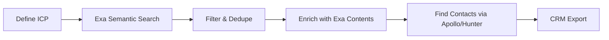

# Exa AI Research: Lead Generation & Market Research

**Research Date:** January 24, 2026  
**Purpose:** Evaluate Exa AI for company discovery, lead generation, and market research

---

## 🔍 Executive Summary

Exa AI is a semantic search engine designed for AI applications. Unlike traditional data providers (Apollo, ZoomInfo), Exa excels at **intelligent web discovery** rather than static database lookups. It's ideal for:

- Finding companies matching specific criteria semantically
- Competitive intelligence and market research  
- Discovering niche players traditional databases miss
- Building custom company lists with AI-powered search

**Best fit:** Developers building AI-powered research tools, or users who need to discover companies that don't show up in traditional databases.

---

## 🌟 Key Capabilities

### Core Endpoints

| Endpoint | Purpose | Best For |
|----------|---------|----------|
| `/search` | Neural/keyword search across the web | Company discovery, competitor research |
| `/contents` | Extract clean text/highlights from URLs | Deep analysis, enrichment |
| `/findSimilar` | Find pages similar to a given URL | "Find more like this" workflows |
| `/answer` | Direct answers with citations | Quick factual queries |
| `/research` | Automated deep research tasks | Comprehensive market studies |

### Company Search Specifics

Using `category="company"` unlocks:
- LinkedIn company page search (Very High coverage)
- Company homepage discovery
- Rich metadata: headcount, location, funding, revenue
- Semantic filtering by industry, stage, technology

### Index Coverage

| Content Type | Coverage | Notes |
|--------------|----------|-------|
| LinkedIn Company Pages | Very High | Use `category="company"` |
| Company Homepages | Very High | Great for startup discovery |
| LinkedIn Profiles (People) | Very High (US+EU) | Use `category="people"` |
| News | Very High | Real-time, updated every minute |
| Financial Reports (SEC) | Very High | 10-Ks, Yahoo Finance |
| GitHub Repos | High | Open source intelligence |
| Research Papers | Very High | Academic/technical discovery |

---

## 💰 Pricing

### Exa AI Pricing (Pay as You Go)

| Feature | Price | Notes |
|---------|-------|-------|
| **Search (1-25 results)** | $5/1k requests | Fast, auto, neural modes |
| **Search (26-100 results)** | $25/1k requests | More results |
| **Deep Search** | $15/1k requests | Highest quality |
| **Contents - Text** | $1/1k pages | Raw content extraction |
| **Contents - Highlights** | $1/1k pages | AI-selected snippets |
| **Contents - Summary** | $1/1k pages | LLM summaries |
| **Answer API** | $5/1k answers | Direct Q&A |
| **Research API** | $5/1k tasks | Agent operations |

**Free tier:** $10 in credits to start

### Cost Examples

| Use Case | Cost Estimate |
|----------|---------------|
| Find 25 AI startups + summaries | ~$0.03 |
| Research 100 competitors with content | ~$0.35 |
| Deep research on 10 companies | ~$0.20 |
| Build list of 1000 companies | ~$5.00 |

---

## 📊 Competitor Comparison

### Pricing Comparison Table

| Platform | Free Tier | Starter/Basic | Growth | Notes |
|----------|-----------|---------------|--------|-------|
| **Exa AI** | $10 credits | Pay-as-you-go | Custom | Per-query pricing, no monthly minimum |
| **Apollo.io** | 50 credits/mo | $49/mo (2k credits) | $149/mo (10k) | Database access, sequences included |
| **Hunter.io** | 50 credits/mo | $34/mo (2k credits) | $104/mo (10k) | Email finding focused |
| **Lusha** | 70 credits/mo | Custom | Custom | 1 credit = email, 10 credits = phone |
| **ZoomInfo** | None | ~$15k/yr minimum | Custom | Enterprise-focused, sales required |
| **Clearbit** | Free (limited) | Custom | Custom | Now part of HubSpot |

### Feature Comparison

| Feature | Exa | Apollo | Hunter | ZoomInfo |
|---------|-----|--------|--------|----------|
| **Semantic Search** | ✅ Excellent | ❌ Keyword only | ❌ Domain-based | ❌ Filters only |
| **Real-time Data** | ✅ Minutes old | ⚠️ Monthly updates | ⚠️ Periodic | ⚠️ Periodic |
| **API Quality** | ✅ Developer-first | ✅ Good | ✅ Good | ⚠️ Complex |
| **Company Discovery** | ✅ Excellent | ⚠️ Static DB | ❌ Not focus | ⚠️ Static DB |
| **Email/Contact Data** | ❌ No direct | ✅ Yes | ✅ Yes | ✅ Yes |
| **Intent Data** | ⚠️ News-based | ⚠️ Basic | ❌ No | ✅ Yes |
| **LinkedIn Access** | ✅ Public data | ✅ Via scraping | ⚠️ Limited | ✅ Yes |
| **Pricing Model** | Pay-per-use | Credits | Credits | Annual contract |

### When to Use What

| Use Case | Best Tool |
|----------|-----------|
| Find unknown companies by description | **Exa** |
| Get verified emails for known contacts | **Apollo / Hunter** |
| Enterprise sales with intent data | **ZoomInfo** |
| Real-time competitive intelligence | **Exa** |
| Outbound campaign with sequences | **Apollo** |
| Pure email finding/verification | **Hunter** |
| AI/LLM integration for research | **Exa** |

---

## 🔧 API Examples

### 1. Find Companies by Description

```python
import requests

url = "https://api.exa.ai/search"
headers = {"x-api-key": "YOUR_API_KEY"}

# Find AI startups in healthcare
payload = {
    "query": "AI healthcare startup using machine learning for diagnostics",
    "category": "company",
    "numResults": 25,
    "useAutoprompt": True,
    "contents": {
        "text": True,
        "summary": True
    }
}

response = requests.post(url, headers=headers, json=payload)
companies = response.json()["results"]
```

### 2. Find Competitors to a Known Company

```python
# Find companies similar to a given company's website
payload = {
    "url": "https://stripe.com",
    "numResults": 20,
    "category": "company"
}

response = requests.post("https://api.exa.ai/findSimilar", 
                         headers=headers, json=payload)
```

### 3. Deep Company Research

```python
# Use the Research API for comprehensive analysis
payload = {
    "instructions": """
    Research Anthropic as a company. Find:
    1. Funding history and investors
    2. Key products and technology
    3. Main competitors
    4. Recent news and developments
    5. Leadership team
    Return as structured JSON.
    """,
    "model": "exa-research-pro",
    "outputSchema": {
        "type": "object",
        "properties": {
            "funding": {"type": "array"},
            "products": {"type": "array"},
            "competitors": {"type": "array"},
            "news": {"type": "array"},
            "leadership": {"type": "array"}
        }
    }
}

response = requests.post("https://api.exa.ai/research", 
                         headers=headers, json=payload)
```

### 4. Find Decision Makers

```python
# Find LinkedIn profiles of executives at target companies
payload = {
    "query": "VP of Engineering at fintech startup San Francisco",
    "category": "people",
    "numResults": 50,
    "useAutoprompt": True
}

response = requests.post("https://api.exa.ai/search", 
                         headers=headers, json=payload)
```

### 5. Industry News Monitoring

```python
# Get recent news about a company or industry
payload = {
    "query": "AI chip startup funding news",
    "category": "news",
    "numResults": 25,
    "startPublishedDate": "2026-01-01",  # Recent only
    "contents": {
        "summary": True
    }
}

response = requests.post("https://api.exa.ai/search", 
                         headers=headers, json=payload)
```

---

## 🎯 Lead Generation Workflows

### Workflow 1: Build Targeted Company Lists



**Steps:**
1. Use Exa to find companies matching your ICP description
2. Use `/contents` to get company summaries and key info
3. Export to Apollo/Hunter to find contact emails
4. Import enriched leads to CRM

### Workflow 2: Competitive Intelligence

```mermaid
graph LR
    A[Competitor URL] --> B[/findSimilar]
    B --> C[Company List]
    C --> D[/contents for each]
    D --> E[Analysis]
```

**Steps:**
1. Start with known competitor URL
2. Find similar companies with `/findSimilar`
3. Extract content and summaries
4. Build competitive landscape report

### Workflow 3: Real-time Market Alerts


**Steps:**
1. Schedule daily/hourly searches for industry news
2. Filter for funding announcements, launches, partnerships
3. Alert on new market entrants or competitive moves

---

## 🔌 Integration Ideas for Marb's Workflows

### 1. Claude MCP Integration
Exa provides official MCP (Model Context Protocol) support:
```bash
claude mcp add --transport http exa "https://mcp.exa.ai/mcp?tools=web_search_advanced_exa"
```

This enables Claude to:
- Research companies on demand
- Find competitors dynamically
- Pull real-time news and trends

### 2. Clawdbot Integration

Add to a skill for company research:
```yaml
# In a Clawdbot skill
triggers: ["find companies", "research company", "competitor analysis"]
```

Example workflow:
- User: "Find 10 AI companies working on voice synthesis"
- Bot: Uses Exa search → enriches results → formats as Telegram message

### 3. Google Sheets Pipeline

Exa has a [Google Sheets add-on](https://exa.ai/docs/reference/exa-for-sheets):
- Input: Column of company descriptions
- Output: Company URLs, summaries, metadata
- Use for batch prospecting

### 4. Webhook/Automation

Build a Zapier/Make automation:
1. Trigger: New company added to watchlist
2. Action: Exa `/findSimilar` to find competitors
3. Action: Enrich with company summaries
4. Output: Populate Notion database

---

## 📋 Rate Limits

| Endpoint | Limit |
|----------|-------|
| `/search` | 5 QPS |
| `/contents` | 50 QPS |
| `/answer` | 5 QPS |
| `/research` | 15 concurrent tasks |

Enterprise plans offer custom rate limits.

---

## ✅ Strengths

1. **Semantic search** - Find companies by description, not just keywords
2. **Real-time data** - Index updated every minute
3. **API-first** - Clean, developer-friendly API
4. **Flexible pricing** - Pay only for what you use
5. **AI integration** - Built for LLM workflows
6. **Unique coverage** - Finds companies traditional databases miss

## ⚠️ Limitations

1. **No contact data** - Need Apollo/Hunter for emails/phones
2. **No intent signals** - Unlike ZoomInfo, no buying intent data
3. **No CRM integration** - Pure API, no native Salesforce/HubSpot
4. **Rate limits** - 5 QPS may limit high-volume use cases
5. **Learning curve** - Prompt engineering needed for best results

---

## 💡 Recommendations

### For Marb's Use Cases

1. **Use Exa for discovery** - Finding companies, competitive research, market mapping
2. **Pair with Apollo** - Once you have company URLs, use Apollo for contact enrichment
3. **MCP integration** - Add to Claude/Clawdbot for on-demand research
4. **Start small** - $10 free credits is enough to validate the use case

### Suggested First Projects

1. Build a "Find competitors" skill using `/findSimilar`
2. Create an automated weekly market research report
3. Add company research to Clawdbot's capabilities via MCP

---

## 📚 Resources

- **Website:** https://exa.ai
- **Documentation:** https://docs.exa.ai
- **Pricing:** https://exa.ai/pricing
- **MCP Setup:** https://exa.ai/docs/reference/exa-mcp
- **Status:** https://status.exa.ai
- **Discord:** https://discord.com/invite/HCShtBqbfV

---

*Last updated: January 24, 2026*
